# 10. 晶体固体的强度（Strength of Crystalline Solids）

> **本章概要**：晶体的屈服与流动应力取决于位错能否以足够的速度和数量参与塑性变形。晶格阻力、溶质、析出物、其他位错和晶界共同影响这一过程；温度和应变率则决定热激活能够帮助位错克服多少障碍。本章将这些机制与屈服降落、合金强化、加工硬化及脆–韧转变联系起来。

本章依据原笔记所附 Hull 与 Bacon《Introduction to Dislocations》（2011）第 10 章，原书第 205–249 页整理。公式与所保留的图号沿用原书；英文段落、公式截图和图注已转为中文说明与 LaTeX，图形由原 PDF 提取。

**符号约定**：$\tau$ 为分切应力，$\sigma$ 为单轴应力；$\gamma$ 为滑移剪应变，$\varepsilon$ 为单轴应变；$G$ 为剪切模量，$\nu$ 为泊松比，$k_{\mathrm B}$ 为玻尔兹曼常数，$T$ 为绝对温度。位错线张力用 $\Gamma$，尝试频率用 $\nu_0$；$\rho_m$ 为可动位错密度，$b$ 为伯格斯矢量的模。不同机制中的局部长度和系数在各节单独定义。

---

## 10.1 引言：从位错运动到应力–应变曲线（Introduction）

### 10.1.1 强度为什么远低于理想晶体的理论值

完美晶体的理论剪切强度远高于实际含位错晶体开始塑性变形时的临界剪切应力。位错使原子面能够逐步滑移，宏观塑性不再要求整个晶面同时跨越原子间势垒。

本章主要讨论**位错滑移控制的塑性变形**。在这一范围内，屈服要求有足够多的位错启动、增殖和运动，使塑性应变率能够响应外部加载；不能仅用一条位错的启动应力定义宏观屈服。孪生、高温攀移和扩散控制的变形还需要相应机制描述，蠕变与疲劳不在本章系统讨论之列。

拉伸试验通常记录载荷和伸长量，得到应力–应变曲线。恒定横梁速度、恒定工程应变率和恒定真应变率是不同的加载条件，解释试验时应明确使用哪一种。晶体结构、合金成分、位错排列、晶粒尺寸，以及温度和应变率，都能改变屈服和后续流动行为。

### 10.1.2 四类典型曲线

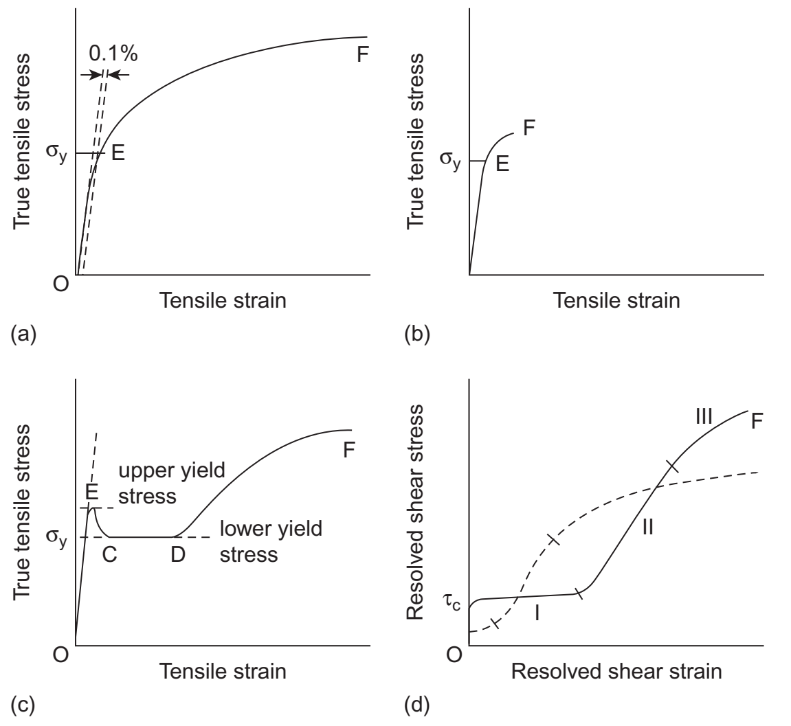

*图 10.1：（a）延性多晶；（b）塑性变形很小即断裂的材料；（c）具有上下屈服点的多晶；（d）单晶的分切应力–剪应变曲线。True tensile stress 为真拉伸应力，Tensile strain 为拉伸应变；Resolved shear stress/strain 为分切应力/剪应变；upper/lower yield stress 为上/下屈服应力。$F$ 表示断裂。图为示意，不能用其形状直接推算材料参数。*

- **弹性与微塑性**：$OE$ 段总体接近线弹性，但屈服前也可能有少量位错运动造成的微塑性（microplasticity）。
- **延性与加工硬化**：延性材料屈服后可积累较大塑性应变，维持变形所需的流动应力（flow stress）通常随应变上升。
- **脆性行为**：若裂纹扩展先于充分的塑性松弛，材料可能在塑性很小的情况下断裂。位错数量不足或运动困难是重要原因，但断裂还受裂纹、应力状态等因素影响。
- **规定塑性延伸强度**（proof stress）：没有清晰屈服点时，可用指定塑性应变对应的应力表征屈服；原图使用 $0.1\%$ 偏移，采用其他偏移值时应明确标注。
- **单晶三阶段硬化**：单晶常按首先启动的滑移系绘制分切应力–剪应变曲线。超过临界分切应力（critical resolved shear stress，CRSS）后可出现阶段 I、II、III；其长短依赖取向、材料和温度，详见 10.8 节。

### 10.1.3 屈服降落与 Lüders 带

图 10.1(c) 的关键是塑性变形在空间上并不均匀：

1. $OE$：以弹性变形为主，伴有屈服前微塑性。
2. $EC$：达到上屈服点后，可动位错迅速增加，所需应力下降，形成**屈服降落**（yield drop）。
3. $CD$：塑性变形集中在 **Lüders 带**（Lüders band，吕德斯带）中，带前沿沿试样传播；已被前沿扫过的区域发生塑性伸长，尚未扫过的区域主要保持弹性。此时整体伸长主要来自已屈服区域的扩大，因而出现近似平台。
4. $DF$：带前沿扫过整个标距后，进一步伸长需要已屈服材料继续变形，曲线转入较均匀的加工硬化。

Lüders 带是一种与屈服传播有关的局部塑性带，不能与高应变率下的绝热剪切带或动态应变时效产生的锯齿流变混为一谈。溶质锁定位错、解锁或新位错源启动，以及位错快速增殖，共同影响屈服降落；其动力学在 10.5 节进一步讨论。

---

## 10.2 流动应力对温度和应变率的依赖（Temperature and Strain-Rate Dependence of Flow Stress）

### 10.2.1 机械功与热激活共同帮助位错越障

设位错沿 $x$ 方向滑移，沿位错线方向的障碍间距为 $l$。有效分切应力 $\tau^*$ 对一段位错施加的前向力为 $\tau^*bl$；单个障碍的阻力随位置变化，记为 $K(x)$。

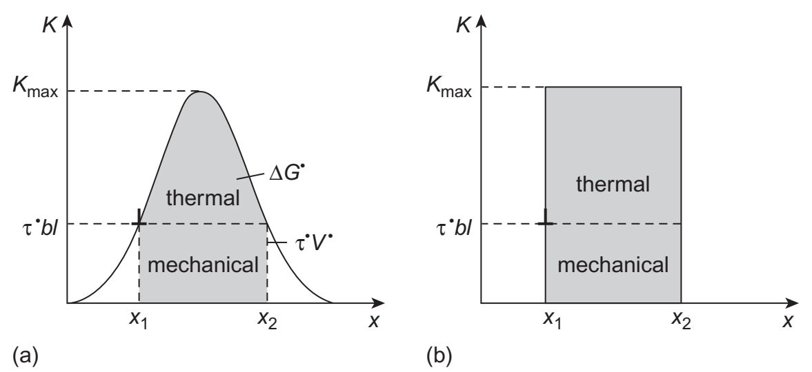

*图 10.2：纵轴 $K$ 为单个障碍的阻力，横轴 $x$ 为位错前进位置。（a）一般阻力曲线；（b）常阻力的矩形近似。mechanical 区表示外应力做功，thermal 区表示仍需热激活提供的自由能。两区面积相加为相应路径上的自由能变化。*

在 $0\ \mathrm K$、忽略其他扰动时，若 $\tau^*bl<K_{\max}$，位错不能直接越过障碍。由停留位置 $x_1$ 到势垒顶部对应位置 $x_2$，内部 Helmholtz 自由能变化为

$$
\Delta F^*=\int_{x_1}^{x_2}K(x)\,\mathrm dx.
\tag{10.1}
$$

外应力做功为 $\tau^*bl(x_2-x_1)$。定义该简单几何下的**激活体积**（activation volume）

$$
V^*=bl(x_2-x_1),
$$

则剩余的**激活自由能**（activation free energy）为

$$
\Delta G^*=\Delta F^*-\tau^*V^*.
\tag{10.2}
$$

$V^*$ 的量纲是体积，但不一定对应一块具有清晰边界的实际物质。对一般应力相关势垒，其定义是 $V^*=-\partial\Delta G^*/\partial\tau^*$；在上述单自由度模型中，结合平衡端点条件即可得到相同的几何表达式。

### 10.2.2 从越障频率到应变率

当位错大部分时间停留在障碍处、越障可视为热激活稀有事件时，取尝试频率 $\nu_0$，成功越障频率近似为

$$
\nu_0\exp\!\left(-\frac{\Delta G^*}{k_{\mathrm B}T}\right).
$$

若每次越障平均前进 $d$，则平均速度为

$$
\bar v=d\nu_0\exp\!\left(-\frac{\Delta G^*}{k_{\mathrm B}T}\right).
\tag{10.3}
$$

结合 Orowan 关系，滑移剪应变率为

$$
\dot\gamma=\rho_m b\bar v
=\rho_m A_0\exp\!\left(-\frac{\Delta G^*}{k_{\mathrm B}T}\right),
\qquad A_0=bd\nu_0.
\tag{10.4}
$$

原书在该式中使用 $\dot\varepsilon$，这里改用 $\dot\gamma$ 以明确它是滑移剪应变率。转换为单轴塑性应变率需要滑移系的取向因子；$l$ 是沿线障碍间距，$d$ 是一次越障后的前进距离，二者也不应混同。

### 10.2.3 矩形势垒：线性温度关系的由来

若障碍构成规则阵列，且阻力曲线近似矩形，则

$$
\Delta G^*=\Delta F\left[1-\frac{\tau^*(T)}{\tau^*(0)}\right],
\tag{10.5}
$$

其中 $\Delta F$ 是零应力时的完整势垒，$\tau^*(0)=K_{\max}/(bl)$。固定微观组织，并近似认为 $\rho_m$ 和 $A_0$ 不随温度或应力变化，令 $\dot\gamma_0=\rho_m A_0$，将式（10.5）代入式（10.4）可得

$$
\frac{\tau^*(T)}{\tau^*(0)}
=1+\frac{k_{\mathrm B}T}{\Delta F}
\ln\!\left(\frac{\dot\gamma}{\dot\gamma_0}\right).
\tag{10.6}
$$

在通常的 $0<\dot\gamma<\dot\gamma_0$ 条件下，对数项为负。定义该近似中热激活应力分量降至零的温度

$$
T_c=\frac{\Delta F}
{k_{\mathrm B}\ln(\dot\gamma_0/\dot\gamma)},
\tag{10.7}
$$

即可写为

$$
\frac{\tau^*(T)}{\tau^*(0)}=1-\frac{T}{T_c},
\qquad 0\le T\le T_c.
\tag{10.8}
$$

超过 $T_c$ 时，应把该模型中的 $\tau^*$ 取为零，而不能外推为负值。$T_c$ 随应变率和障碍性质变化，不是材料的普适临界温度；$\tau^*=0$ 也不表示零外应力下会自发产生持续的定向塑性流动。

### 10.2.4 热激活分量与非热激活分量

位错既受可由热激活协助克服的短程障碍，也受在所考察温区和时间尺度上难以热激活越过的长程阻力。常用分解为

$$
\tau=\tau^*+\tau_G.
\tag{10.9}
$$

$\tau^*$ 是**热激活应力分量**（thermal component）；$\tau_G$ 是**非热激活应力分量**（athermal component），常与剪切模量 $G$ 成正比。后者仍会随 $G(T)$ 或组织变化而改变，“非热激活”并不等于任何条件下都与温度无关。

一般障碍的势垒形状可用经验式描述：

$$
\Delta G^*=\Delta F
\left\{1-\left[\frac{\tau^*(T)}{\tau^*(0)}\right]^p\right\}^q,
\qquad 0<p\le1,\quad 1\le q\le2.
\tag{10.10}
$$

其中 $p,q$ 描述势垒形状；$p=1,q=1$ 退化为矩形势垒模型。这里排除使公式退化的 $p=0$。在相同的前因子近似下，反解得到

$$
\tau^*(T,\dot\gamma)=\tau^*(0)
\left\{1-
\left[\frac{k_{\mathrm B}T}{\Delta F}
\ln\!\left(\frac{\dot\gamma_0}{\dot\gamma}\right)\right]^{1/q}
\right\}^{1/p},
$$

仅在括号内给出有效实数、且该机制仍控制变形时使用。原书给出的障碍能量量级约为 $0.05Gb^3$ 至 $2Gb^3$，从溶质和晶格阻力到较强障碍不等；这不是适用于所有材料的固定范围。

因此，在微观组织和主导机制不变的热激活区间内，升温或降低外加应变率通常使流动应力下降。动态应变时效、组织演化和机制切换可使这一趋势不再适用。若 $\Delta G^*\sim k_{\mathrm B}T$，应重新考虑越障等待时间与位错拖曳的相对作用：失去适用性的是简单的稀有事件速率近似，不能笼统说玻尔兹曼统计本身失效。

---

## 10.3 Peierls 应力与晶格阻力（Peierls Stress and Lattice Resistance）

### 10.3.1 Peierls 应力不是宏观屈服应力

**Peierls 应力**（Peierls stress，亦称 Peierls–Nabarro stress）是在没有热激活帮助的理想条件下，使位错克服晶格周期势垒所需的临界分切应力，通常按 $0\ \mathrm K$ 的直位错定义。

它来自晶格的离散周期性，敏感地依赖原子间作用和位错核心结构。宏观屈服还要求位错源启动、可动位错数量和运动速度足以维持外加应变率，因此不能将实测屈服应力直接等同于 Peierls 应力。个别位错在较低应力下移动，只能造成有限的微塑性。

### 10.3.2 错配位移、核心宽度与伯格斯矢量分布

设滑移面上、下两侧原子的位移分别为 $u(A)$ 和 $u(B)$，则跨滑移面的**错配位移**（disregistry）为

$$
\Delta u(x)=u(B)-u(A).
$$

描述核心时，应区分按晶格周期折回的错配位移和连续展开的错配位移。对后者，可选取其由 $0$ 连续变化到 $b$，并把 $\Delta u=b/4$ 到 $3b/4$ 之间的距离定义为核心宽度 $w$。原书图 10.4 的折回曲线在核心中心发生数值跳转，这是表示方式的改变，不意味着原子位移发生物理断裂。

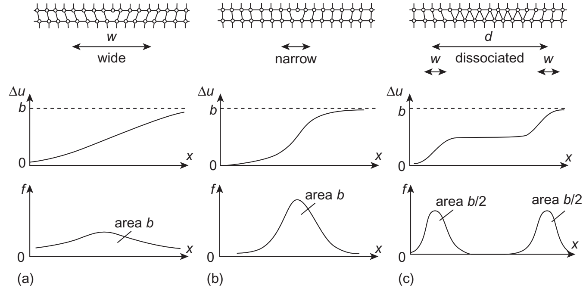

*图 10.5：（a）宽核心（wide）；（b）窄核心（narrow）；（c）分解核心（dissociated）。第一排为原子构型，第二排为连续展开的 $\Delta u(x)$，第三排为其导数 $f(x)$。area 表示曲线下面积；两个部分位错在所画分量上的面积各为 $b/2$。$d$ 是部分位错间距，$w$ 是单个核心宽度。*

定义**伯格斯矢量分布**（Burgers vector distribution）

$$
f(x)=\frac{\mathrm d\Delta u}{\mathrm dx},
\tag{10.11}
$$

于是

$$
\int_{-\infty}^{\infty}f(x)\,\mathrm dx=b.
$$

宽核心对应较平缓的 $f(x)$，窄核心对应较尖锐的峰。位错分解后出现两个或多个峰，可用于识别相近的部分位错。原书列举的未分解位错核心宽度通常为 $b$ 至 $5b$ 的量级，具体值取决于结构、原子势和宽度定义。

平面分解位错中，部分位错间距 $d$ 主要由弹性排斥与层错能平衡决定，而各自核心宽度 $w$ 由局部原子作用控制；**分解宽度不能直接作为单个部分位错的核心宽度**。对于 BCC 螺位错等非平面核心，一条 $\Delta u(x)$ 曲线不够，应结合不同晶面或二维差分位移图分析，参见第 6 章。

### 10.3.3 Peierls–Nabarro 模型中的周期势垒

经典 Peierls–Nabarro 模型将滑移面两侧视为弹性半晶体，并用周期性的原子面间恢复力描述核心错配。取正弦恢复力时，原书模型给出

$$
w_{\mathrm{edge}}\simeq\frac{a_\perp}{1-\nu},
\qquad
w_{\mathrm{screw}}\simeq a_\perp,
$$

其中 $a_\perp$ 为相关原子面间距，避免与后文的晶格常数或沿滑移方向的周期混淆。核心错配能与外部弹性能共同决定总线能，外部弹性表达式中的有效核心截断尺度约为 $w/3$。

位错移动时，其单位长度能量随位置周期变化。对原书所用的刃型位错模型，周期为 $b/2$，能量起伏的峰谷差为

$$
E_p=\frac{Gb^2}{\pi(1-\nu)}
\exp\!\left(-\frac{2\pi w}{b}\right).
\tag{10.12}
$$

$E_p$ 的单位是 $\mathrm{J\,m^{-1}}$。例如用 $E_p[1-\cos(4\pi x/b)]/2$ 表示周期能量项，其最大斜率即单位长度最大阻力；除以 $b$，得到

$$
\tau_p=\frac{2\pi E_p}{b^2}
=\frac{2G}{1-\nu}
\exp\!\left(-\frac{2\pi w}{b}\right).
\tag{10.13}
$$

该式最重要的定性结论是：**宽的平面核心通常具有较低的晶格阻力**。它不构成适用于所有位错的通式，尤其不能直接代入非平面核心或把部分位错间距当作 $w$；定量结果还依赖晶格周期、位错性质和原子间势。

### 10.3.4 不同材料的差异

原书据微塑性和内耗实验给出如下定性比较：

| 材料或滑移类型 | 典型特征 |
| --- | --- |
| FCC 与某些基面滑移的 HCP 金属 | 晶格阻力较低；实验上位错可在约 $10^{-6}G$ 至 $10^{-5}G$ 或更低应力下启动 |
| BCC 金属中的 $\langle111\rangle$ 螺位错、某些 HCP 棱柱面滑移 | 核心可能非平面，温度与应变率依赖较明显 |
| Si、金刚石等共价晶体 | 强定向键合使位错运动困难；原书所列启动应力量级可达 $10^{-2}G$ |

这些是特定实验条件下的量级比较，不应当作统一的 $0\ \mathrm K$ Peierls 应力表。原子模拟得到的理想直位错临界应力可能高于实验启动应力，因为真实位错可带有扭折，并受到热激活帮助。位错沿低核心能的晶向排列，也不意味着它沿横向跨越晶格势垒时的阻力必然小。

### 10.3.5 扭折运动与双扭折形核

位错线在滑移面内连接相邻 Peierls 势阱的局部转折称为**扭折**（kink）。扭折的长度由两种能量倾向共同决定：位错希望更多地停留在低能位置，也希望缩短总线长。势垒较高时扭折通常较窄，势垒较低时扭折可较宽；这对应原书图 10.7 中折线与直线两个极限之间的平滑构型。

已有扭折沿位错线横向移动，可使整段位错逐步进入相邻势阱，所需应力一般低于整条直位错同步越过势垒的应力。但已有扭折到达节点后，这一过程可能耗尽，只产生有限的屈服前微塑性。

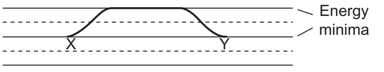

*图 10.8：位错线局部从一个势阱移向相邻势阱，形成扭折 $X$ 与 $Y$。Energy minima 为能量极小位置。扭折对拉开后，中间线段进入下一势阱；若未达到临界尺寸，则可能收缩湮灭。*

有限温度下，热涨落可使部分位错线跨入相邻势阱，形成**双扭折形核**（double-kink or kink-pair nucleation）。这个过程增加线长与能量；两个相反扭折还会相互吸引。外应力做功必须使扭折对达到足够间距，之后才能继续分离，带动位错滑移。原书以约 $20b$ 的扭折间距作量级示例，它不是固定的材料常数。

双扭折形核可用式（10.10）描述，原书给出的典型拟合指数为

$$
p\simeq\frac34,\qquad q\simeq\frac43,
$$

其中 $\Delta F$ 为形成两个充分分离扭折的零应力自由能，包含核心和弹性贡献。原书所列 Si、Ge 以及 BCC 过渡金属螺位错的量级约为 $0.1Gb^3$（约 $1$–$2\ \mathrm{eV}$），FCC 金属可低于 $0.05Gb^3$（约 $0.2\ \mathrm{eV}$）。因此 FCC 中晶格阻力往往只在很低温度下才显著影响流动应力，而高晶格阻力材料的温度、应变率效应更突出。

---

## 10.4 点缺陷与位错的相互作用（Interaction Between Point Defects and Dislocations）

空位、自间隙原子、置换溶质和间隙溶质都可与位错相互作用。点缺陷引起的局部畸变与位错应力场耦合，使体系能量改变，称为**相互作用能**（interaction energy）$E_I$。取缺陷远离位错时为零能量参考，则 $E_I<0$ 对应有利的结合位置，将二者分离需要做功。

位错滑过含缺陷的晶体时会遇到这些相互作用；在允许扩散的温度下，缺陷还会主动向有利位置偏聚。前者构成固溶强化等机制的基础，后者可以形成溶质气团并锁定位错。

### 10.4.1 球形缺陷的尺寸错配模型

先考虑最简单的**尺寸效应**（size effect）：将自然半径为 $r_a(1+\delta)$、体积为 $V_s$ 的弹性球，放入半径为 $r_a$、体积为 $V_h=4\pi r_a^3/3$ 的球形孔洞中。球与基体均取各向同性，并具有相同的 $G$ 和 $\nu$。$\delta$ 是线性错配参数，尺寸过大时为正、过小时为负。

两者的**错配体积**（misfit volume）为

$$
V_{\mathrm{mis}}=V_s-V_h
=\frac{4\pi r_a^3}{3}\left[(1+\delta)^3-1\right]
\simeq4\pi r_a^3\delta,
\qquad |\delta|\ll1.
\tag{10.14}
$$

插入后，球与孔洞共同变形，最终半径为 $r_a(1+\varepsilon)$。孔洞体积增加

$$
\Delta V_h
=\frac{4\pi r_a^3}{3}\left[(1+\varepsilon)^3-1\right]
\simeq4\pi r_a^3\varepsilon,
\qquad |\varepsilon|\ll1.
\tag{10.15}
$$

球面两侧的径向压力必须平衡。令体积模量为 $B$，则线性近似给出 $3B(\delta-\varepsilon)=4G\varepsilon$。利用 $B=2G(1+\nu)/[3(1-2\nu)]$，得到

$$
\Delta V_h=\frac{1+\nu}{3(1-\nu)}V_{\mathrm{mis}},
\qquad
\varepsilon=\frac{1+\nu}{3(1-\nu)}\delta.
\tag{10.16}
$$

这里的 $\varepsilon$ 是球形孔洞的径向相对变化，不是试样的宏观拉伸应变。无限基体中，缺陷外部的应变场没有体积膨胀分量，体积变化由 $\Delta V_h$ 表示；有限试样还需满足外表面无牵引条件，其总体积变化为

$$
\Delta V=\frac{3(1-\nu)}{1+\nu}\Delta V_h
=V_{\mathrm{mis}}.
\tag{10.17}
$$

因此，孔洞本身的体积变化与自由试样的总体积变化需要区分。

### 10.4.2 Cottrell–Bilby 相互作用能

取拉应力为正，静水压力定义为

$$
p=-\frac13(\sigma_{xx}+\sigma_{yy}+\sigma_{zz}).
$$

在缺陷位置的应力近似均匀时，球形缺陷与该应力场的相互作用能为

$$
E_I=p\Delta V.
\tag{10.18}
$$

对于沿 $z$ 轴的正刃型位错，取 $\mathbf b=b\mathbf e_x$、滑移面为 $y=0$，额外半原子面位于 $y>0$。各向同性弹性场给出

$$
p=\frac{Gb(1+\nu)}{3\pi(1-\nu)}\frac{y}{x^2+y^2}.
$$

结合式（10.14）和（10.17），得

$$
\boxed{
E_I=\frac{4(1+\nu)Gbr_a^3\delta}{3(1-\nu)}
\frac{y}{x^2+y^2}.
}
\tag{10.19}
$$

令 $x=r\cos\theta$、$y=r\sin\theta$，则

$$
E_I=\frac{4(1+\nu)Gbr_a^3\delta}{3(1-\nu)}
\frac{\sin\theta}{r}.
\tag{10.20}
$$

再利用式（10.16），可写成

$$
E_I=4Gbr_a^3\varepsilon\frac{\sin\theta}{r}.
\tag{10.21}
$$

式（10.21）的系数依赖球与基体具有相同弹性常数的假设。例如，若缺陷视为不可压缩，便有 $\varepsilon=\delta$，不能仍沿用式（10.16）及其化简结果。

上述公式给出清楚的空间选择性：

- 尺寸过大的缺陷（$\delta>0$）偏好 $y<0$ 的拉伸区，受到 $y>0$ 压缩区的排斥；固定 $r$ 时，最有利方向为 $\theta=3\pi/2$。
- 尺寸过小的缺陷（$\delta<0$）偏好压缩区，最有利方向为 $\theta=\pi/2$。
- 各向同性线弹性中的纯螺型位错满足 $p=0$，因此与**球对称体积缺陷的一阶尺寸相互作用**为零；这不排除其他类型的相互作用。

对置换缺陷和空位，可粗略取 $V_h\simeq\Omega$，其中 $\Omega$ 是原子体积；间隙缺陷对应的有效孔洞体积通常较小。教材列举的错配参数量级为：空位约 $-0.1\sim0$，置换溶质约 $-0.15\sim0.15$，间隙原子约 $0.1\sim1$。这些范围用于认识错配强弱，较大错配显然已超出小应变球形模型的定量适用范围。

将弹性公式外推到 $r\sim b$，结合能量级约为

$$
|E_I|\sim G\Omega|\delta|.
$$

原资料给出的典型估计约为密排金属中的 $3|\delta|\,\mathrm{eV}$，以及硅、锗中的 $20|\delta|\,\mathrm{eV}$。它们仅是核心附近的量级估计，不能替代原子尺度计算得到的真实结合能。

### 10.4.3 非球对称畸变：为什么间隙溶质也能锁定螺位错

许多缺陷产生的并非球对称畸变。以 $\alpha$-Fe 中的碳为例，碳优先占据 BCC 点阵的八面体间隙。以畸变主轴为 $z$ 轴时，其两近邻位于 $z$ 方向、距离为 $a/2$，另四个次近邻的距离为 $a/\sqrt2$。碳对前一对原子的推挤更强，因此产生**四方畸变**（tetragonal distortion）。教材采用的估计为

$$
\delta_{xx}=\delta_{yy}=-0.05,
\qquad
\delta_{zz}=0.43.
\tag{10.22}
$$

在缺陷畸变的主轴坐标系中，相互作用能近似为

$$
E_I=-\left(
\sigma_{xx}\delta_{xx}
+\sigma_{yy}\delta_{yy}
+\sigma_{zz}\delta_{zz}
\right)\frac{4\pi r_a^3}{3}.
\tag{10.23}
$$

应力与畸变必须用同一坐标系表示。四方畸变除体积分量外还具有偏应变分量，因此能与剪应力耦合。沿 $\langle111\rangle$ 的螺位错在自身坐标系中虽只有剪应力，换到缺陷主轴系后仍可与式（10.23）的非球对称畸变产生非零耦合；其强度可与刃位错的相互作用相当。远离核心时，能量仍具有 $1/r$ 的距离尺度，但角度依赖比 $\sin\theta$ 更复杂。

### 10.4.4 模量效应、电相互作用与 Suzuki 偏聚

除了尺寸错配，还需区分以下机制：

| 机制 | 物理来源与主要结论 |
| --- | --- |
| **模量效应**（modulus effect），也称弹性非均匀性相互作用 | 缺陷与基体的弹性常数不同。简单模型中的软区使局部应变能降低，因而被位错高能区域吸引；硬区的作用相反。刃型与螺型位错都可产生这种相互作用，远场能量通常按 $1/r^2$ 衰减。当尺寸错配很小时，它仍可成为重要贡献。 |
| **电相互作用**（electrical interaction） | 金属中自由电子屏蔽通常使其弱于主要弹性贡献。离子晶体中的带电割阶（jog）可与带电空位、杂质离子发生库仑作用；局域电荷的作用具有 $1/r$ 的能量尺度。共价晶体中，位错核心的悬挂键俘获载流子也可能改变相互作用。 |
| **Suzuki 效应**（Suzuki effect） | 扩展位错间的层错带具有不同于基体的局部堆垛结构，例如 FCC 层错处出现局部 HCP 型堆垛。溶质在层错区和基体中的化学势不同，可驱动其偏聚到层错带，阻碍扩展位错运动。这属于局部化学作用，不是上述长程弹性作用。 |

这些贡献可能同时存在；仅凭原子尺寸或价态，通常不能完整判断真实缺陷的结合能。

---

## 10.5 溶质气团与屈服现象（Solute Atmospheres and Yield Phenomena）

### 10.5.1 Cottrell 气团的形成

若溶质在远离位错处的占位浓度为 $c_0$，位错附近的能量改变为 $E_I(x,y)$，在稀溶液、独立缺陷且局部占位仍很低的近似下，平衡浓度为

$$
c(x,y)=c_0\exp\!\left[-\frac{E_I(x,y)}{k_{\mathrm B}T}\right].
\tag{10.24}
$$

$E_I<0$ 的区域浓度升高，位错附近可形成**Cottrell 气团**（Cottrell atmosphere）。其形成需要两方面条件：温度足够高，使溶质在所考察时间内能够扩散；又不能高到使混合熵完全压过结合能，导致偏聚显著减弱。

式（10.24）不能直接外推到 $c\gtrsim1$。若只补入有限位点占据、仍忽略溶质间相互作用，理想占位模型给出

$$
\frac{c}{1-c}
=\frac{c_0}{1-c_0}
\exp\!\left(-\frac{E_I}{k_{\mathrm B}T}\right).
$$

例如，$c_0=10^{-3}$、$T=0.5T_{\mathrm m}$ 时，要达到 $c=0.5$，需 $-E_I=k_{\mathrm B}T\ln999\simeq3.45k_{\mathrm B}T_{\mathrm m}$。这说明即使整体很稀，具有数倍 $k_{\mathrm B}T$ 结合能的核心位置仍可形成高占位气团；高浓度时的相互作用或析出则需更进一步的模型。

### 10.5.2 偏聚动力学、应变时效与动态应变时效

对于球形错配缺陷与刃位错，定义

$$
A=\frac{4(1+\nu)Gbr_a^3\delta}{3(1-\nu)},
$$

则

$$
E_I=A\frac{y}{x^2+y^2}
=A\frac{\sin\theta}{r}.
\tag{10.25}
$$

非零等能线满足 $x^2+(y-A/2E_I)^2=(A/2E_I)^2$，即圆心在 $y$ 轴上的圆。缺陷受到的平均漂移力为 $-\nabla E_I$；在各向同性迁移率近似下，漂移线与等能线正交，其几何形状为圆心在 $x$ 轴上的圆。实际原子轨迹同时包含随机扩散，不能理解为原子逐个严格沿圆弧运动。

早期、尚未达到饱和且忽略溶质耗尽时，Cottrell–Bilby 型漂移模型给出**单位位错长度的累积捕获量** $N_\ell$ 的时间标度：

$$
N_\ell\propto
\begin{cases}
t^{2/3},&E_I\propto r^{-1},\\
t^{1/2},&E_I\propto r^{-2}.
\end{cases}
$$

这一尺度可由 $E_I\propto r^{-p}$ 推出：漂移速度量级为 $r^{-(p+1)}$，捕获半径因而满足 $r_c^{p+2}\propto t$，捕获量则与截面积 $r_c^2$ 成正比。上述幂律描述的是累积量；对应的瞬时到达速率分别为 $dN_\ell/dt\propto t^{-1/3}$ 和 $t^{-1/2}$。

缺陷到达核心后可产生不同结果：空位、自间隙原子可引起攀移；小间隙位错环可聚集在刃位错拉伸区；溶质可保留为气团，也可因局部浓度升高而形成沿位错分布的析出物。偏聚会改变局部弹性场与化学势；平衡时净扩散通量为零，并不要求整个长程位错应力场严格消失。

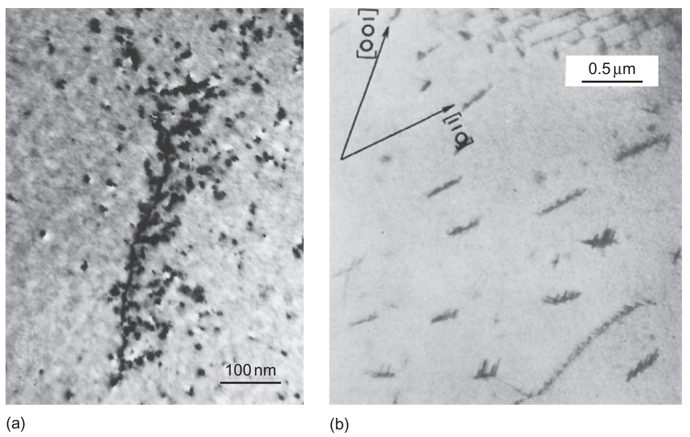

*图 10.12：（a）320 K 下快中子辐照的钼中，小间隙位错环沿位错聚集；（b）铁中沿位错析出的片状碳化物，以侧面投影观察。两图分别保留 100 nm 和 0.5 μm 标尺。原资料分别引自 Trinkaus、Singh 与 Foreman（1997），以及 Hull 与 Mogford（1961）。*

溶质与位错的结合需要额外应力才能解除，称为**位错锁定**（dislocation locking）。位错脱离原气团后，若立即重新加载，原先的锁定效应不会自动恢复；若在适当温度下停留，溶质重新扩散到位错附近，可再次锁定，这构成**静态应变时效**（static strain aging）的基础。

若变形过程中溶质扩散与位错等待时间相当，溶质还可反复锁定正在间歇运动的位错，产生**动态应变时效**（dynamic strain aging）。在适当的温度与应变率区间，它可表现为应力–应变曲线的锯齿，即 **Portevin–Le Chatelier 效应**；不能把所有动态应变时效都等同于可见的锯齿流动。

### 10.5.3 一列溶质对刃位错的解锁应力

考虑一条沿 $z$ 轴的直刃位错，其滑移面为 $y=0$。尺寸过大的溶质位于 $y=-r_0$，沿原位错位置形成间隔为 $b$ 的饱和原子列，$r_0\sim b$。这里 $r_0$ 是溶质列与滑移面的垂直距离。取 $A>0$，当位错沿滑移方向离开原位置 $x$ 时，与单个溶质的相互作用能为

$$
E_I(x)=-\frac{Ar_0}{x^2+r_0^2}.
\tag{10.26}
$$

单个溶质对位错的回拉力为

$$
f_x(x)=-\frac{dE_I}{dx}
=-\frac{2Ar_0x}{(x^2+r_0^2)^2}.
\tag{10.27}
$$

单位位错长度上有 $1/b$ 个溶质，回拉力为 $f_x/b$。令其与外加剪应力产生的单位线长滑移力 $\tau b$ 平衡，得

$$
\tau(x)=-\frac{f_x(x)}{b^2}
=\frac{2Ar_0x}{b^2(x^2+r_0^2)^2}.
\tag{10.28}
$$

该阻力先增大后减小，在 $x=r_0/\sqrt3$ 处达到最大值：

$$
\boxed{\tau_0=\frac{3\sqrt3\,A}{8b^2r_0^2}.}
\tag{10.29}
$$

采用原资料的原子尺度参数估计，可得 $\tau_0\sim0.2G|\delta|$，说明致密气团可能产生很强的锁定。但此值同时假设核心位点饱和、位错保持直线，并将连续弹性模型外推到核心区，应视为理想化的上限量级。

气团饱和并不要求整个晶体含有大量溶质。若位错密度为 $\rho$，饱和原子列中的溶质数密度约为 $\rho/b$，而晶体中的总溶质数密度约为 $c_0/b^3$；两者之比约为 $\rho b^2/c_0$。例如 $\rho=10^{12}\,\mathrm{m^{-2}}$、$b=0.3\,\mathrm{nm}$ 时，该比值为 $9\times10^{-8}/c_0$，少量溶质就可能占据大部分有利核心位点。

### 10.5.4 热激活解锁的作用与限制

式（10.29）给出该模型在零温下的解锁应力量级。当 $0<\tau<\tau_0$ 时，阻力曲线与外应力有两个交点：靠近气团的 $x_1$ 是稳定平衡位置，较远的 $x_2$ 是不稳定位置。热涨落可使局部位错段弓出、跨越 $x_2$，随后向外扩展而脱离气团。

这与双扭折形核跨越 Peierls 势垒的图景相似，但 $x_2-x_1$ 由气团的作用范围和外应力决定，并不固定等于晶格周期。Cottrell–Bilby 模型对应式（10.10）中的 $p=1$、$q=3/2$，可写为

$$
\Delta G(\tau)
=\Delta F\left(1-\frac{\tau}{\tau_0}\right)^{3/2},
\qquad0\le\tau\le\tau_0.
$$

升温会降低给定速率下所需的解锁应力，但强气团和核心析出物的能垒可能过高，使整体热激活解锁并非实际屈服的控制步骤。此时可能只有少量位错在局部应力集中处释放，屈服应力的温度依赖更多来自晶格阻力或固溶强化；大量位错保持锁定，仍会通过降低初始可动位错密度影响屈服行为。

### 10.5.5 拉伸试验中的屈服降落

某些合金在塑性流动开始后，所需应力会从上屈服点下降到下屈服点，称为**屈服降落**（yield drop）。立即卸载并重新加载时，屈服降落可能不再出现；经适当时效后，重新锁定可使其恢复。

为了同时考虑试验机与试样的响应，将二者的弹性变形合并为一个弹簧。设横梁以恒速 $s=dl/dt$ 移动，轴向力为 $F$，试样原始标距为 $l_0$，轴向塑性应变为 $\varepsilon_p$。以 $K$ 表示整个系统的**柔度**（compliance），单位为 $\mathrm{m/N}$，弹性位移即为 $KF$；相应刚度为 $1/K$。位移兼容条件为

$$
st=KF+\varepsilon_p l_0.
\tag{10.30}
$$

于是

$$
\varepsilon_p=\frac{st-KF}{l_0},
\tag{10.31}
$$

$$
\dot\varepsilon_p=\frac{s-K\,dF/dt}{l_0}.
\tag{10.32}
$$

用 $S_0$ 表示试样原始横截面积，避免与第 10.2 节的速率前因子 $A_0$ 混淆。沿用原推导中 Schmid 因子为 $1/2$ 的取向，即 $\tau=F/(2S_0)$，有

$$
\frac{d\tau}{dt}
=\frac{s-\dot\varepsilon_p l_0}{2S_0K},
\tag{10.33}
$$

$$
\frac{d\tau}{dl}
=\frac{1}{2S_0K}
\left(1-\frac{\dot\varepsilon_p l_0}{s}\right).
\tag{10.34}
$$

因此，记录到的应力–横梁位移曲线同时取决于系统柔度与瞬时塑性应变率。$d\tau/dl$ 是该曲线的斜率，不能直接当作材料的剪切加工硬化率 $d\tau/d\gamma$。

单滑移、小变形下，若一般 Schmid 因子记为 $m_s$，则

$$
\tau=m_s\frac{F}{S_0},
\qquad
\dot\varepsilon_p=m_s\dot\gamma
=m_s\rho_m b\bar v.
$$

上面的式（10.33）和（10.34）对应 $m_s=1/2$。必须保留这个取向因子，不能直接把轴向塑性应变率写成剪切 Orowan 关系。

### 10.5.6 可动位错增殖为何能引起应力下降

Johnston 对 LiF 晶体的分析采用早期位错密度随应变增加，以及速度在相应区间内满足

$$
\bar v\propto\tau^m,
\tag{10.35}
$$

的经验关系，LiF 的示例取 $m=16.5$。这里 $m$ 是速度对应力的幂指数，与 Schmid 因子 $m_s$ 不同。

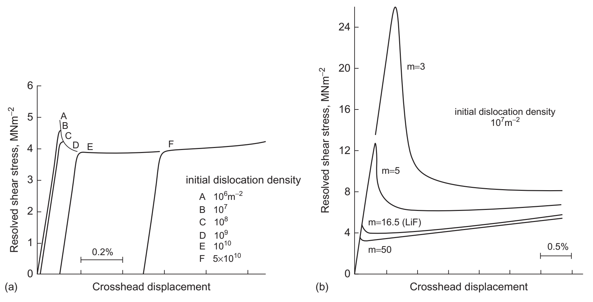

*图 10.16：模型计算得到的分切应力–横梁位移曲线。（a）初始可动位错密度由 $10^6$ 增至 $5\times10^{10}\,\mathrm{m^{-2}}$，屈服降落逐渐减弱；部分曲线为便于观察作了水平平移。（b）固定初始可动密度为 $10^7\,\mathrm{m^{-2}}$，减小速度幂指数 $m$，屈服降落更明显。纵轴单位 $\mathrm{MN/m^2}$ 即 MPa；横轴为横梁位移，标尺给出对应的相对应变量。原资料据 Johnston（1962）。*

在比较具有相同塑性应变率、相同取向和同一速度关系的上、下屈服状态时，Orowan 关系给出

$$
\rho_{m,u}\bar v_u=\rho_{m,l}\bar v_l,
\tag{10.36}
$$

从而

$$
\boxed{
\frac{\tau_u}{\tau_l}
=\left(\frac{\rho_{m,l}}{\rho_{m,u}}\right)^{1/m}.
}
\tag{10.37}
$$

下标 $u$、$l$ 分别表示上、下屈服状态。该比较说明：可动位错密度增幅越大、速度指数 $m$ 越小，屈服降落越明显。对于原资料中 $\alpha$-Fe 的示例，取 $m\simeq40$，若应力下降约 $20\%$，即 $\tau_l/\tau_u\simeq0.8$，则

$$
\frac{\rho_{m,l}}{\rho_{m,u}}
\simeq(1/0.8)^{40}\simeq7.5\times10^3,
$$

为 $10^4$ 的量级。即使初始总位错密度较高，只要大部分位错被锁定，初始**可动**密度仍可很小。

结合式（10.34），恒横梁速度试验中的过程可解释为：

1. 初始 $\rho_m$ 很小，位错运动提供的轴向塑性应变率不足，$\dot\varepsilon_p<s/l_0$，应力上升。
2. 应力提高使位错加速并增殖；当 $\dot\varepsilon_p=s/l_0$ 时，曲线斜率为零，出现应力峰值。
3. 若位错继续迅速增殖，暂时有 $\dot\varepsilon_p>s/l_0$，系统释放部分弹性变形，应力下降。
4. 应力降低使位错速度减小，直至塑性变形速率重新与加载速率相匹配。

因此，以下组合通常有利于产生明显屈服降落：初始可动位错密度低、位错增殖快、速度对应力的幂指数较小。其中低初始可动密度尤其关键。溶质锁定是获得这种状态的重要途径，但屈服降落并不等同于全部原有位错同时从气团中脱离。

### 10.5.7 辐照硬化与位错通道

高能粒子通过碰撞使原子离开晶格位置，产生过饱和空位与自间隙原子。这些缺陷可复合，也可聚集为间隙型或空位型位错环、缺陷团簇和层错四面体；部分缺陷还会扩散到位错或晶界等缺陷汇。

留在晶内的位错环和小团簇阻碍滑移，提高屈服与流动应力，称为**辐照硬化**（irradiation hardening）。某些可动的间隙位错环还能迁移到刃位错的有利位置，形成类似气团的装饰结构并锁定位错，使原本不明显出现屈服降落的金属也发生这种现象。

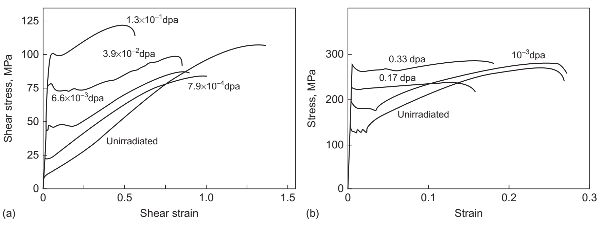

*图 10.17：（a）590 MeV 质子辐照后铜单晶的剪应力–剪应变曲线；（b）快中子辐照后多晶铁的拉伸应力–应变曲线。与未辐照状态相比，辐照使初始屈服应力升高，并改变屈服降落和后续硬化行为。dpa（displacements per atom）表示平均每个原子发生位移事件的次数，是损伤剂量指标，不等于最终存活缺陷的原子分数。原资料引自 Victoria 等（2000）。*

高缺陷密度材料在屈服后，滑过的位错可能清除或重组部分障碍，形成缺陷较少、后续滑移优先集中的窄带，称为**位错通道化**（dislocation channeling）。原资料讨论的可能机制包括：位错在滑移中与团簇作用，通过局部攀移吸收其空位或间隙原子，使反复滑移逐渐形成通道。具体过程取决于障碍性质与位错反应，不能将所有通道统一解释为单一的滑移–攀移机制。

---

## 10.6 随机障碍阵列的流动应力（Flow Stress for Random Arrays of Obstacles）

合金化能够通过引入位错运动障碍显著提高晶体强度。具体机制取决于溶质以孤立原子、原子团簇还是第二相颗粒的形式存在；本节先不限定障碍的具体来源，而讨论 **$0\ \mathrm K$ 下障碍阻碍位错滑移的简化模型**。

需要区分两个彼此独立的分类：

| 分类 | 判断依据 | 位错的典型响应 |
| --- | --- | --- |
| 强障碍与弱障碍（strong/weak obstacles） | 单个障碍能否使位错明显弯曲 | 强障碍附近弯曲显著；弱障碍由较长线段共同响应 |
| 弥散作用力与局域作用力（diffuse/localized forces） | 作用力沿位错分布的范围 | 弥散力分布在较长线段上；局域力集中在少量钉扎点附近 |

以下取位错线张力 $\Gamma=\alpha Gb^2$，常用估计为 $\alpha\simeq1/2$。原书本节用 $T$ 表示线张力，这里改为 $\Gamma$，以免与温度混淆。数值系数依赖线张力、障碍几何和统计近似，并非材料通用常数。

### 10.6.1 弥散作用力：强障碍与集体钉扎

设一个障碍在基体中产生幅值为 $\tau_i$ 的内部剪应力，其作用范围与障碍特征间距 $\Lambda$ 同量级。它对位错产生的单位长度最大作用力为 $\tau_i b$。与线张力平衡时，曲率半径为

$$
R=\frac{\Gamma}{\tau_i b}
=\frac{\alpha Gb}{\tau_i}
\simeq\frac{Gb}{2\tau_i}.
\tag{10.38}
$$

若 $R\lesssim\Lambda$，单个障碍能够使位错沿低相互作用能区域明显弯曲，属于**强弥散力**情形。书中对内部阻力作平均后得到

$$
\tau_{\mathrm{diff}}^{\mathrm{strong}}
\simeq\frac2\pi\tau_i.
\tag{10.39}
$$

若 $R\gg\Lambda$，线张力阻止位错逐一绕随各个弱障碍；位错只能以长段的方式调整形状，同时取样多个高能和低能区域。设能够独立前进的线段长度为 $L\gg\Lambda$，它所经历的障碍数约为 $n\simeq L/\Lambda$。对于作用方向近似随机、平均值相互抵消的障碍，净阻力由约 $\sqrt n$ 的统计涨落决定，而非所有障碍力直接同号相加：

$$
\tau bL\simeq\sqrt n\,\frac2\pi\tau_i b\Lambda.
$$

因此

$$
\tau\simeq\frac{2\tau_i}{\pi}
\left(\frac{\Lambda}{L}\right)^{1/2}.
\tag{10.40}
$$

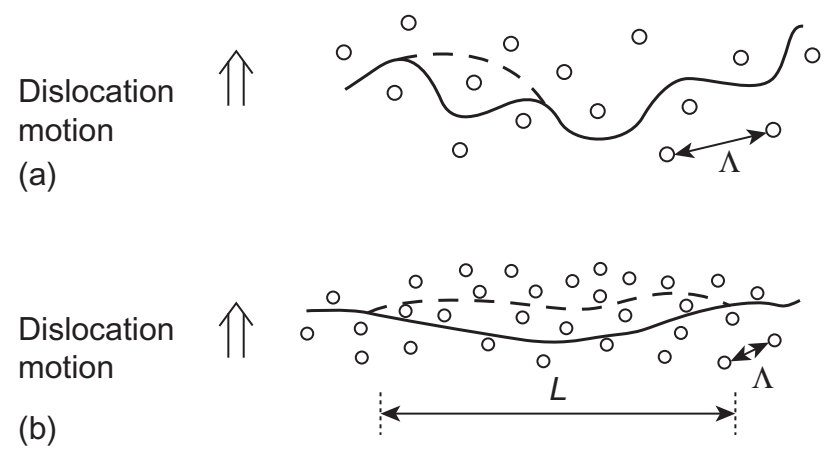

*图 10.19：强弥散力使位错围绕各个障碍形成明显起伏；弱弥散力下，长为 $L$ 的线段共同前进。实线与虚线表示前进前后的位错位置，“Dislocation motion”为位错运动方向，$\Lambda$ 为障碍特征间距。*

关键困难在于确定集体响应长度 $L$。本模型假设运动线段近似圆弧，$R\gg L$，且相邻低能构型之间的前进距离约为 $\Lambda$；用弓高约为 $\Lambda/2$ 表示单个构型的弯曲程度，则

$$
\frac{\Lambda}{2}
=R-\sqrt{R^2-(L/2)^2}
\simeq\frac{L^2}{8R}.
\tag{10.41}
$$

这里的曲率由外加应力决定，$R\simeq Gb/(2\tau)$，从而 $L^2\simeq2Gb\Lambda/\tau$。代入式（10.40）得到

$$
\tau_{\mathrm{diff}}^{\mathrm{weak}}
\simeq\frac{2}{\pi^{4/3}}\tau_i
\left(\frac{\tau_i\Lambda}{Gb}\right)^{1/3}.
\tag{10.42}
$$

这体现了**集体钉扎**（collective pinning）：许多弱障碍通过统计涨落共同阻碍一段位错。对相关长度、作用力分布和位错形状作不同假设，会改变数值系数，甚至改变幂指数。

### 10.6.2 局域作用力：脱钉角与规则阵列

局域力模型把障碍间的位错视为自由弯曲线段，将每个障碍的阻力简化为作用在钉扎点上的力 $K$。在剪应力 $\tau$ 下，障碍间位错弯曲为半径约 $Gb/(2\tau)$ 的圆弧。

设障碍处两侧线张力与前进方向各成角 $\phi$，即两条切线之间的夹角为 $2\phi$。力平衡给出

$$
K=2\Gamma\cos\phi
\simeq Gb^2\cos\phi.
\tag{10.43}
$$

若沿位错的有效障碍间距为 $l$，每个障碍分担的驱动力为 $\tau bl$。当该力达到最大障碍力 $K_{\max}$ 时脱钉。对规则方形阵列，流动应力为

$$
\tau_{\mathrm{loc}}
=\frac{K_{\max}}{bl}
=\frac{2\Gamma}{bl}\cos\phi_c
\simeq\frac{Gb}{l}\cos\phi_c,
\tag{10.44}
$$

其中

$$
\phi_c=\arccos\!\left(\frac{K_{\max}}{2\Gamma}\right).
$$

在这一可脱钉的线张力模型中，$0\le K_{\max}/(2\Gamma)\le1$。弱障碍对应 $\phi_c\simeq\pi/2$、位错近似平直；强障碍对应 $\phi_c\to0$、位错在障碍附近高度弯曲。若障碍切过阻力超过线张力可平衡的范围，便应比较绕过等替代机制，不能继续令反余弦的参数超过 $1$。

### 10.6.3 Friedel 统计与随机局域障碍

随机阵列中，沿位错实际起钉扎作用的障碍间距 $l$，通常不等于由滑移面障碍面密度定义的间距 $\Lambda$。若面密度为 $n_A$，定义 $\Lambda^2=1/n_A$。

对于弱局域障碍，**Friedel 关系**（Friedel relation）采用如下稳态假设：位错每脱离一个障碍，向前扫过的区域平均使它再遇到一个新障碍。因此，平均扫过面积约为 $\Lambda^2$。

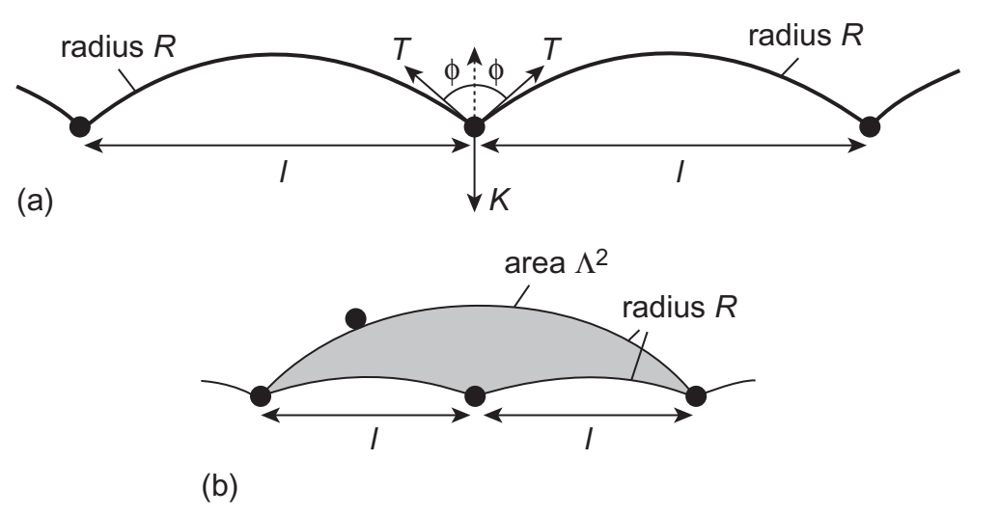

*图 10.20：（a）障碍阻力 $K$ 与两侧线张力平衡；图中 $T$ 对应正文的 $\Gamma$，“radius $R$”为曲率半径。（b）从中间障碍脱钉后，长圆弧与原来两段短圆弧之间的阴影面积为平均扫过面积 $\Lambda^2$，用于计算有效钉扎间距 $l$。*

在 $l\ll R$ 的小挠度近似下，大圆弓形面积减去两个小圆弓形面积，得到

$$
\Lambda^2
\simeq\frac{2l^3}{3R}-\frac{l^3}{6R}
=\frac{l^3}{2R}
\simeq\frac{l^3\tau}{Gb}.
\tag{10.45}
$$

结合式（10.44），有

$$
l\simeq\frac{\Lambda}{\sqrt{\cos\phi_c}},
$$

从而弱局域障碍的流动应力为

$$
\tau_{\mathrm{loc}}^{\mathrm{weak}}
\simeq\frac{Gb}{\Lambda}
(\cos\phi_c)^{3/2}.
\tag{10.46}
$$

弱障碍使 $l\gg\Lambda$：近乎平直的位错只需与稀疏的一部分障碍保持有效接触。对随机强障碍，位错优先通过障碍间距较大的较低阻力路径；书中采用的统计修正给出

$$
\tau_{\mathrm{loc}}^{\mathrm{strong}}
\simeq0.84\frac{Gb}{\Lambda}
(\cos\phi_c)^{3/2}.
\tag{10.47}
$$

强障碍极限下 $\cos\phi_c\simeq1$，因此应力尺度为 $Gb/\Lambda$。式（10.47）的系数 $0.84$ 是相应随机阵列模型的结果；不能把式（10.45）的小挠度推导直接视为强障碍情况下的严格证明。

---

## 10.7 合金的强度（Strength of Alloys）

### 10.7.1 固溶、析出与时效组织

元素 B 在元素 A 晶格中的平衡溶解度通常有限。低于相应温度的**固溶度极限**（solubility limit）时，分散在基体中的溶质原子可阻碍位错，产生**固溶强化**（solid-solution strengthening）。典型例子包括单相 $\alpha$ 黄铜中的 Zn，以及 Al–Mg 系合金中的 Mg。

当溶质含量超过固溶度极限，过量溶质可形成富溶质颗粒或化合物析出相。由于固溶度随温度变化，合适的合金可以经历

$$
\text{高温固溶}
\longrightarrow\text{快速淬火形成过饱和固溶体}
\longrightarrow\text{时效析出与后续粗化}.
$$

以原资料的 Al–Cu 示意相图为例，Cu 在 Al 中的固溶度在约 $550\ ^\circ\mathrm C$ 接近 $6\ \mathrm{wt}\%$，室温则低于 $0.1\ \mathrm{wt}\%$。含约 $4\ \mathrm{wt}\%$ Cu 的合金在适当高温可形成固溶体；缓慢冷却使平衡第二相析出，快速淬火则可暂时保留过饱和状态。随后在较低温度时效，形成细小析出物；继续保温会使它们长大、粗化，平均数量减少、间距增加。

Al–Cu 合金的代表性析出演变为

$$
\text{过饱和固溶体}
\longrightarrow\text{GP 区}
\longrightarrow\theta''
\longrightarrow\theta'
\longrightarrow\theta\text{（}\mathrm{Al_2Cu}\text{）}.
$$

这里的 **GP 区**（Guinier–Preston zones）是与基体共格的溶质富集区。原资料以位于 Al 的 $\{100\}$ 晶面、直径约 $10\ \mathrm{nm}$ 的富 Cu 薄片说明其结构。Cu 原子较小，使附近基体发生共格应变；随着颗粒长大，形成共格 $\theta''$、部分界面具有错配位错的半共格 $\theta'$，最终形成通常更粗大的平衡 $\theta$ 相。具体析出路径及各阶段是否明显出现，取决于合金成分和热处理条件。

析出物的数量、尺寸、间距、共格性和有序结构共同控制强度。强度通常先随时效增加，达到峰值后因粗化等变化而下降；后者称为**过时效**（overaging）。这一规律是 2000 系 Al–Cu、6000 系 Al–Mg–Si 和 7000 系 Al–Zn 基时效强化铝合金的组织设计基础。

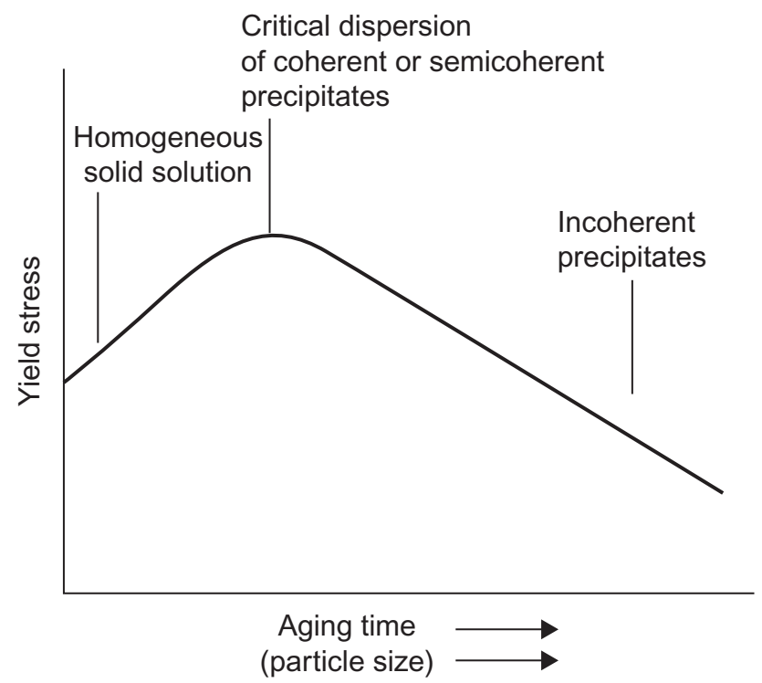

*图 10.23：纵轴为屈服应力（Yield stress），横轴为时效时间及随之增加的颗粒尺寸（Aging time/particle size）。均匀固溶体（Homogeneous solid solution）经时效形成有效的共格或半共格析出物分布时达到高强度；进一步形成粗大的非共格析出物（Incoherent precipitates）后强度下降。这是一幅机制示意曲线，不意味着所有合金具有同一峰值组织。*

### 10.7.2 固溶强化：浓度、失配与温度

设 $c$ 为溶质的**原子分数**，$\delta$ 为前节定义的尺寸失配参数。以下数量级模型用 $b$ 表示原子间距的尺度，并近似取原子体积为 $b^3$；这不是所有晶格中原子体积与伯格斯矢量模之间的精确恒等式。

在弥散力模型中，溶质体密度约为 $c/b^3$，三维平均间距为

$$
\Lambda\simeq\frac b{c^{1/3}}.
\tag{10.48}
$$

对每个溶质周围尺度约为 $\Lambda$ 的区域作平均，内部应力的估计为

$$
\tau_i\simeq G|\delta|c\ln(1/c).
\tag{10.49}
$$

在局域力模型中，主要计入紧邻滑移面的两层原子中的溶质。其障碍面密度约为 $2c/b^2$，因此

$$
\Lambda\simeq\frac b{(2c)^{1/2}}.
\tag{10.50}
$$

**式（10.48）与式（10.50）的 $\Lambda$ 属于不同模型，不能混用**：前者来自三维体密度，后者来自滑移面附近的障碍面密度。由溶质—位错相互作用力估计

$$
K_{\max}\simeq\frac15Gb^2|\delta|.
\tag{10.51}
$$

通常单个置换溶质原子的作用不足以满足强障碍条件，因此应比较弱弥散力式（10.42）与弱局域力式（10.46）。在采用局域障碍主导的稀固溶体近似时，得到

$$
\tau_{\mathrm{loc}}^{\mathrm{weak}}
\simeq\sqrt2\,Gc^{1/2}
(\cos\phi_c)^{3/2},
\qquad
\cos\phi_c\simeq\frac{K_{\max}}{Gb^2}
\simeq\frac{|\delta|}{5}.
\tag{10.52}
$$

这一模型预言固溶强化应力随 $c^{1/2}$ 增加，也随尺寸失配增大而上升。例如，取 $|\delta|\simeq0.15$、$c=0.10$，有 $\cos\phi_c\simeq0.03$，按该局域模型计算的强化应力约为 $G/400$。这是一项数量级估计；尤其在浓度较高时，是否仍能忽略弥散项及溶质间关联，需要另行检验。

溶质障碍的能垒量级为 $\Delta F\sim bK_{\max}$，因此升温可使位错借助热激活越过障碍，降低流动应力的热激活部分。原资料用 10.2 节式（10.10）的形式描述这一效应，取 $p\simeq2/3$、$q\simeq3/2$，以及上述能垒尺度；这些参数对应所采用的力—位移模型。

实际固溶体还存在有限作用范围、不同形状的力—距离曲线以及多种溶质相互作用。因此，$c^{1/2}$ 不是普遍定律；其他模型可得到 $c^{2/3}$，更复杂的合金也可能偏离简单幂律。若两类障碍分别产生强化应力 $\tau_1$、$\tau_2$，原资料引用的模拟可用

$$
\tau\simeq\sqrt{\tau_1^2+\tau_2^2}
\tag{10.53}
$$

描述两者共同存在时的阻力。它是适用于相应障碍组合的近似叠加规律，不应自动用于所有强化机制。

### 10.7.3 析出强化：先区分作用范围与通过机制

位错遇到析出物时，可选择**切过**（cutting/shearing）颗粒，或在颗粒之间弯曲并**绕过**（bypassing）。对于可竞争的两条通过路径，位错倾向于选择所需应力较低的机制；同时，它还可能必须克服共格析出物在周围基体中产生的内部应力。

沿用原书的分步估计，局域通过阻力取切过与绕过所需应力中的较小者，再与弥散共格阻力比较，取控制运动的较大者：

$$
\tau_{\mathrm{local,eff}}
\simeq\min(\tau_{\mathrm{cut}},\tau_{\mathrm{Orowan}}),
\qquad
\tau_{\mathrm{flow}}
\simeq\max(\tau_{\mathrm{diff}},\tau_{\mathrm{local,eff}}).
$$

这用于说明“可替代路径取较易者、必须经历的阻碍由较难者控制”的物理逻辑；实际应力场与通过路径会相互耦合，不能将此视为所有析出强化问题的精确合成公式。

以下改用 $c$ 表示析出相的**体积分数**，而不再是上一小节的溶质原子分数；$N$ 表示每个近似球形析出物包含的原子数，颗粒体积约为 $Nb^3$。

### 10.7.4 共格应变产生的弥散阻力

在球形、尺寸相近的共格析出物模型中，内部应力仍采用式（10.49）的尺度估计，而三维间距变为

$$
\Lambda\simeq b\left(\frac Nc\right)^{1/3}.
\tag{10.54}
$$

早期颗粒较小，满足弱弥散力条件。将式（10.49）、（10.54）代入式（10.42），有

$$
\tau_{\mathrm{diff}}^{\mathrm{weak}}
\simeq0.4N^{1/9}G|\delta|^{4/3}
c^{11/9}[\ln(1/c)]^{4/3}.
\tag{10.55}
$$

因此在固定 $c$、$\delta$ 的比较下，颗粒长大会使这一阻力缓慢上升。当颗粒及其间距增大，使位错能围绕单个障碍明显弯曲，即 $R\sim\Lambda$，转入强弥散力情形：

$$
\tau_{\mathrm{diff}}^{\mathrm{strong}}
\simeq\frac2\pi G|\delta|c\ln(1/c).
\tag{10.56}
$$

此近似式不再显含 $N$。若随后通过界面错配位错及共格性丧失充分松弛失配应变，共格应力的强化贡献会显著减弱。原书将充分松弛极限近似为 $\tau_i\to0$；这不等于任何非共格颗粒周围都严格没有残余应力。

### 10.7.5 析出物的切过阻力

局域作用模型需要滑移面上的颗粒截面密度。对于随机截取的球形颗粒，截面面积分数等于体积分数 $c$，平均截面面积为

$$
\overline A
=\left(\frac\pi6\right)^{1/3}(Nb^3)^{2/3}.
$$

由 $c=\overline A/\Lambda^2$ 得

$$
\Lambda
=\left(\frac\pi6\right)^{1/6}
\frac{bN^{1/3}}{c^{1/2}}
\simeq\frac{bN^{1/3}}{c^{1/2}}.
\tag{10.57}
$$

这里的 $\Lambda$ 是平面障碍间距；其 $c^{-1/2}$ 标度与式（10.54）的三维间距不同，而实际有效钉扎距离 $l$ 仍须由 Friedel 统计确定。

切过颗粒的最大阻力 $K_{\max}$ 可来自不同机制：

- 对有序析出物，切过可能形成**反相畴界**（antiphase boundary, APB）；
- 析出物内部的 Peierls 阻力可能较高；
- 切过后颗粒界面形成高度约为 $b$ 的台阶，需要额外界面能。

对于前两类机制，原资料取 $K_{\max}$ 与颗粒直径 $bN^{1/3}$ 成正比，并给出示例量级

$$
K_{\max}\sim\frac{Gb^2N^{1/3}}{100},
\qquad
\cos\phi_c\sim\frac{N^{1/3}}{100}.
$$

在该弱障碍估计仍适用时，将其与式（10.57）代入式（10.46），得到

$$
\tau_{\mathrm{loc}}^{\mathrm{weak}}
\simeq\frac1{1000}N^{1/6}Gc^{1/2}.
\tag{10.58}
$$

固定体积分数时，颗粒长大会提高切过阻力。书中用 $N\lesssim10^5$ 描述这一示例参数下的弱障碍量级范围；实际应以 $K_{\max}/(2\Gamma)$ 判断，不能把该原子数当作所有合金的强弱障碍分界。

### 10.7.6 Orowan 绕过、过时效与弥散强化

当切过阻力变得很大，位错可能更容易在颗粒之间弓出。随着外加应力增加，颗粒附近的位错线段相互靠近、相遇，位错主体继续前进，在颗粒周围留下闭合位错环。这就是 **Orowan 绕过机制**（Orowan bypassing mechanism）。

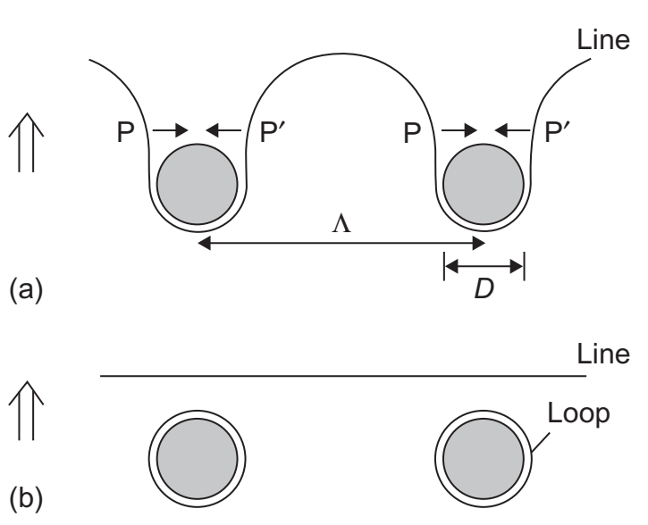

*图 10.24：（a）位错在颗粒间弓出，$P$ 与 $P'$ 附近线段靠近并相遇；（b）主体位错继续前进，颗粒周围留下 Orowan 环。Line 为位错线，Loop 为遗留位错环，$\Lambda$ 为颗粒中心间距，$D$ 为滑移面上的颗粒截面直径。*

在强障碍极限 $\cos\phi_c\simeq1$ 下，由式（10.47）和（10.57）得到 **Orowan 应力**（Orowan stress）：

$$
\tau_{\mathrm{Orowan}}
\simeq0.84\frac{Gb}{\Lambda}
\simeq0.84N^{-1/3}Gc^{1/2}.
\tag{10.59}
$$

这一结果忽略颗粒尺寸相对于间距的影响。若颗粒不够小，应采用位错能够自由弓出的表面间距 $\lambda\simeq\Lambda-D$，于是

$$
\tau_{\mathrm{Orowan}}
\simeq0.84\frac{Gb}{\Lambda-D}.
$$

Orowan 环还会改变后续位错所感受到的有效间距及内部应力，从而影响后续强化；其交滑移及演变可与第 7 章对照。

据此可理解典型时效曲线：

| 阶段 | 主要组织与位错机制 | 固定体积分数下的主要趋势 |
| --- | --- | --- |
| 欠时效（underaging） | 小而可切过的析出物；共格应变和局域切过阻力均可能重要 | 式（10.55）、（10.58）随 $N$ 增大而上升 |
| 峰值附近 | 颗粒尺寸、间距与通过机制达到较强阻碍的组合 | 可能接近切过—绕过转变；若共格应变持续存在，也可能由式（10.56）控制 |
| 过时效 | 颗粒粗化、间距增大，常伴随共格性降低；绕过更重要 | Orowan 阻力随 $N^{-1/3}$ 下降 |

原书强调一种共格应变较强的情况：颗粒长大后，式（10.56）的阻力可能大于局域绕过阻力，因而强度在共格性丧失前主要受基体内应力控制。具体哪种机制占主导，仍取决于失配、反相畴界能、颗粒形貌及共格性；峰值强度并不普遍对应同一种组织。

对于通常的粗大非共格析出物，切过往往代价很高，因而以绕过为主；“非共格”本身并不是绝对不能切过的充分条件。除时效初期的小团簇外，许多析出障碍的激活能垒可达 $Gb^3$ 量级，远大于常温下的 $k_{\mathrm B}T$，故在相应温区内其强化贡献常近似**非热激活**（athermal）。高温下仍须考虑弹性模量变化、粗化及攀移等机制。

**弥散强化**（dispersion strengthening）也是利用难切过的第二相颗粒阻碍位错，例如基体中的稳定氧化物颗粒；在以滑移绕过为主的条件下，同样可用 Orowan 应力描述。

最后，不能仅凭临界位错形状就断言发生了不可切过颗粒的 Orowan 绕过。原书的铁中孔洞原子模拟表明，位错从孔洞脱钉时也可形成近似的高度弯曲构型：进入孔洞使位错弹性及核心能降低，而离开孔洞需要在孔洞表面形成台阶，两者共同提供强阻力。该孔洞阻力还会随温度升高而下降，说明障碍机制必须结合能量变化与实际运动过程判断。

---

## 10.8 加工硬化（Work Hardening）

### 10.8.1 从位错相互作用到 Taylor 关系

前述机制主要讨论位错通过给定障碍时需要多大应力。实际塑性变形中，位错不断增殖、相互作用并改变排列，障碍的数量和强度也随应变演化。因此，使塑性变形继续进行所需的流动应力通常逐渐升高，这一现象称为**加工硬化**或**应变硬化**（strain hardening）。

Taylor 的早期模型将流动应力归因于位错克服彼此的弹性相互作用。设两条位错所在平行滑移面的特征间距为 $l$，使其相互通过所需的应力可写为

$$
\tau=\alpha\frac{Gb}{l},
\tag{10.60}
$$

其中 $\alpha$ 是由位错性质和排列决定的无量纲系数，原模型取约 $0.1$ 的量级。此处的 $\tau$ 指位错相互作用产生的应力贡献；真实材料中还可能存在晶格摩擦、固溶强化等贡献。

若位错网络的特征间距为 $l$，其位错密度满足

$$
\rho\simeq l^{-2},
$$

便得到熟悉的平方根关系

$$
\tau\simeq\alpha Gb\sqrt{\rho}.
$$

这里 $\rho$ 为单位体积内的位错线总长度，单位为 $\mathrm{m^{-2}}$；它与 Orowan 应变率关系中的**可动位错密度** $\rho_m$ 不能混用。

进一步假设产生的位错平均移动固定距离 $x$ 后被储存，以 $\gamma\simeq\rho bx$ 估算累积塑性剪应变，则

$$
\tau=\alpha G\left(\frac{b}{x}\right)^{1/2}\gamma^n,
\qquad n=\frac12.
\tag{10.61}
$$

原教材此处用 $\varepsilon$ 表示剪应变，本笔记统一改记为 $\gamma$。式（10.61）给出抛物线式硬化趋势，但依赖于固定平均滑移距离等强假设。真实位错常以群体形式形成滑移带，变形本身又会产生新障碍并改变平均自由程，因此不能用这一式子代替完整的加工硬化理论。

### 10.8.2 单晶加工硬化的三个典型阶段

定义加工硬化率

$$
\theta=\frac{d\tau}{d\gamma}.
$$

许多单晶，特别是取向适当的 FCC 金属单晶，表现出下列三阶段行为。各阶段的长短取决于晶体结构、取向、纯度和温度；并非所有试样都会清楚地经历全部三个阶段。

| 阶段 | 应力–应变特征 | 主要位错过程 |
| --- | --- | --- |
| I：易滑移阶段（easy glide） | 硬化率低，近似线性；教材给出的典型量级为 $\theta_{\mathrm I}\sim10^{-4}G$ | 主要滑移系占主导，位错能滑移较长距离；异号刃型位错形成偶极子、多极子 |
| II：近线性硬化阶段 | 硬化率明显升高；教材示例为 $\theta_{\mathrm{II}}\sim(3\text{–}10)\theta_{\mathrm I}$ | 次要滑移系大量启动，森林交互作用、位错结和塞积增多，滑移距离缩短 |
| III：动态回复阶段（dynamic recovery） | 硬化率随应变增加而降低，流动应力仍可继续上升 | 交滑移促进异号位错湮灭和重排；较高温度下攀移也可参与 |

这些硬化率是原教材给出的代表性量级，不是跨材料的固定常数。BCC 金属和以柱面滑移为主的 HCP 金属可在适当中温范围表现出类似阶段；以基面滑移强烈占优的 HCP 单晶，其阶段 I 可能持续很长。

**阶段 I：长程滑移与偶极子储存。** 最有利滑移系上的位错源率先启动，位错移动距离可达到约 $100\ \mu\mathrm m$ 乃至试样尺寸的量级，多条位错共同形成表面滑移线。位于不同平行滑移面上的异号刃型位错相互吸引，可组成偶极子；多个偶极子构成**位错多极子**（dislocation multipole）。原图 10.25 中，两条相隔 $h$ 的平行滑移面上，位错源 $S_A$、$S_B$ 发出的异号位错朝相反方向移动并形成这类组合。

在易于交滑移的晶体中，异号螺型位错可通过交滑移相遇并湮灭，因此变形后储存的螺型位错可能较少。低层错能使扩展位错收缩困难，抑制该过程；在过时效或弥散强化材料中，螺型位错还可能与棱柱环相互作用而形成螺旋形构型。偶极子的部分应力场相互抵消，有助于理解阶段 I 的低硬化率，但仅凭偶极子形成仍不能完整预测其储存量和稳定性。

**阶段 II：次要滑移、森林障碍与塞积。** 当外加应力和内部应力使次要滑移系达到其临界分切应力时，阶段 I 结束。主、次滑移系的位错密度可达到相近量级，即使主要塑性应变仍由主滑移系承担。两类位错相交和反应，形成位错结、锁及其他障碍。滑移线数量增多而长度缩短，TEM 可观察到主、次位错及其反应产物聚集成片状位错结构。

障碍使主滑移位错发生塞积，其内部应力又促进进一步的次要滑移；新位错在相对容易变形的区域产生，随后再次受阻。由此产生的非均匀位错结构和内应力促进快速硬化，不能将其等同于第 9 章中能够有效屏蔽远场的理想无限周期位错墙。

**阶段 III：位错储存与动态回复竞争。** 螺型位错通过交滑移离开原滑移面，增加异号位错相遇和湮灭的机会；温度更高时，刃型位错攀移和重排也更容易发生，可逐渐形成胞状结构或小角度界面。这些过程在变形进行时释放部分储存能，称为动态回复。

动态回复消耗已经储存的位错并降低部分内应力，但位错仍在增殖，因而阶段 III 的总位错密度不一定随应变下降，硬化率降低也不等于应力立即下降。对于 FCC 晶体，较高层错能和较高温度通常有利于交滑移，使阶段 III 更早出现；具体转变应力还取决于应变率和位错构型。

### 10.8.3 森林位错、割阶及热激活贡献

位错导致的流动阻力可继续分解为近似非热激活部分 $\tau_G$ 和可由热激活帮助克服的部分 $\tau^*$。由弹性应力场和位错线能控制的应力具有尺度关系

$$
\tau_G\propto\frac{Gb}{l}.
\tag{10.62}
$$

其中 $l$ 取决于障碍机制：对平行滑移面上的异号位错相互通过，$l$ 可对应滑移面间距 $h$；对穿过滑移面的**森林位错**（forest dislocations），$l$ 可对应森林交点的平均间距 $l_f$。这里“近似非热激活”不表示完全不随温度变化，因为 $G$ 和位错组织本身仍可能变化。

若森林排列近似随机，则在忽略取向几何系数时

$$
l_f^{-2}\simeq\rho_f,
\qquad
\tau\propto Gb\sqrt{\rho_f}.
\tag{10.63}
$$

森林密度 $\rho_f$ 是相对于正在活动的滑移系定义的障碍密度，不应直接用可动密度 $\rho_m$ 代替。森林作用主要包含下列三类贡献：位错结的解锁、相交时形成割阶，以及带割阶位错运动时产生点缺陷。

**形成割阶的应力。** 设形成一个割阶所需能量为 $E_j$。在简单模型中，长度为 $l_f$ 的位错段受单位长度力 $\tau b$，向前移动约 $b$，外力做功为

$$
E_j\simeq\tau b^2l_f.
$$

把割阶视为长度约 $b$ 的位错段，估算 $E_j\simeq0.2Gb^3$，无热激活时便有

$$
\tau_j^*(0)\simeq0.2\frac{Gb}{l_f}.
\tag{10.64}
$$

**割阶攀移产生空位的应力。** 对第 7 章讨论的非保守割阶运动，若每次推进需要形成空位，取空位形成能的教材估算

$$
E_f^v\simeq8k_{\mathrm B}T_m\sim0.1Gb^3,
$$

则对应的零温应力量级为

$$
\tau_v^*(0)\simeq0.1\frac{Gb}{l_f}.
\tag{10.65}
$$

$T_m$ 为熔点；以上能量系数用于说明量级，并非所有材料都严格取相同数值。两种短程机制均可写成

$$
\tau^*(0)=\alpha Gb\sqrt{\rho_f},
\qquad \alpha\sim0.1\text{–}0.2.
\tag{10.66}
$$

式（10.64）和（10.65）的下标用于区分机制，原教材均记为 $\tau^*(0)$。实际总阻力是否直接相加，应根据控制过程判断，不能把两个估算系数无条件相加。升温可通过热激活降低这些短程障碍的有效应力贡献。

对于晶格摩擦较小的材料，森林相互作用的近似非热激活部分常占重要地位；但在 BCC 晶体或某些固溶体中，Peierls 阻力或溶质障碍造成的热激活应力，在低温到中温也可能超过 $\tau_G$。

### 10.8.4 多滑移系的相互作用与位错组织演化

FCC 晶体中，不同滑移系间可发生共线相互作用，并形成 Lomer–Cottrell 锁、Hirth 锁和可动位错结。对滑移系 $i$，这些位错相互作用贡献可组合为

$$
\tau^{(i)}
=Gb\sqrt{\sum_j a^{ij}\rho^{(j)}}.
\tag{10.67}
$$

其中 $\rho^{(j)}$ 为滑移系 $j$ 的位错密度，$a^{ij}$ 是衡量 $i$、$j$ 两滑移系相互作用强度的无量纲系数。该式表示位错贡献，不自动包括晶格摩擦和溶质等全部阻力。教材引用的位错动力学计算中，共线相互作用较强，$\sqrt{a^{ij}}$ 约为 $0.8$，其他若干相互作用约为 $0.2$–$0.4$；这些数值应与具体模型条件一起使用。

式（10.67）描述“给定位错状态需要多大应力”，却没有直接给出位错状态如何随应变改变。以单一有效森林密度为例，在 $\alpha$、$G$、$b$ 固定时，

$$
\theta
=\frac{d\tau}{d\gamma}
=\frac{\alpha Gb}{2\sqrt{\rho_f}}
\frac{d\rho_f}{d\gamma}.
$$

因此，要预测硬化率，还必须描述位错增殖、储存、湮灭、平均滑移距离和组织重排。位错密度相同的两个组织，也可能因为相互作用类型和空间分布不同而具有不同的流动阻力。

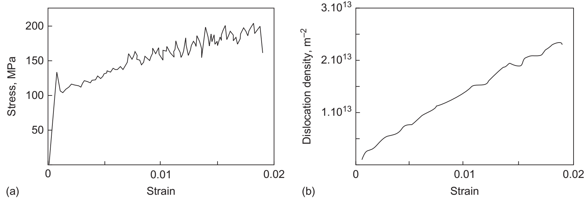

*图 10.26：钼单晶的位错动力学模拟。（a）应力–应变曲线；（b）位错密度–应变曲线。Stress 为应力，单位 MPa；Strain 为应变；Dislocation density 为位错密度，单位 $\mathrm{m^{-2}}$。原图引自 Bulatov 与 Cai（2006）。*

教材所述模拟采用约 $10\times10\times10\ \mu\mathrm m^3$ 的钼单晶体积，由位错运动计算塑性应变，再用总应变减去塑性应变得到弹性应变，并由弹性关系求应力。图中屈服后应力和位错密度总体升高，展示了增殖与加工硬化的联系。初始屈服跌落与模型中偏向螺型的初始位错排列、较大的螺型位错运动阻力及屈服时可动位错密度迅速增加有关，不能仅凭曲线形状将其归因于溶质气团脱钉。

---

## 10.9 多晶体的变形（Deformation of Polycrystals）

### 10.9.1 晶粒取向、晶界与变形协调

多晶体的应力–应变曲线不能简单视为不同取向单晶曲线的平均，原因在于晶粒之间存在明显的力学约束：

- 各晶粒的取向不同，同一外载在其滑移系上产生的分切应力不同，因此不同晶粒先后开始塑性变形。
- 晶界阻碍或改变位错的传播，限制滑移距离，使多晶中通常难以出现单晶那样明显的阶段 I 易滑移区。
- 晶界附近的位错塞积产生内部应力，可帮助相邻晶粒中的位错源启动。
- 相邻晶粒必须维持接触并协调形状变化，否则可能产生应力集中、空洞或裂纹。

因此，宏观屈服反映的是大量晶粒协同塑性变形的建立，而不要求每个晶粒在同一外应力下同时达到相同的屈服状态。

### 10.9.2 五个独立滑移系与 Taylor 因子

在小应变、近似体积不变的塑性变形中，对称应变张量原有六个独立分量，去掉体积应变这一自由度后，任意形状变化由五个独立分量描述。若要求晶粒仅通过滑移实现任意这样的形状变化，就需要至少五个能够独立贡献塑性应变的滑移系，这称为**von Mises 条件**。

“独立”指某一滑移系产生的应变不能由其他已选滑移系的线性组合获得，并不等于晶体中所有几何上不同的滑移系都相互独立。

FCC 的 $12$ 个 $\{111\}\langle110\rangle$ 滑移系可提供所需的五个独立分量；BCC 的滑移几何也允许满足此条件，但实际能否启动仍取决于位错运动阻力。只依靠基面滑移的 HCP 晶体虽有三个基面滑移系，却仅有两个独立的应变模式，因而难以协调任意多晶变形；非基面滑移和孪生能够提供额外的协调途径。

这一条件建立在特定的均匀变形、滑移主导假设上，不是“满足五个滑移系就必定具有高塑性”的充分判据；断裂、织构、位错迁移率及其他变形机制仍然重要。

对于由单一滑移系开始屈服的单晶，Schmid 定律可写为

$$
\sigma_y=m\tau_c,
\qquad
m=\frac{1}{|\cos\phi\cos\lambda|}.
\tag{10.68}
$$

$\phi$ 为拉伸轴与滑移面法向的夹角，$\lambda$ 为拉伸轴与滑移方向的夹角；$\tau_c$ 为临界分切应力。这里沿用原教材的 $m$，它是 **Schmid 因子的倒数**，Schmid 因子本身是 $|\cos\phi\cos\lambda|$。

对多晶体，可用

$$
\sigma_y=M\tau_c
\tag{10.69}
$$

建立宏观拉伸屈服应力与滑移阻力之间的近似联系。$M$ 为 **Taylor 因子**（Taylor factor），反映取向分布和多滑移协调所需的塑性功。随机取向 FCC、BCC 多晶常取 $M\approx3$ 的量级，但它不是简单平均单晶 Schmid 因子得到的普适常数，织构和采用的晶粒约束模型均会改变其数值。

### 10.9.3 Hall–Petch 关系及塞积解释

在成分、位错组织和试验条件基本相同、主要改变平均晶粒尺寸 $d$ 的一系列试样中，屈服应力常近似满足 **Hall–Petch 关系**：

$$
\sigma_y=\sigma_0+k_y d^{-n},
\qquad n\simeq\frac12.
\tag{10.70}
$$

$\sigma_0$ 是在这些固定条件下与晶粒尺寸无关的基准应力，$k_y$ 表示晶粒细化的强化系数。当 $n=1/2$ 时，$k_y$ 的单位为应力乘长度的平方根。一定塑性应变处的流动应力也可能具有类似的晶粒尺寸关系，但其拟合参数不必与初始屈服相同。

在晶界扩散或滑动尚未主导的常规低温变形条件下，细化晶粒往往提高强度。一种经典解释是：晶粒 1 中位错源 $S_1$ 发出的位错在晶界前塞积，头部应力放大并推动晶粒 2 中的源 $S_2$ 启动，这对应原图 10.27 的物理过程。

采用第 9 章的理想单端塞积模型，并令塞积长度近似为 $d$，有

$$
n_{\mathrm{pu}}\simeq\frac{d\tau}{A},
\qquad
\tau_1=n_{\mathrm{pu}}\tau,
$$

故

$$
\tau_1=\frac{d}{A}\tau^2.
\tag{10.71}
$$

这里 $n_{\mathrm{pu}}$ 为塞积位错数，避免与式（10.70）的指数 $n$ 混淆；$A$ 是具有“应力乘长度”量纲的弹性系数。按第 9 章同样的单端塞积和长度约定，螺型位错取 $A=Gb/\pi$，刃型取 $A=Gb/[\pi(1-\nu)]$。若实际塞积长度只是晶粒尺寸的一部分，相应几何系数也应计入。

设启动邻晶位错源所需的等效头部应力阈值为 $\tau_1^*$，把取向及应力传递几何包含在该阈值中。令 $\tau_1=\tau_1^*$，可得

$$
\tau_y=\left(\frac{A\tau_1^*}{d}\right)^{1/2}.
$$

再将分切应力换算为拉伸应力：

$$
\sigma_y=k_yd^{-1/2},
\qquad
k_y=m\left(A\tau_1^*\right)^{1/2}.
\tag{10.72}
$$

式（10.72）中的 $m$ 为这一简化几何模型的应力换算因子；推广到多晶平均时，应使用相应的取向约束模型。加入与晶粒尺寸无关的基准应力 $\sigma_0$，便得到式（10.70）的常见形式。

> **系数约定**：原教材在式（10.71）后另写 $A\simeq Gb/(2\pi)$，与第 9 章式（9.28）的具体单端塞积系数并不相同。本笔记按第 9 章统一定义；该尺度推导的核心是 $\tau_1\propto d\tau^2$ 和 $\sigma_y-\sigma_0\propto d^{-1/2}$，不能将不同长度或几何约定下的数值系数直接混用。

塞积模型并非 Hall–Petch 关系的唯一解释，晶界位错、位错源和变形协调等模型也可给出相似的晶粒尺寸依赖。因此，实验拟合出 $d^{-1/2}$ 并不足以单独证明存在理想的长位错塞积。

### 10.9.4 晶粒细化的适用范围

不能把式（10.70）无限外推至任意小的 $d$。在纳米晶粒中，晶内可容纳的位错源和塞积长度受到严重限制；短 Frank–Read 源的启动应力很高，其他机制可能在它启动前就已承担变形。例如，晶界滑动、晶界迁移，以及晶界发射或吸收位错都可能变得重要。

因此，随晶粒继续减小，强化趋势可能减弱、趋于饱和，某些材料和试验条件下还可能出现反向趋势。教材讨论的“约 $100\ \mathrm{nm}$ 以下”是进入纳米晶研究范围的量级提示，不是 Hall–Petch 失效的统一临界尺寸。具体变化取决于材料、晶界结构、温度、应变率和初始组织。

---

## 10.10 位错与断裂（Dislocations and Fracture）

### 10.10.1 裂纹扩展与塑性松弛的竞争

表面不规则处和裂纹尖端具有很强的应力集中，可促进位错产生。裂纹是否在发生显著塑性变形前扩展，取决于两类过程的竞争：一类是裂纹前方原子键断裂、解理面形成；另一类是位错形核或位错源启动，以及随后发生的滑移、增殖和塑性松弛。

若裂尖附近能及时建立足够的塑性流动，裂纹会发生钝化，裂尖应力也可被部分屏蔽；若位错难以产生或来不及运动，解理可能先发生。因此，“存在位错”并不足以保证韧性，还必须考虑其产生速率、迁移能力和加载时间尺度。

部分陶瓷、半导体及难熔金属随温度升高会出现**脆–韧转变**（brittle-to-ductile transition）。硅等材料的转变可非常陡峭，其他材料则可能在较宽温区内逐渐过渡。原教材给出的某些渐变型转变宽度约为 $50$–$100\ \mathrm K$，并非所有材料通用。裂纹前沿可用位错源的数量及分布，也是决定转变是否平缓的因素。

### 10.10.2 应力强度因子与位错屏蔽

在尖锐裂纹的线弹性描述中，用**应力强度因子**（stress intensity factor）表征裂尖奇异应力场。对于垂直于拉应力 $\sigma$ 的张开型裂纹，

$$
K=Y\sigma\sqrt{\pi c}.
\tag{10.73}
$$

$Y$ 为无量纲几何系数，原教材记为 $\alpha$，此处改记 $Y$ 以免与加工硬化系数混淆；$c$ 为与该几何解匹配的裂纹特征长度。例如无限板中央裂纹总长为 $2c$ 时可取 $Y=1$，其他构型须使用对应的长度定义和几何系数。$K$ 的单位通常为 $\mathrm{MPa}\sqrt{\mathrm m}$。

在适用的近尖端弹性区域，应力的典型尺度为

$$
\sigma_{ij}(r,\vartheta)
=\frac{K}{\sqrt{2\pi r}}f_{ij}(\vartheta)+\cdots,
$$

$r$ 为距裂尖的距离，$\vartheta$ 为极角，$f_{ij}$ 为角分布函数。这一连续介质表达不能直接延伸到原子尺度核心或用来替代大范围塑性变形分析。

位错的弹性场可以减弱裂尖局部驱动。将能够降低裂尖张开应力的位错贡献记为 $K_{\mathrm{disl}}>0$，则

$$
K_{\mathrm{tip}}=K-K_{\mathrm{disl}}.
\tag{10.74}
$$

其中 $K$ 是外加加载对应的应力强度因子，$K_{\mathrm{tip}}$ 是考虑屏蔽后的局部值。位错贡献的实际符号取决于位置和伯格斯矢量；式（10.74）讨论的是净屏蔽构型，而不是任意位错都必然增韧。

令 $K_c$ 为局部理想解理阈值，$K_{\mathrm{frac}}$ 为试验中发生断裂时的外加值。在这一简化模型内：

- **几乎没有屏蔽**：$K_{\mathrm{disl}}\simeq0$，当 $K_{\mathrm{frac}}\simeq K_c$ 时即可解理。
- **存在有限屏蔽**：必须使 $K_{\mathrm{frac}}=K_c+K_{\mathrm{disl}}>K_c$，局部裂尖才达到解理条件。
- **塑性活动充分发展**：位错运动、增殖和裂尖钝化可能在解理阈值达到前就充分松弛局部应力，材料表现出更强的韧性变形能力。

这并不意味着材料不会以其他方式断裂。塑性区很大时，需要相应的弹塑性断裂分析；此处的 $K_{\mathrm{frac}}$ 也不能在未经试样和加载条件检验时直接视为标准平面应变断裂韧度 $K_{\mathrm{IC}}$。

### 10.10.3 裂尖位错源、背应力与速率效应

原图 10.28 描述了裂尖前方一个已有位错源的连续发射过程。外加 $K$ 尚低于理想解理阈值时，位错源便可能发射第一条位错。若局部驱动力足够，该位错沿滑移面离开源；其运动还受到裂纹自由表面产生的镜像力及其他位错应力的影响。

第一条位错的应力场降低源处的有效驱动力，形成背应力；要发射第二条位错，通常需要增大外加 $K$，或等待先前位错移得更远而减弱背应力。后续位错也会重复这一过程，同时共同改变裂尖局部应力场。因此，裂尖屏蔽是随位错位置和加载历史演化的动力学过程。

教材讨论的屏蔽结构涉及微米量级的位错运动：原子尺度模型适合研究局部位错形核、核心结构和表面台阶，位错动力学则适合跟踪更大范围内多条位错的运动及弹性相互作用。使用预存位错源是其中一类模型的假设，并不排除真实裂尖直接形核位错的可能。

描述脆–韧转变时，至少要同时考虑外载上升速度、位错源启动条件，以及位错速度对局部应力和温度的依赖。升温通常提高位错运动能力，使塑性松弛更容易跟上加载；在其他条件相同时，提高加载速率则往往需要更高温度才能达到同样的屏蔽效果。

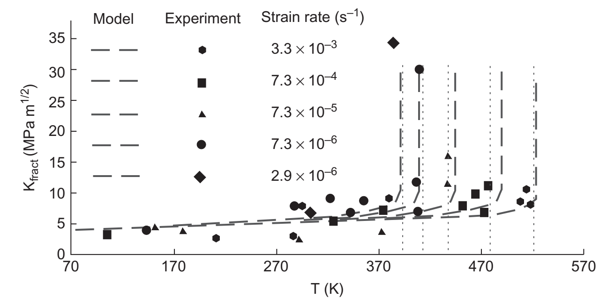

*图 10.29：钨单晶在五种外加应变率下的断裂行为。纵轴 $K_{\mathrm{frac}}$ 的单位为 $\mathrm{MPa}\sqrt{\mathrm m}$，横轴为温度 $T$；Model 为模型曲线，Experiment 为实验点，Strain rate 为应变率。应变率覆盖约 $2.9\times10^{-6}$ 至 $3.3\times10^{-3}\ \mathrm{s^{-1}}$，竖直点线标示实验转变温度。原图引自 Tarleton 与 Roberts，*Philosophical Magazine* **89**, 2759（2009）。*

图中提高应变率使韧性显著上升的温区移向更高温度；加入温度相关位错运动规律的模型能够再现主要趋势。这说明脆–韧转变不仅由静态的裂纹表面能或屈服应力决定，还与位错屏蔽建立所需的时间有关。

---

## 主要出处与延伸阅读

本章主要依据 Hull, D. 与 Bacon, D. J.，*Introduction to Dislocations*，第 5 版，Butterworth–Heinemann（2011），第 10 章 “Strength of Crystalline Solids”，书页 205–249。公式编号沿用教材，中文术语、符号及适用条件作了统一；以下为原教材参考文献中与本章机制最直接相关的选读资料。

| 阅读主题 | 文献 |
| --- | --- |
| 强化机制的整体框架 | Argon, A. S. *Strengthening Mechanisms in Crystal Plasticity*. Oxford University Press（2007） |
| 滑移热力学、热激活与速率依赖 | Kocks, U. F., Argon, A. S. & Ashby, M. F. “Thermodynamics and kinetics of slip.” *Progress in Materials Science* **19**, 1（1975） |
| 铁的屈服点与应变时效 | Cottrell, A. H. & Bilby, B. A. “Dislocation theory of yielding and strain ageing in iron.” *Proceedings of the Physical Society A* **62**, 49（1949） |
| 加工硬化阶段 II 与滑移系相互作用 | Kubin, L., Devincre, B. & Hoc, T. “The deformation stage II of face-centered cubic crystals: Fifty years of investigations.” *International Journal of Materials Research* **100**, 10（2009） |
| 位错与晶粒尺寸效应 | Li, J. C. M. & Chou, Y. T. “The role of dislocations in the flow stress grain size relationship.” *Metallurgical Transactions* **1**, 1145（1970） |
| 纳米晶中的 Hall–Petch 适用范围 | Pande, C. S. & Cooper, K. P. “Nanomechanics of Hall–Petch relationship in nanocrystalline materials.” *Progress in Materials Science* **54**, 689（2009） |
| 裂尖位错形核及脆–韧转变 | Xu, G. “Dislocation nucleation from crack tips and brittle to ductile transitions in cleavage fracture.” 载 *Dislocations in Solids*，第 12 卷，North-Holland，81 起（2004） |

图 10.26 的模拟背景可另参阅 Bulatov, V. V. 与 Cai, W.，*Computer Simulations of Dislocations*，Oxford University Press（2006）。
