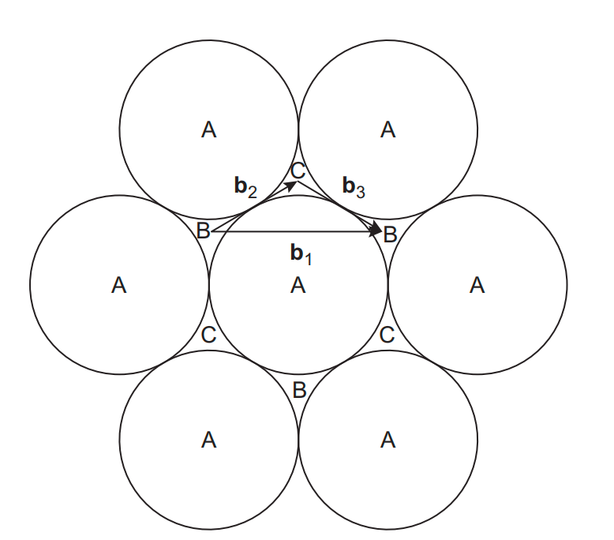
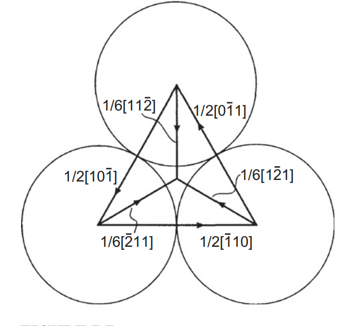
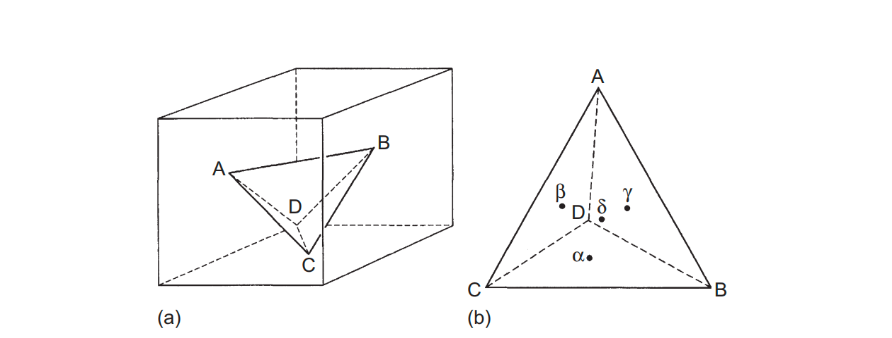
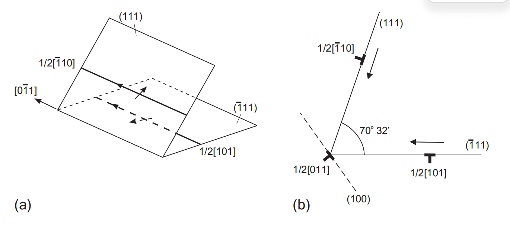
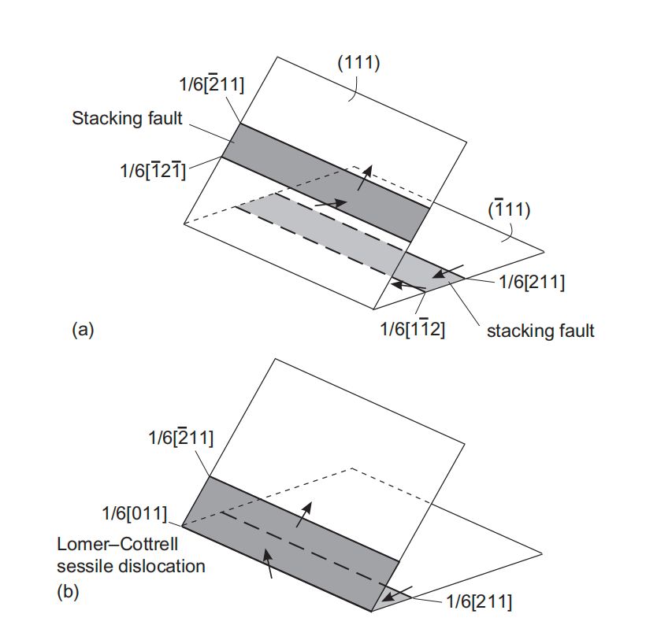
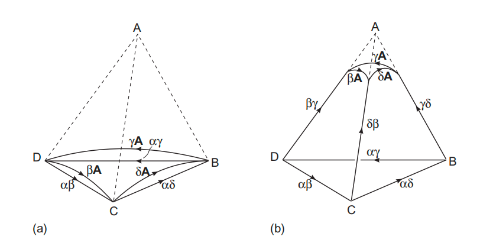

# 5. 面心立方晶体中的位错（Dislocations in FCC Crystals）

> **本章概要**：面心立方（face-centered cubic, FCC）晶体中的主要滑移系为 $\{111\}\langle110\rangle$。完整位错通常可分解为两个 Shockley 不全位错，并在两者之间形成层错。本章讨论完整位错的分解、扩展位错与交滑移、Thompson 四面体、Frank 不全位错环、Lomer/Hirth/Lomer–Cottrell 位错锁，以及层错四面体的形成。

---

## 5.1 FCC 晶体中的基本位错类型

设 FCC 晶格常数为 $a$。本章涉及的主要位错可概括为：

| 类型 | 典型伯格斯矢量 | 可动性 | 主要特征 |
| --- | --- | --- | --- |
| 完整位错（perfect dislocation） | $\dfrac a2\langle110\rangle$ | 通常可滑移 | 伯格斯矢量是晶格平移矢量，滑移后晶体仍保持完整堆垛 |
| Shockley 不全位错（Shockley partial） | $\dfrac a6\langle112\rangle$ | 可滑移（glissile） | 位于某一 $\{111\}$ 面内，运动后留下层错 |
| Frank 不全位错（Frank partial） | $\dfrac a3\langle111\rangle$ | 不可滑移（sessile），但可攀移 | 伯格斯矢量垂直于相应 $\{111\}$ 面，常构成层错环边界 |
| 阶梯杆不全位错（stair-rod partial） | $\dfrac a6\langle110\rangle$ | 通常不可滑移 | 常位于两个层错面的交线处，也称面角位错 |

### 5.1.1 完整位错

伯格斯矢量是晶格平移矢量的位错称为**完整位错或全位错（perfect dislocation）**。完整位错扫过后，滑移面两侧晶体的相对位移等于一个晶格平移矢量，因此晶体仍恢复为完整结构。

FCC 晶体中最短的完整位错伯格斯矢量为：

$$
\mathbf b=\frac a2\langle110\rangle,
\qquad
b=\frac a{\sqrt2}.
$$

### 5.1.2 不全位错与层错

伯格斯矢量不是完整晶格平移矢量的位错称为**不全位错或分位错（partial dislocation）**。单根完整位错不一定以未分解的形式存在；在 FCC 晶体中，它往往分解为两个 Shockley 不全位错：

$$
\mathbf b_{\mathrm{perfect}}
=\mathbf b_2+\mathbf b_3,
$$

其中

$$
\mathbf b_2,\mathbf b_3\in\frac a6\langle112\rangle.
$$

Shockley 不全位错扫过后，晶体两部分之间的相对位移不是完整晶格平移，因而留下**层错（stacking fault）**；层错的边界就是 Shockley 不全位错。

伯格斯回路仍可用于定义不全位错的伯格斯矢量，但回路起点和终点应选在层错面两侧具有相同局部参照的位置。若回路穿越层错面，闭合终点一般不会落在原始完整晶格的等价格点上。

---

## 5.2 Shockley 不全位错与扩展位错

### 5.2.1 $\{111\}$ 面上的滑移路径与层错能

FCC 晶体的密排面为 $\{111\}$，完整滑移方向为 $\langle110\rangle$。沿 $\langle111\rangle$ 方向观察密排面时，原子层依次占据 $A$、$B$、$C$ 三类位置。

图中 $\mathbf b_1$ 表示从一个完整堆垛位置到相邻等价位置的完整滑移；实际最低能路径通常不会沿 $\mathbf b_1$ 一步跨越最高势垒，而是先沿 $\mathbf b_2$ 到达局部层错位置，再沿 $\mathbf b_3$ 到达下一个完整堆垛位置：

$$
\mathbf b_1=\mathbf b_2+\mathbf b_3.
$$

需要区分两个容易混淆的能量：

- **本征层错能（intrinsic stacking-fault energy）** $\gamma_{\mathrm{isf}}$：层错局部能量极小值与完整晶体能量之间的单位面积能量差；
- **不稳定层错能（unstable stacking-fault energy）** $\gamma_{\mathrm{usf}}$：从完整堆垛位置滑向层错位置时经过的最高能垒。

完整堆垛位置可取 $\gamma=0$；层错位置是能量非零的局部极小值，而路径中的极大值对应不稳定层错能。以下在讨论扩展位错宽度时，若无特殊说明，$\gamma$ 均指本征层错能 $\gamma_{\mathrm{isf}}$。

### 5.2.2 完整位错的 Shockley 分解

一个典型分解反应为：

$$
\frac a2[\bar110]
\rightarrow
\frac a6[\bar211]
+\frac a6[\bar12\bar1].
\tag{5.2}
$$

更一般地可写成族方向形式：

$$
\frac a2\langle110\rangle
\rightarrow
\frac a6\langle112\rangle
+\frac a6\langle112\rangle,
$$

但两个 $\langle112\rangle$ 方向必须同时位于原完整位错的 $\{111\}$ 滑移面内，并满足伯格斯矢量守恒。

同一 $\{111\}$ 面内三个完整位错方向的分解示例为：

$$
\begin{aligned}
\frac a2[\bar110]
&\rightarrow
\frac a6[\bar211]
+\frac a6[\bar12\bar1],\\
\frac a2[\bar101]
&\rightarrow
\frac a6[\bar211]
+\frac a6[\bar1\bar12],\\
\frac a2[0\bar11]
&\rightarrow
\frac a6[1\bar21]
+\frac a6[\bar1\bar12].
\end{aligned}
\tag{5.3}
$$

### 5.2.3 Frank 能量判据

位错单位长度弹性能近似满足 $E\propto Gb^2$。因此，位错反应在弹性能上有利的简单判据为：

$$
b_{mathrm{after}}^2
<b_{mathrm{before}}^2,
$$

或对分解反应：

$$
b_2^2+b_3^2<b_1^2.
$$

对 FCC 完整位错与 Shockley 不全位错：

$$
b_1^2=\frac{a^2}{2},
\qquad
b_2^2=b_3^2=\frac{a^2}{6},
$$

因而

$$
b_2^2+b_3^2=\frac{a^2}{3}<\frac{a^2}{2}=b_1^2.
$$

这说明完整位错分解在远离核心的弹性能上有利。不过，实际平衡还必须同时考虑两不全位错之间的弹性排斥以及夹在其中的层错能。

### 5.2.4 两个不全位错的相互作用与平衡间距

由于两个 Shockley 不全位错的伯格斯矢量具有夹角，其相互作用力应分别按刃型分量与螺型分量计算。设两个不全位错的伯格斯矢量模均为

$$
b=\frac a{\sqrt6},
$$

分离距离为 $d$，则纯刃型和纯螺型完整位错分解后，两不全位错之间的单位长度排斥力分别为：

$$
\begin{aligned}
F_{\mathrm{edge}}
&=\frac{Gb^2(2+\nu)}{8\pi(1-\nu)d},\\
F_{\mathrm{screw}}
&=\frac{Gb^2(2-3\nu)}{8\pi(1-\nu)d}.
\end{aligned}
\tag{5.4}
$$

当 $\nu=0$ 时，两种线取向给出相同结果：

$$
F
=\frac{G\,\mathbf b_2\cdot\mathbf b_3}{2\pi d}
=\frac{Gb^2}{4\pi d}.
\tag{5.5}
$$

夹在两个不全位错之间的层错带具有单位面积能量 $\gamma$。层错带每增加单位长度宽度，能量增加 $\gamma$，因此它等效为大小为 $\gamma$ 的单位长度吸引力，倾向于缩短层错带。平衡条件为

$$
F_{\mathrm{rep}}=\gamma.
$$

在 $\nu=0$ 的简化情况下，平衡分离距离为：

$$
d=\frac{Gb^2}{4\pi\gamma}.
\tag{5.6}
$$

更一般地：

$$
\begin{aligned}
d_{\mathrm{edge}}
&=\frac{Gb^2(2+\nu)}{8\pi(1-\nu)\gamma},\\
d_{\mathrm{screw}}
&=\frac{Gb^2(2-3\nu)}{8\pi(1-\nu)\gamma}.
\end{aligned}
$$

因此 $d\propto1/\gamma$：层错能越低，扩展位错越宽；层错能越高，两个不全位错越靠近。

### 5.2.5 扩展位错的运动

完整位错分解为两条 Shockley 不全位错及其间的层错带后，整体称为**扩展位错（extended dislocation）**。刃型、螺型和混合型完整位错都可发生这种分解。

扩展位错滑移时：

- 前导不全位错（leading partial）通过运动创建层错；
- 后随不全位错（trailing partial）通过运动消除层错；
- 两条不全位错扫过后的总位移仍等于完整伯格斯矢量 $\mathbf b_1=\mathbf b_2+\mathbf b_3$。

### 5.2.6 收缩与交滑移

完整螺型位错的 $a/2\langle110\rangle$ 伯格斯矢量可同时位于两个相交的 $\{111\}$ 面内，因此未分解的螺型位错可以交滑移。分解后，两个 $a/6\langle112\rangle$ Shockley 不全位错一般只共同位于原滑移面，无法分别直接转移到交滑移面。

扩展螺型位错要发生交滑移，通常必须先在局部形成**收缩区（constriction）**，使两个不全位错重新合并成完整螺型位错，然后在另一 $\{111\}$ 面上重新分解。高层错能会减小平衡分离距离，因而通常降低形成收缩区的能量代价。

**Escaig 应力（Escaig stress）**是改变两个不全位错间距、但不直接驱动扩展位错整体滑移的剪应力分量。其符号可使两个不全位错靠拢或分开；该名称描述应力的作用方式，而不限定应力来自外载荷还是内部缺陷场。

收缩区通常不稳定，越过障碍后可能再次分解。不可滑移位错、不可穿透颗粒等障碍物附近，若局部应力把两个不全位错推向彼此，则较容易形成收缩区。

---

## 5.3 Thompson 四面体

**Thompson 四面体（Thompson tetrahedron）**为 FCC 晶体中的滑移面、完整位错、不全位错及其反应提供了紧凑的几何记号。

四面体的主要记号规则如下：

| Thompson 记号 | 晶体学含义 | 典型伯格斯矢量 |
| --- | --- | --- |
| Roman–Roman，如 $AB$ | 四面体棱，对应完整位错 | $a/2\langle110\rangle$ |
| Roman–Greek 或 Greek–Roman，如 $A\delta$、$\delta B$ | Shockley 不全位错 | $a/6\langle112\rangle$ |
| Roman–opposite Greek，如 $A\alpha$ | Frank 不全位错 | $a/3\langle111\rangle$ |
| Greek–Greek，如 $\alpha\beta$ | 阶梯杆不全位错 | $a/6\langle110\rangle$ |

四个三角面分别对应四个 $\{111\}$ 滑移面；面中心以 $\alpha$、$\beta$、$\gamma$、$\delta$ 表示，并分别与相对的 Roman 顶点对应。

> [!warning] 不全位错次序与层错类型
> 使用 Thompson 记号分析反应时必须保留不全位错的先后次序。以完整位错 $\mathbf b=AB$ 为例：观察者位于四面体外并沿位错正线向观察时，若左侧不全位错采用 Greek–Roman 记号（如 $\delta B$ 或 $\gamma B$），右侧采用 Roman–Greek 记号（如 $A\delta$ 或 $A\gamma$），两者之间形成内禀层错；从四面体内部观察时次序相反。若交换前导与后随不全位错，层错类型与位错符号也会改变。

---

## 5.4 Frank 不全位错与层错环

### 5.4.1 形成、结构与可动性

在 FCC 晶体中插入或移除一个 $\{111\}$ 密排原子面，可分别形成间隙型和空位型 Frank 位错环，并产生相应的外禀或内禀层错：

| Frank 环 | 形成方式 | 典型层错 |
| --- | --- | --- |
| 正 Frank 环（positive/interstitial Frank loop） | 插入额外密排面 | 外禀层错（extrinsic stacking fault） |
| 负 Frank 环（negative/vacancy Frank loop） | 移除密排面 | 内禀层错（intrinsic stacking fault） |

Frank 不全位错的伯格斯矢量为：

$$
\mathbf b_{\mathrm F}=\frac a3\langle111\rangle,
\qquad
b_{\mathrm F}=\frac a{\sqrt3}=d_{111}.
$$

$\mathbf b_{\mathrm F}$ 垂直于层错所在的 $\{111\}$ 面，因此 Frank 位错环是纯刃型环。由于伯格斯矢量不在环面内，它不能在该面内保守滑移，属于**不可滑移位错（sessile dislocation）**；但可通过吸收或发射点缺陷发生攀移。

### 5.4.2 负 Frank 环的消除

若在负 Frank 环内部成核一个 Shockley 不全位错并使其扫过整个层错面，层错可被消除。Shockley 不全位错到达环边界后与 Frank 不全位错反应，形成完整位错：

$$
\underbrace{\frac a6[11\bar2]}_{B\alpha\;\text{Shockley partial}}
+\underbrace{\frac a3[111]}_{\alpha A\;\text{Frank partial}}
\rightarrow
\underbrace{\frac a2[110]}_{BA\;\text{perfect dislocation}}.
\tag{5.8}
$$

反应后得到无层错的完整位错环。该环的宏观运动可表现为沿圆柱面推进，但其局部运动需要滑移与攀移的组合。

### 5.4.3 正 Frank 环的消除

外禀层错可视为两个相邻层错的组合，因此正 Frank 环通常需要两个 Shockley 不全位错依次扫过才能恢复完整堆垛。一个反应示例为：

$$
\underbrace{\frac a6[\bar12\bar1]}_{\alpha C}
+\underbrace{\frac a6[2\bar1\bar1]}_{\alpha D}
+\underbrace{\frac a3[111]}_{\alpha A}
\rightarrow
\underbrace{\frac a2[110]}_{BA}.
\tag{5.9}
$$

### 5.4.4 反应的粗略能量判据

上述消除反应能否发生，不只取决于伯格斯矢量守恒，还取决于 Shockley 不全位错能否在 Frank 环内部成核并扩展。其驱动力来自层错能和反应前后位错线能之差。

设圆环半径为 $r$、核心截断半径为 $r_0$，在各向同性线张力近似下，刃型环能量可估为：

$$
E_{\mathrm{edge}}
=\frac{Gb_e^2r}{2(1-\nu)}
\ln\left(\frac{2r}{r_0}\right).
\tag{5.10}
$$

剪切型位错环沿环周同时包含刃型和螺型线段，其平均能量近似为：

$$
E_{\mathrm{shear}}
=\frac{Gb_e^2r}{2(1-\nu)}
\left(1-\frac\nu2\right)
\ln\left(\frac{2r}{r_0}\right).
\tag{5.11}
$$

这里 $b_e$ 是该粗略线张力模型采用的有效伯格斯矢量模。代入 FCC 中相应反应的伯格斯矢量后，反应释放能可写为：

$$
\Delta E
=\pi r^2\gamma
-\frac{rGa^2}{24}
\left(\frac{2-\nu}{1-\nu}\right)
\ln\left(\frac{2r}{r_0}\right).
\tag{5.12}
$$

若定义 $\Delta E$ 为反应前能量减去反应后能量，则反应在热力学上有利要求 $\Delta E>0$，即：

$$
\gamma>
\frac{Ga^2}{24\pi r}
\left(\frac{2-\nu}{1-\nu}\right)
\ln\left(\frac{2r}{r_0}\right).
\tag{5.13}
$$

因此临界层错能与环半径有关：环越大，消除层错所需的层错能下界通常越低。该结果仅是线张力模型下的数量级估计；真实过程还受成核势垒、弹性各向异性、核心结构和局部应力影响。

### 5.4.5 多层空位片与交替层错

若在负 Frank 环的内禀层错旁再次形成一层空位片，原有堆垛序列可由类似

$$
ABCACABC\cdots
$$

转变为外禀层错序列

$$
ABCACBC\cdots.
$$

若第三层空位片紧邻第二层形成，则穿过三层后的局部序列可能重新成为完整的 $ABCABC\cdots$ 堆垛。某些条件下可观察到同心 Frank 不全位错环，其内部区域交替呈现内禀层错、外禀层错和完整堆垛。

---

## 5.5 不可滑移位错锁

相交滑移面上的位错可发生反应并形成不易滑移的位错结，从而成为后续位错运动的重要障碍。

### 5.5.1 Lomer 锁

两个位于相交 $\{111\}$ 面上的完整位错可反应形成 Lomer 位错：

$$
\frac a2[\bar110]
+\frac a2[101]
\rightarrow
\frac a2[011].
\tag{5.14}
$$

产物的伯格斯矢量仍属于 $a/2\langle110\rangle$ 完整晶格平移矢量，但位错结位于 $\{100\}$ 型平面，而不是 FCC 的 $\{111\}$ 密排滑移面，因此该构型不可滑移，称为 **Lomer 锁（Lomer lock）**。

### 5.5.2 Hirth 锁

另一类反应可由两个合适取向的完整位错形成 $a\langle100\rangle$ 型位错结，例如：

$$
\frac a2[101]
+\frac a2[10\bar1]
\rightarrow
a[100].
$$

该反应满足伯格斯矢量守恒，并有

$$
\left|\frac a2[101]\right|^2
+\left|\frac a2[10\bar1]\right|^2
=|a[100]|^2,
$$

因此简单的 $b^2$ 判据既不提供能量降低，也不排除反应。$a\langle100\rangle$ 不是 FCC 常规滑移矢量，形成的位错结不可滑移，称为 **Hirth 锁（Hirth lock）**。实际稳定性还由相互作用能、线方向和核心结构决定。

### 5.5.3 Lomer–Cottrell 锁与阶梯杆不全位错

两个位于相交 $\{111\}$ 面上的 Shockley 不全位错可反应形成阶梯杆不全位错：

$$
\frac a6[\bar12\bar1]
+\frac a6[1\bar12]
\rightarrow
\frac a6[011].
\tag{5.15}
$$

产物属于 $a/6\langle110\rangle$ 型**阶梯杆不全位错（stair-rod partial，也称面角位错）**。它位于两个层错面的交线处，伯格斯矢量不能作为 Shockley 矢量在任一参与的 $\{111\}$ 面上滑移，因此是不可滑移的。

反应后的两个残余 Shockley 不全位错、两片层错和中间的阶梯杆位错共同构成稳定的 **Lomer–Cottrell 锁**，会强烈阻碍后续位错运动。类似地，当一条已分解位错从一个滑移面弯折到另一个滑移面时，也必须在折角处形成阶梯杆分量以保证伯格斯矢量守恒。

---

## 5.6 层错四面体

**层错四面体（stacking-fault tetrahedron, SFT）**由四个 $\{111\}$ 面上的内禀层错构成，六条棱通常为 $a/6\langle110\rangle$ 型阶梯杆不全位错。

### 5.6.1 Frank 不全位错的进一步分解

当层错能足够低且几何条件合适时，Frank 不全位错可分解为一个阶梯杆不全位错和一个 Shockley 不全位错：

$$
\frac a3[111]
\rightarrow
\frac a6[101]
+\frac a6[121].
\tag{5.20}
$$

对应的 $b^2$ 变化为：

$$
\frac{a^2}{3}
\rightarrow
\frac{a^2}{18}
+\frac{a^2}{6},
$$

即

$$
\frac{a^2}{18}+\frac{a^2}{6}
=\frac{2a^2}{9}
<\frac{a^2}{3},
$$

所以仅从弹性线能看，分解是有利的；完整判据仍需计入新形成或消失的层错面积能。

### 5.6.2 四面体形成过程

Frank 环某条棱上的分解产生相互排斥的 Shockley 与阶梯杆不全位错。Shockley 不全位错向相邻棱移动，在其他棱上继续触发类似反应；最终，四个 $\{111\}$ 层错面闭合成四面体，六条棱均由阶梯杆不全位错构成。

层错四面体常与空位团簇有关。形成三角形 Frank 环的典型途径包括：

- 空位片或三维空位团簇坍塌；
- 含割阶（jog）的螺型位错发生交滑移，并通过割阶分解与局部点缺陷重排形成 Frank 环。

---

## 5.7 本章小结

- FCC 晶体的主要滑移系为 $\{111\}\langle110\rangle$，完整位错伯格斯矢量为 $a/2\langle110\rangle$。
- 完整位错通常分解为两个 $a/6\langle112\rangle$ Shockley 不全位错；两者之间形成层错，整体称为扩展位错。
- 本征层错能决定层错带的面积代价，并与扩展宽度近似满足 $d\propto1/\gamma$；不稳定层错能则控制滑移路径上的能垒。
- 扩展螺型位错交滑移前通常需要局部收缩；Escaig 应力可改变不全位错间距。
- Thompson 四面体可统一表示 FCC 的滑移面、完整位错、Shockley/Frank/阶梯杆不全位错及其反应。
- Frank 不全位错为 $a/3\langle111\rangle$ 型不可滑移刃位错，可通过 Shockley 不全位错反应消除层错并转化为完整位错环。
- Lomer、Hirth 和 Lomer–Cottrell 锁均可阻碍滑移；Lomer–Cottrell 锁的核心包含 $a/6\langle110\rangle$ 阶梯杆不全位错。
- 层错四面体由四个 $\{111\}$ 内禀层错面和六条阶梯杆不全位错棱构成，通常与空位团簇演化有关。
