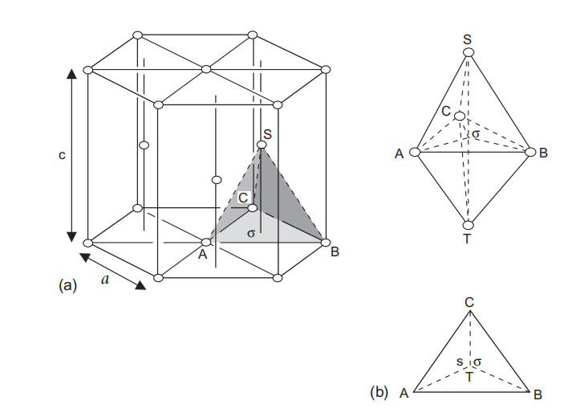
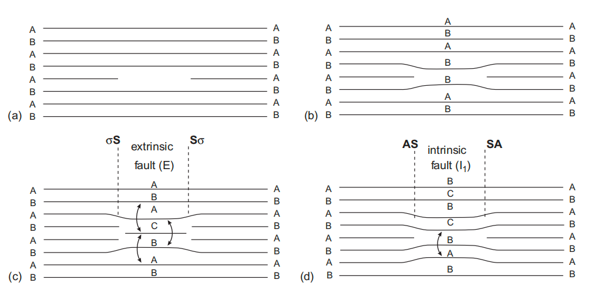
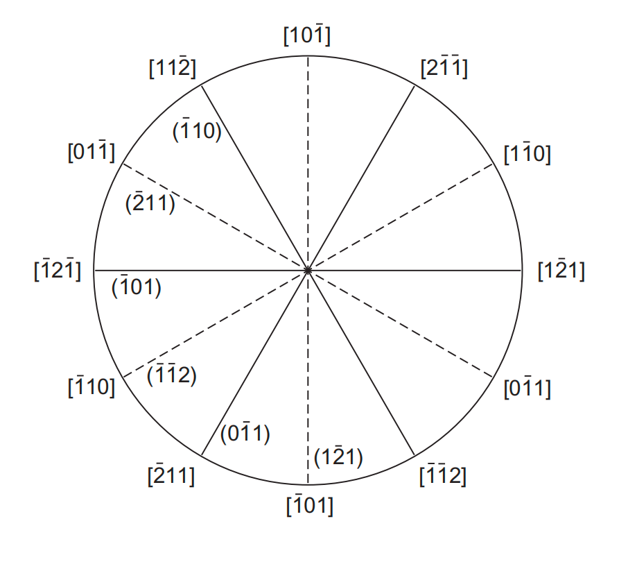
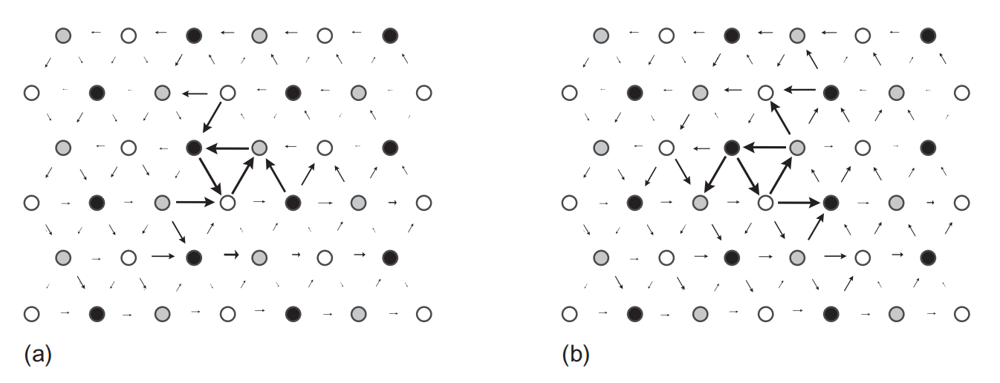
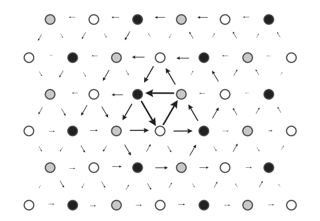
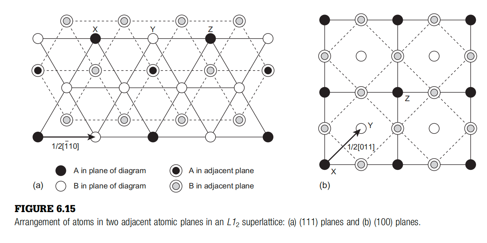
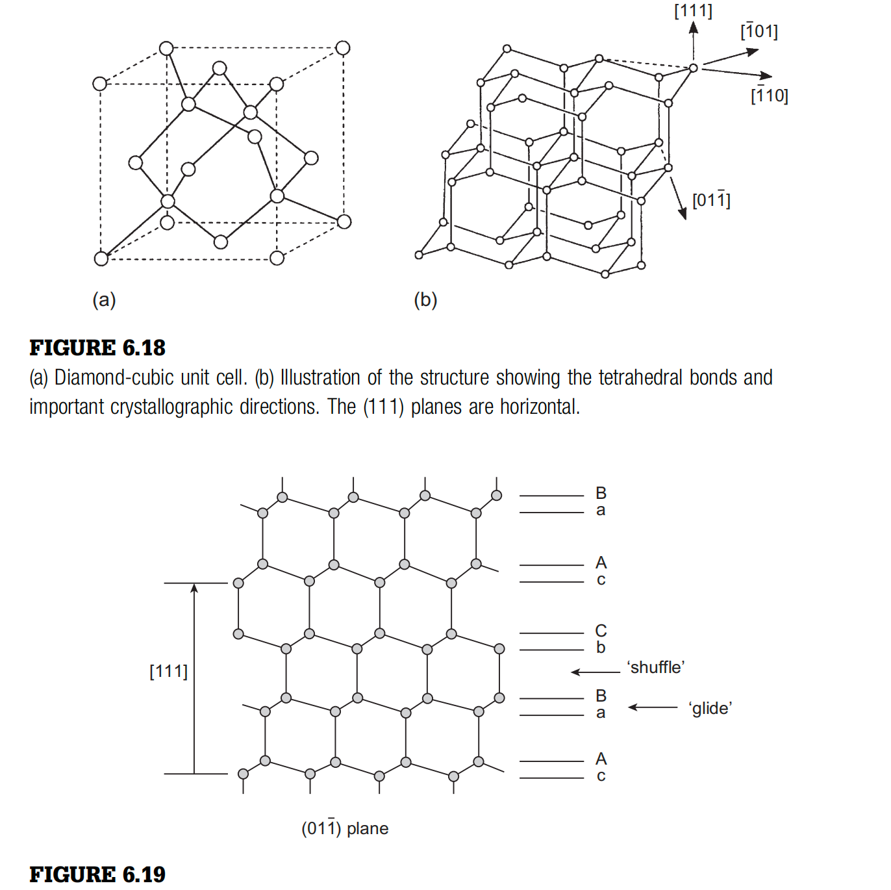
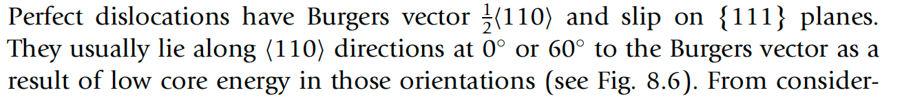
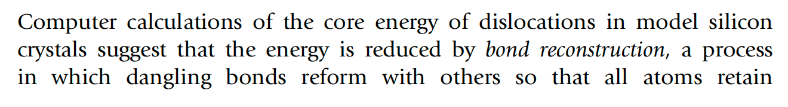
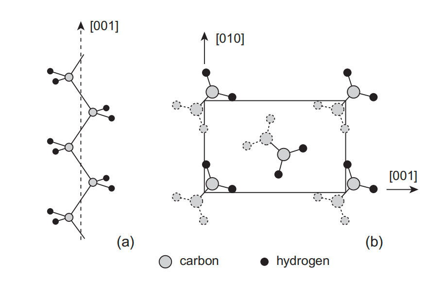

# 6. 其他晶体结构中的位错（Dislocations in Other Crystal Structures）

> **本章概要**：FCC 晶体提供了理解位错反应的清晰范例，但位错行为还取决于晶体几何、原子键方向性、化学有序度和分子结构。本章依次讨论 HCP、BCC、离子晶体、有序超点阵、共价晶体、层状晶体和聚合物晶体，重点比较它们的滑移系、位错核心、层错与特殊位错机制。

---

## 6.1 从 FCC 推广到其他晶体

许多在 FCC 中建立的概念——伯格斯矢量守恒、位错分解、层错、交滑移和位错锁——也适用于其他晶体。不过，当晶体几何、原子键性质或原子种类改变时，以下因素会重新决定主导机制：

- 可用的晶格平移矢量和滑移面；
- 广义层错能面（generalized stacking-fault energy surface, $\gamma$-surface）是否存在稳定极小值；
- 位错核心能否限制在单一平面；
- 键合是否具有方向性、电荷或化学有序性；
- 位错运动是否需要点缺陷、扩散或分子链协同运动。

因此，不能只根据“几何最密排”判断滑移系，还必须考虑位错核心与局部键合。

---

## 6.2 HCP 晶体中的位错

### 6.2.1 基本滑移系与几何记号

六方密排（hexagonal close-packed, HCP）晶体的基面族为 $\{0001\}$，基面密排方向族为 $\langle11\bar{2}0\rangle$。最短晶格平移矢量是 $a$ 型伯格斯矢量：

$$
\mathbf b_a=\frac13\langle11\bar{2}0\rangle,
\qquad
|\mathbf b_a|=a.
$$

从纯硬球几何看，$a$ 型位错应优先在基面滑移；但实际 HCP 金属存在明显的键合与电子结构差异，部分金属反而更容易在一阶柱面族 $\{10\bar{1}0\}$ 上滑移。

HCP 位错也可用类似 Thompson 四面体的双棱锥记号表示：

图中 $ABC$ 为基面三角形，$S$ 和 $T$ 位于基面上、下方，$\sigma$ 为内部参考点。主要矢量类型如下：

| 几何记号       | 位错类型              | 伯格斯矢量示例                            | 矢量模                  | 当 $c^2=\dfrac83a^2$ 时的 $b^2$ |
| ---------- | ----------------- | ---------------------------------- | -------------------- | ---------------------------- |
| $AB$       | $a$ 型完整位错         | $\dfrac13\langle11\bar{2}0\rangle$ | $a$                  | $a^2$                        |
| $TS$       | $c$ 型完整位错         | $[0001]$                           | $c$                  | $\dfrac83a^2$                |
| $SA/TB$    | $a+c$ 型完整位错       | $\dfrac13\langle11\bar{2}3\rangle$ | $\sqrt{a^2+c^2}$     | $\dfrac{11}{3}a^2$           |
| $A\sigma$  | 基面 Shockley 型不全位错 | $\dfrac13\langle\bar{1}100\rangle$ | $a/\sqrt3$           | $\dfrac13a^2$                |
| $\sigma S$ | $c/2$ 型不全位错       | $\dfrac12[0001]$                   | $\dfrac c2$          | $\dfrac23a^2$                |
| $AS$       | 混合型不全位错           | $\dfrac16\langle\bar{2}203\rangle$ | $\sqrt{a^2/3+c^2/4}$ | $a^2$                        |

其中 $a$、$c$ 为 HCP 晶格常数；$c/a=\sqrt{8/3}\approx1.633$ 是理想硬球密排比值，实际金属可偏离该值。

### 6.2.2 基面层错

HCP 完整堆垛序列为 $ABABAB\cdots$。基面上常讨论三类层错：内禀层错 $I_1$、$I_2$ 和外禀层错 $E$。

一种形成 $I_1$ 层错的序列表示为：

$$
\mathrm{ABABABABA}\cdots
\rightarrow \mathrm{ABABBABA}\cdots
\rightarrow \mathrm{ABABCBCB}\cdots\quad(I_1).
\tag{6.1}
$$

$I_2$ 层错可由完整晶体在基面上发生 $\frac13\langle10\bar{1}0\rangle$ 相对滑移形成：

$$
\mathrm{ABABABAB}\cdots
\rightarrow \mathrm{ABABCACA}\cdots\quad(I_2).
\tag{6.2}
$$

插入额外密排面可形成外禀层错：

$$
\mathrm{ABABABAB}\cdots
\rightarrow \mathrm{ABABCABAB}\cdots\quad(E).
\tag{6.3}
$$

这些层错在局部产生短程的 FCC 型堆垛片段。简单几何模型给出的层错能近似关系为：

$$
\gamma_E\approx\frac32\gamma_{I_2}
\approx3\gamma_{I_1}.
$$

该比例只用于定性估算。真实层错能强烈依赖元素、$c/a$、电子结构和磁性，通常需通过第一性原理或实验确定。

### 6.2.3 完整位错分解与滑移面偏好

若基面 $\gamma$-surface 在 $\frac13\langle10\bar{1}0\rangle$ 位移处存在稳定极小值，$a$ 型完整位错可分解为两个 Shockley 型不全位错：

$$
AB\rightarrow A\sigma+\sigma B,
$$

例如：

$$
\frac13[11\bar{2}0]
\rightarrow
\frac13[10\bar{1}0]
+\frac13[01\bar{1}0].
\tag{6.4}
$$

对应的简单 $b^2$ 判据为：

$$
a^2\rightarrow\frac{a^2}{3}+\frac{a^2}{3},
$$

说明分解可降低弹性线能；平衡宽度仍由不全位错弹性排斥与层错能的吸引作用决定，近似满足

$$
d\propto\frac1\gamma.
$$

滑移面偏好本质上由基面和柱面层错的能量与稳定性，以及这些层错如何改变螺位错核心结构共同决定。螺位错核心若优先扩展在某一平面，在另一平面运动前通常需要局部收缩，因此其滑移面选择比刃位错更加敏感。

### 6.2.4 多晶塑性与 $a+c$ 滑移

多晶材料要实现任意协调塑性变形，通常需要五个独立变形模式。单独依赖基面滑移或柱面滑移无法满足这一要求，因此 HCP 多晶中常需同时激活：

- 基面或柱面 $a$ 型滑移；
- 锥面 $a+c$ 型滑移；
- 变形孪晶（deformation twinning）。

$a+c$ 型完整位错的伯格斯矢量为：

$$
\mathbf b_{a+c}=\frac13\langle11\bar{2}3\rangle.
$$

其常见滑移面族包括一阶锥面 $\{10\bar{1}1\}$ 和二阶锥面 $\{11\bar{2}2\}$。由于 $|\mathbf b_{a+c}|$ 较大且锥面原子排列较粗糙，$a+c$ 滑移通常需要较高临界分切应力（critical resolved shear stress, CRSS），但它对提供 $c$ 轴方向塑性应变十分重要。

宏观上，若只有易启动的基面 $a$ 型滑移，晶粒难以提供 $c$ 轴应变，材料会表现出强塑性各向异性、显著织构效应和较差的多晶协调变形能力。激活 $a+c$ 滑移可以提高延性；孪晶也能快速补充独立变形模式，但孪晶界和孪晶尖端可能引起局部应力集中。

### 6.2.5 基面空位环与间隙环

基面空位片坍塌会造成局部原子面缺失。为避免同类原子层直接相接形成高能结构，体系通常通过剪切生成层错：

外禀层错可由上下两侧符号相反的 Shockley 型不全位错共同作用形成。相应反应可写为：

$$
\sigma S+\sigma A+A\sigma\rightarrow\sigma S,
$$

例如：

$$
\frac12[0001]
+\frac13[\bar{1}100]
+\frac13[1\bar{1}00]
\rightarrow\frac12[0001].
\tag{6.5}
$$

另一条路径形成 $I_1$ 层错，并在边界产生混合型不可滑移环：

$$
A\sigma+\sigma S\rightarrow AS,
$$

例如：

$$
\frac13[\bar{1}100]
+\frac12[0001]
\rightarrow\frac16[\bar{2}203].
\tag{6.6}
$$

这两类层错环的边界都含 Frank 型不可滑移分量。由于通常有 $\gamma_E\approx3\gamma_{I_1}$，外禀层错可能继续通过位错反应转化为能量更低的 $I_1$ 层错。插入两个相邻原子面时，也可能形成伯格斯矢量为 $[0001]$ 的完整位错环。

对以柱面滑移为主的材料，柱面缺陷也可先形成不可滑移环，再通过剪切反应转化为可动 $a$ 型位错环，例如：

$$
\frac12\langle10\bar{1}0\rangle
+\frac16\langle1\bar{2}10\rangle
\rightarrow\frac13\langle11\bar{2}0\rangle.
\tag{6.7}
$$

---

## 6.3 BCC 晶体中的位错

### 6.3.1 滑移系与非 Schmid 行为

体心立方（body-centered cubic, BCC）晶体的最短晶格平移矢量为：

$$
\mathbf b=\frac a2\langle111\rangle.
$$

常见滑移面族为 $\{110\}$、$\{112\}$ 和 $\{123\}$。对于给定的 $\langle111\rangle$ 方向，有 3 个 $\{110\}$、3 个 $\{112\}$ 和 6 个 $\{123\}$ 面包含该方向：

螺位错可以在多个包含其伯格斯矢量的面之间切换，因而表面滑移线常呈波浪状。实际主滑移面还会随成分、晶体取向、温度和应变率变化。

BCC 塑性的突出特征是**非 Schmid 行为（non-Schmid behavior）**：临界应力不仅取决于沿伯格斯矢量方向的分切应力，其他应力分量也会改变螺位错核心，因此拉伸与压缩、正向与反向剪切可能表现出不同的屈服应力。

### 6.3.2 $\frac12\langle111\rangle$ 螺位错核心

BCC 中通常没有稳定的低能层错，因此螺位错不会像 FCC 位错那样分解为由稳定层错带分隔的平面不全位错。其核心往往同时扩展到三个 $\{110\}$ 面，形成**非平面核心（non-planar core）**，从而产生较高晶格阻力。

$[111]$ 方向具有三重螺旋对称性：绕该轴旋转 $120^\circ$ 并平移 $\pm\mathbf b/3=\pm\frac16[111]$，可把相邻原子柱映射到等价位置。

#### 差分位移图的几何含义

下列图均沿位错线和伯格斯矢量方向 $[111]$ 观察，因此 $[111]$ 垂直纸面，圆点代表平行于 $[111]$ 的原子柱。先定义第 $i$ 根原子柱沿位错线的位移分量：

$$
u_i^{\parallel}=\mathbf u_i\cdot\boldsymbol\xi,
\qquad
\boldsymbol\xi\parallel[111].
$$

相邻原子柱 $i$、$j$ 的螺型差分位移为：

$$
\Delta u_{ij}^{\parallel}
=\left(\mathbf u_j-\mathbf u_i\right)\cdot\boldsymbol\xi,
$$

并按晶格周期映射到一个约定区间（通常为 $[b/2,b/2]$）。

> [!important] 为什么纸面箭头垂直于 $[111]$？
> **物理位移分量沿 $[111]$，但绘图箭头不按物理位移方向绘制。**箭头被人为放在相邻原子柱的二维投影连线上，作为承载标量 $\Delta u_{ij}^{\parallel}$ 的图形符号：箭头长度与 $|\Delta u_{ij}^{\parallel}|$ 成正比，箭头指向表示差分位移的正负（通常指向沿 $[111]$ 位移更大的原子柱）。因此，纸面箭头方向只标识“哪一对原子柱及差值符号”，不能当作真实原子位移方向或位错运动方向。绕核心一周累加这些有符号差分位移，结果为一个完整伯格斯矢量 $b$。

#### Degenerate 与 non-degenerate 核心

BCC 螺位错常讨论两类非平面核心：

- **非简并核心（non-degenerate, ND core）**：除三重旋转关系外，还保持相应的二重对称性。例如教材图中的构型绕 $[10\bar{1}]$ 轴旋转 $180^\circ$ 后不变，因此在给定核心位置只有一个独立构型。
- **简并核心（degenerate, D core，也称 polarized core）**：破坏上述二重对称性，错动在三个 $\{110\}$ 面上呈不对称分布。对某一二重轴而言，一个构型经 $180^\circ$ 旋转会变成另一个能量相同但结构不同的构型，因此出现成对或多重对称等价变体。

简并核心可近似理解为三个相交 $\{110\}$ 面上各集中约 $\frac b3$ 的不稳定错动；非简并核心则可近似理解为六个约 $\frac b6$ 的错动分量更对称地分布在三个 $\{110\}$ 面上。这只是描述核心展宽的方式，并不表示形成了可独立存在的不全位错：相关 $\gamma$-surface 没有稳定局部极小值，因此这些分数错动之间不存在稳定层错带。

核心极化参数 $p$（部分文献记为 $q$）可量化差分位移分布偏离高对称构型的程度：ND 核心的极化较弱或为零，D 核心具有非零极化并选择一个对称变体。

核心外的弹性应力和应变仍按 $1/r$ 衰减；螺位错位移场本身为 $u_z=b\theta/(2\pi)$，不能简单表述为位移随 $1/r$ 衰减。

### 6.3.3 核心转化、位错运动与宏观性质

#### 核心结构如何发生转化

D 与 ND 并不是所有 BCC 金属中固定不变的两级运动状态。零应力下哪一种是稳定基态，主要由 $\{110\}$ 面的 $\gamma$-surface、原子间键合和合金化学决定。第一性原理计算通常预测许多纯 BCC 过渡金属具有紧凑 ND 基态，而某些经验势、合金成分或压力条件可能稳定 D 核心。

核心转化可由三类因素引起：

1. **材料状态变化**：合金化、压力、磁性或温度改变不稳定层错能 $\gamma_{\mathrm{us}}$ 和不同核心的相对能量，使稳定结构在 D 与 ND 之间切换。
2. **外加应力畸变核心**：除产生 Peach–Koehler 滑移力的剪应力外，某些“非滑移”应力分量也能改变三个 $\{110\}$ 面上的错动分配。它们可使 ND 核心连续极化、选择某个 D 变体，或在能量差足够小时诱发局部 D–ND 转化。
3. **位错迁移路径**：位错从一个 Peierls 势谷移动到下一个势谷时，核心必须重排并经过较高能的过渡构型（如 hard/split core）。在采用 D 基态的模型中，两个简并变体之间的转换可成为迁移路径的一部分；但不能把所有位错滑移都简单等同于“ND 变成 D”。

#### 从核心性质到宏观塑性

| 微观性质                        | 对位错运动的影响                     | 宏观表现                    |
| --------------------------- | ---------------------------- | ----------------------- |
| 核心同时扩展到多个 $\{110\}$ 面       | 在单一滑移面运动前需要核心重排，Peierls 势垒升高 | 低温屈服强度高，材料更易表现低温脆性      |
| D/ND 极化对应力分量敏感              | 非滑移应力也会改变势垒和易动方向             | 非 Schmid 行为、拉压不对称和方向不对称 |
| 螺型线段迁移率远低于非螺型线段             | 位错环或位错源扩展后留下长直螺型段            | 显微组织中螺位错占主导，塑性速率受螺位错控制  |
| 运动依赖扭折对（kink pair）成核        | 需要热激活跨越局部势垒                  | 屈服应力对温度和应变率高度敏感         |
| $\gamma$-surface 与核心结构随成分变化 | 改变滑移面选择、Peierls 势垒和 kink 能量  | 固溶强化、合金软化/硬化及不同材料的滑移面差异 |

低温电子显微观察常见长直螺位错，说明非螺型线段移动更快，而螺型线段成为控制塑性流动的慢过程。BCC 螺位错主要通过**扭折对（kink-pair）成核与迁移**移动，其速率具有显著温度和应力依赖性。因此 BCC 金属的屈服强度通常比 FCC 金属更敏感于温度和应变率。

### 6.3.4 $\langle100\rangle$ 位错与变形孪晶

除 $\frac a2\langle111\rangle$ 位错外，BCC 中有时也能观察到 $a\langle100\rangle$ 位错。它可由两条 $\frac a2\langle111\rangle$ 位错反应形成，例如：

$$
\frac a2[111]
+\frac a2[1\bar{1}\bar{1}]
\rightarrow a[100].
$$

$\langle100\rangle$ 位错通常需要较高滑移应力，在常温下不易成为主导滑移载体，但其相对稳定性随温度和材料而变，高温行为中不能完全忽略。

BCC 变形孪晶常见于低温、高应变率或高应力条件，主要孪晶系为：

$$
\{112\}\langle111\rangle.
$$

孪晶可视为 $\frac a6\langle111\rangle$ 孪晶不全位错在相邻 $\{112\}$ 面上的连续运动，对应均匀孪生剪切量：

$$
s=\frac1{\sqrt2}.
$$

正、反两个 $\frac a6\langle111\rangle$ 剪切方向并不等价：一个方向产生正确孪晶堆垛，反方向则产生高能非孪晶结构，形成**孪晶—反孪晶不对称性（twinning–antitwinning asymmetry）**。

### 6.3.5 空位环与间隙环

BCC 缺少类似 FCC/HCP 的稳定密排层错，因此由点缺陷团簇形成的初始层错环通常会在早期发生剪切转化，成为完整位错环。典型伯格斯矢量转化可写为：

$$
\frac12\langle110\rangle
+\frac12\langle001\rangle
\rightarrow\frac12\langle111\rangle,
\tag{6.9}
$$

或

$$
\frac12\langle110\rangle
+\frac12\langle1\bar{1}0\rangle
\rightarrow\langle100\rangle.
\tag{6.10}
$$

族方向写法只表示存在满足矢量守恒的具体取向组合。原子模拟还表明，一些空位或间隙团簇可直接形成 $\frac12\langle111\rangle$ 完整位错环；最终环类型取决于温度、尺寸、点缺陷种类与局部应力。

---

## 6.4 离子晶体中的位错

### 6.4.1 NaCl 结构与滑移

离子晶体除弹性和晶格阻力外，还需考虑长程静电作用。NaCl（岩盐）结构可视为两个相互穿插的 FCC 离子子晶格，整体 Bravais 晶格为 FCC，最短晶格平移矢量为：

$$
\mathbf b=\frac a2\langle110\rangle.
$$

NaCl 的主滑移系通常为 $\{110\}\langle1\bar{1}0\rangle$。在高温、高应力或键合极化改变时，也可能观察到 $\{100\}$、$\{111\}$ 和 $\{112\}$ 等次要滑移面。螺位错交滑移通常受限于能够维持合适离子排列的等价 $\{110\}$ 面。

### 6.4.2 位错、割阶与有效电荷

离子晶体中的位错核心、表面露头、扭折（kink）和割阶（jog）可能因正负离子数目不平衡而带有效电荷。对教材所讨论的 NaCl 几何：

- 位错在 $\{110\}$ 或 $\{100\}$ 表面的露头有效电荷可为 $\pm e/8$；
- $\frac12\langle110\rangle$ 螺位错上的 kink 和 jog 可带 $\pm e/4$；
- 刃位错的单原子高度基本 jog 可带 $\pm e/2$，偶数倍高度的 jog 才可能电中性。

刃位错在滑移面内移动不改变额外半原子面的终端离子类型，因此滑移本身通常不翻转电荷符号；攀移会增删离子或点缺陷，因而更容易改变电荷状态。带电位错与空位、杂质和其他带电割阶之间存在库仑吸引或排斥，热平衡下还会发生点缺陷补偿和电荷屏蔽。

### 6.4.3 滑移面偏好的来源

NaCl 为何主要选择 $\{110\}$ 滑移，不能仅由几何密排程度解释。位错核心内的静电相互作用、滑移时是否使同号离子相邻，以及带电杂质与刃位错的相互作用都会改变各滑移系的核心能和晶格阻力。

宏观上，带电位错既是塑性载体，也是电荷输运和点缺陷偏聚中心。因此变形、离子电导率、杂质含量和高温蠕变可能相互耦合；改变缺陷化学状态也可能改变屈服与攀移速率。

---

## 6.5 有序合金与超点阵中的位错

### 6.5.1 反相畴界与超位错

随机固溶体发生长程有序化后形成**超点阵（superlattice）**。如果相邻有序畴的子晶格相位不一致，其界面称为**反相畴界（antiphase boundary, APB）**。

以 $L1_2$ 有序合金为例，$\frac a2\langle110\rangle$ 是母相 FCC 的晶格平移矢量，却不是恢复化学有序的完整超点阵平移。一个 $\frac a2\langle110\rangle$ 位错扫过后会留下 APB；第二个同类位错继续扫过，才能恢复有序结构：

$$
a\langle110\rangle
=\frac a2\langle110\rangle
+\frac a2\langle110\rangle.
$$

因此一个完整**超位错（superdislocation）**通常由两个 $\frac a2\langle110\rangle$ **超不全位错（superpartial dislocations）**组成，中间夹着 APB。

### 6.5.2 Kear–Wilsdorf 锁与屈服应力反常

在许多 $L1_2$ 合金中，$\{100\}$ 面上的 APB 能低于 $\{111\}$ 面。螺型超不全位错因此可能从 $\{111\}$ 面交滑移到 $\{100\}$ 面，以降低 APB 面积能；但位错在 $\{100\}$ 面上的 Peierls 阻力通常更高，交滑移段会变得难以运动。这种构型称为 **Kear–Wilsdorf 锁（Kear–Wilsdorf lock）**。

温度升高可促进超不全位错交滑移与锁的形成，从而增加维持塑性流动所需的外加应力。在一定温区内，CRSS 随温度升高反而上升，称为**屈服应力反常（yield-stress anomaly）**。更高温度下扩散、攀移和热软化增强后，该趋势最终会改变。

---

## 6.6 共价晶体中的位错

### 6.6.1 定向共价键与金刚石立方结构

共价键由原子共享电子形成，具有强局域性和方向性，因此位错运动不仅改变几何邻接关系，还会产生或重构悬挂键（dangling bonds）。Si、Ge 和金刚石等金刚石立方晶体可视为两个相对位移的 FCC 子晶格：

其完整位错通常具有

$$
\mathbf b=\frac a2\langle110\rangle
$$

并在 $\{111\}$ 面上运动。由于不同线方向的核心能不同，位错线常偏好与伯格斯矢量成 $0^\circ$、$30^\circ$、$60^\circ$ 或 $90^\circ$ 的低能取向。

### 6.6.2 Glide set 与 shuffle set

金刚石结构的 $\{111\}$ 面间距交替为窄间距和宽间距，从而定义两套切割方式：

- **glide set**：切割窄间距面组；位错可像 FCC 中那样分解成 Shockley 不全位错，并由层错带分隔；
- **shuffle set**：切割宽间距面组；缺少相应低能稳定层错，位错通常更接近未分解核心，其运动可能与点缺陷生成、吸收或跨面重排耦合。

两类位错的相对稳定性和迁移率随温度、应力、杂质及核心重构变化。借助攀移、割阶或点缺陷过程，位错也可能在两套核心结构之间转换。

### 6.6.3 核心键重构

未重构不全位错核心中可能存在悬挂键。相邻悬挂键重新成键可降低核心能，这一过程称为**键重构（bond reconstruction）**：

重构会改变核心周期、电子态、迁移势垒和 kink 结构，因此共价晶体的位错可动性不能仅由连续弹性理论或层错能判断。

宏观上，强定向键与高核心重排势垒使共价晶体在低温下通常难以通过位错塑性松弛，因而更易脆断；升温后 kink 成核、键重构和点缺陷过程加快，才可能出现明显塑性和脆—韧转变。

---

## 6.7 层状晶体中的位错

层状晶体在层内具有强键合，而层间由较弱的范德华力或其他弱相互作用连接。因此：

- 平行于层面的滑移容易发生；
- 穿越层面的非基面滑移非常困难；
- 层间错排的层错能通常较低，完整位错容易宽幅分解为不全位错；
- 位错核心和裂纹、剥离等层间缺陷可能发生强耦合。

这一机制适用于石墨、许多层状硫族化合物及其他范德华层状材料，但具体伯格斯矢量和核心结构仍取决于各自晶格。

宏观上，这会产生极强的弹性与塑性各向异性：沿层面易剪切、摩擦和塑性流动，垂直层面则更容易发生解理、分层或剥离。

---

## 6.8 聚合物晶体中的位错

### 6.8.1 键合各向异性

聚合物晶体沿分子链轴方向具有强共价键，横向链间主要由较弱的范德华作用连接，表现出比普通层状晶体更强的力学各向异性。以聚乙烯为例：

重要位错常沿链轴 $[001]$ 方向。最短链轴晶格矢量为 $[001]$，相应螺位错可作为完整位错在 $(100)$、$(010)$ 和 $\{110\}$ 等包含链轴的平面上滑移，产生链轴方向滑移。

### 6.8.2 横向滑移与分解

横向滑移主要由刃位错承担。虽然横向较短晶格矢量可沿 $[100]$ 或 $[010]$，实际常见滑移矢量还包括 $\langle110\rangle$。一个完整 $\langle110\rangle$ 位错可分解为两个近似 $\frac12\langle110\rangle$ 不全位错，并在 $\{110\}$ 面上围成低能层错带；典型层错能可低至约 $10\ \mathrm{mJ\,m^{-2}}$，因而分离宽度较大。

链轴 $[001]$ 螺位错则不能通过同样的简单 Frank $b^2$ 判据有利分解。体相聚乙烯的 $(001)$ 表面由分子链离开并重新进入晶体所形成的链折叠构成，折叠方向会偏置包含折叠区的滑移面，进一步影响位错成核和运动。

宏观上，链轴滑移、横向位错和链折叠共同决定拉伸取向、层片旋转及加工硬化。强链内键使沿链方向刚度较高，而较弱链间作用使横向剪切和层片间滑移更容易发生。

---

## 6.9 跨材料比较

| 晶体类型  | 主要控制因素                  | 典型位错特征                            | 主要宏观表现                       |
| ----- | ----------------------- | --------------------------------- | ---------------------------- |
| HCP   | $c/a$、基面/柱面层错能、可用独立变形模式 | $a$、$c$、$a+c$ 型位错                 | 强织构和各向异性；$a+c$ 滑移及孪晶决定多晶延性   |
| BCC   | 非平面螺位错核心、kink-pair 势垒   | $\frac a2\langle111\rangle$ 螺位错最慢 | 高低温强度差、应变率敏感和非 Schmid 拉压不对称  |
| 离子晶体  | 核心静电能与电荷补偿              | 带电位错、kink 和 jog                   | 塑性与离子电导、点缺陷浓度及高温蠕变耦合         |
| 有序超点阵 | 化学有序与 APB 能             | 成对超不全位错和 APB                      | Kear–Wilsdorf 锁导致屈服应力反常和高温强化 |
| 共价晶体  | 定向键、悬挂键与核心重构            | glide/shuffle 两类核心                | 低温脆性、高温塑性及明显脆—韧转变            |
| 层状晶体  | 强层内键与弱层间键               | 宽幅分解的基面位错                         | 层内易滑移，层间易解理和剥离               |
| 聚合物晶体 | 强链内键、弱链间作用与链折叠          | 链轴与横向位错机制不同                       | 拉伸取向、层片旋转和显著力学各向异性           |

## 6.10 本章小结

- 晶体几何只能给出可能的滑移系；真实滑移偏好还由层错能、位错核心和键合性质决定。
- HCP 塑性通常需要 $a$ 型滑移、$a+c$ 型滑移和孪晶协同，基面与柱面偏好由核心扩展和层错稳定性控制。
- BCC 无稳定低能层错，$\frac a2\langle111\rangle$ 螺位错形成非平面核心，并通过 kink-pair 机制控制低温塑性和非 Schmid 行为。
- 离子晶体的位错、kink 和 jog 可带分数有效电荷，静电作用会影响滑移与点缺陷平衡。
- 有序合金中的超位错由超不全位错和 APB 组成；Kear–Wilsdorf 锁与屈服应力反常密切相关。
- 共价、层状和聚合物晶体的强键合方向性使位错核心、分解和运动呈现显著各向异性。
