# 7. 位错交叉、割阶与位错结（Dislocation Intersections, Jogs and Junctions）

> **本章概要**：随着塑性变形推进，位错密度增加，不同滑移系上的位错频繁交叉。穿过当前滑移面的其他位错称为**林位错（forest dislocations）**。交叉可产生割阶、扭折、位错偶极子、棱柱位错环及不同类型的位错结；这些结构会钉扎位错、改变滑移方式并控制加工硬化。

---

## 7.1 林位错与加工硬化

前几章主要讨论单条位错在给定滑移面上的运动。实际塑性变形中，多个滑移系会同时启动，不同滑移面相交，滑移位错不断遇到林位错。林位错造成的短程交叉和长程弹性作用会：

- 生成 jog 或 kink，增加位错线长度与核心能；
- 阻碍保守滑移，使位错需要攀移、交滑移或产生点缺陷；
- 形成稳定或亚稳定的位错结；
- 使继续变形所需应力随应变增加，即产生**加工硬化（work hardening）**。

本章先用相互正交的直位错说明交叉几何，再推广到扩展位错、位错结和多结网络。

---

## 7.2 位错交叉与 jog 的形成

### 7.2.1 两条刃位错交叉

当伯格斯矢量相互垂直的刃位错相交时，一条位错切过另一条位错所在的原子面，使后者的一段发生高度等于前者伯格斯矢量的台阶位移：

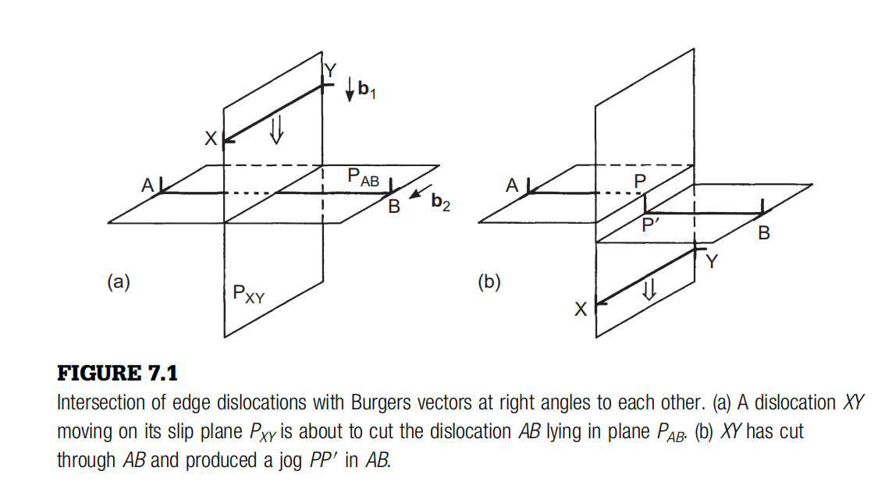

图中位错 $XY$ 在其滑移面 $P_{XY}$ 上运动并切过位错 $AB$；交叉后，$AB$ 上出现 jog $PP'$。

若两条刃位错的伯格斯矢量平行，交叉后同样会在交点附近产生台阶，但台阶相对位错线与滑移面的几何性质不同：

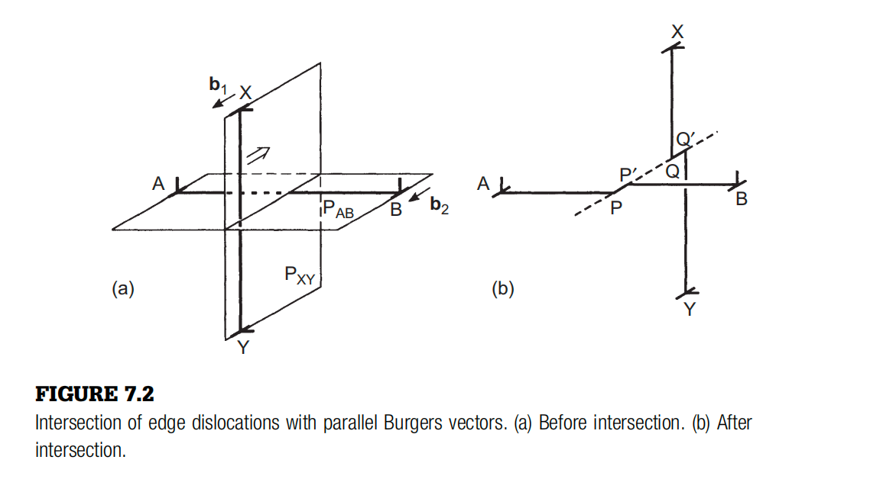

### 7.2.2 刃位错与螺位错交叉

螺位错周围的原子面构成螺旋面。刃位错沿自身滑移面穿过一条螺位错时，其两端最终落在螺旋面的不同高度，因此必须以一个 jog 连接：

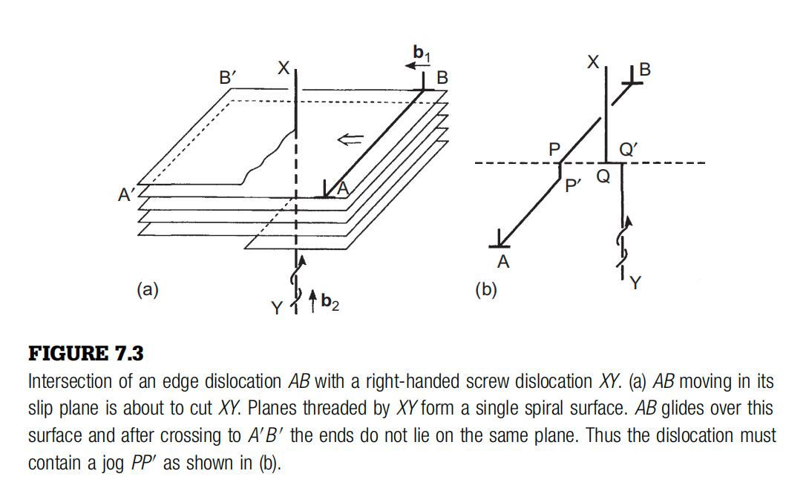

### 7.2.3 几何规则

两条位错相交时，可使用以下基本规则：

> [!important] Jog 几何规则
> 一条位错上形成的 jog，其方向和长度等于另一条位错的伯格斯矢量。符号由两条位错的正线向、伯格斯矢量和交叉方向共同确定。

因此，若位错 1 与位错 2 相交，则位错 1 上的台阶矢量为 $\pm\mathbf b_2$，位错 2 上的台阶矢量为 $\pm\mathbf b_1$。

高度等于最短晶格平移矢量的 jog 称为**基本割阶或单位割阶（elementary/unit jog）**。若其位移完全位于原位错的滑移面内，则该台阶在运动学上是 **kink（扭折）**；若台阶使位错离开原滑移面，则称为 jog。

### 7.2.4 Jog 能量

位错单位长度能量近似为

$$
E_\ell\simeq\alpha Gb^2.
$$

若基本 jog 的长度约为 $b$，忽略与相邻线段的弹性交互，其能量数量级为

$$
E_{\mathrm{jog}}\simeq\alpha Gb^3.
$$

这里 $G$ 为剪切模量，$\alpha$ 为与核心和几何有关的系数。若把 jog 视为普通长位错线段，可取 $\alpha\sim1$；但未分解位错上的短 jog 几乎没有完整的长程弹性能，能量主要来自核心，教材后续估算采用

$$
\alpha\simeq0.2.
$$

---

## 7.3 含基本 jog 位错的运动

### 7.3.1 刃位错与螺位错上的 jog

纯刃位错上的基本 jog 通常是短螺型线段；它可随主位错在相同滑移过程中运动，因此往往不会显著阻碍后续滑移。

螺位错上的 jog 则是短刃型线段：

- 若该线段仍位于可用滑移面内，它等效为 kink，可随螺位错保守运动；
- 若它离开原滑移面，则只能通过攀移等**非保守运动（non-conservative motion）**随主位错移动；
- 在高温或高应力下，主位错拖动 jog 会连续产生或吸收点缺陷。

产生空位轨迹的称为**空位型 jog（vacancy jog）**，产生间隙原子轨迹的称为**间隙型 jog（interstitial jog）**。这使含 jog 螺位错的运动具有明显温度依赖性。

### 7.3.2 Jog 之间的线张力作用

两个距离较近的 jog 会受到相邻位错线段线张力的侧向合力，因而沿位错线相互靠近。它们可能：

- 符号相反时相互湮灭；
- 符号相同时合并为高度为两个晶格间距的 jog；
- 经迁移与合并后形成平均间距近似均匀的 jog 阵列。

以下记相邻 jog 的平均间距为 $x$。

### 7.3.3 产生点缺陷的临界应力

设主位错在相邻 jog 之间的长度为 $x$。位错前进一个原子间距时，jog 需要产生一个形成能为 $E_f$ 的点缺陷。外应力所做功与点缺陷形成能平衡，得到临界剪应力：

$$
\tau_0=\frac{E_f}{b^2x}.
\tag{7.1}
$$

对空位 jog，$E_f=E_f^{\mathrm v}$；对间隙 jog，$E_f=E_f^{\mathrm i}$。间隙原子形成能通常为空位形成能的约 $2$–$4$ 倍，因此拖动间隙型 jog 形成连续间隙原子轨迹需要更高应力。更常见的情况是间隙型 jog 沿位错线迁移并彼此合并或与反号 jog 湮灭。

> [!note] 宏观意义
> Jog 将位错滑移与点缺陷产生联系起来：应力和温度越高，位错越可能拖动 jog 并形成缺陷碎屑；这些缺陷又会反过来钉扎位错或参与回复、蠕变和辐照缺陷演化。

---

## 7.4 Superjog、位错偶极子与长 jog

### 7.4.1 Superjog 的定义

高度超过一个原子滑移面间距的 jog 称为 **superjog（长割阶或超割阶）**。设其高度为 $n$ 个原子面间距：

- 当 $n$ 很小时，螺位错可能直接拖动 superjog，在每个原子面产生多个空位；
- 相应临界应力约为式 (7.1) 的 $n$ 倍：

$$
\tau_{\mathrm c}\simeq\frac{nE_f^{\mathrm v}}{b^2x}.
$$

### 7.4.2 位错线可提供的最大应力

间距为 $x$ 的两个 jog 之间，位错线弓出到最小曲率半径 $R_{\min}\simeq x/2$ 时，线张力可提供的最大应力约为

$$
\tau_{\max}\simeq\frac{2\alpha Gb}{x}.
$$

若

$$
\tau_{\max}<\tau_{\mathrm c},
$$

主位错无法通过连续生成空位直接拖动 superjog。此时行为取决于 jog 高度。

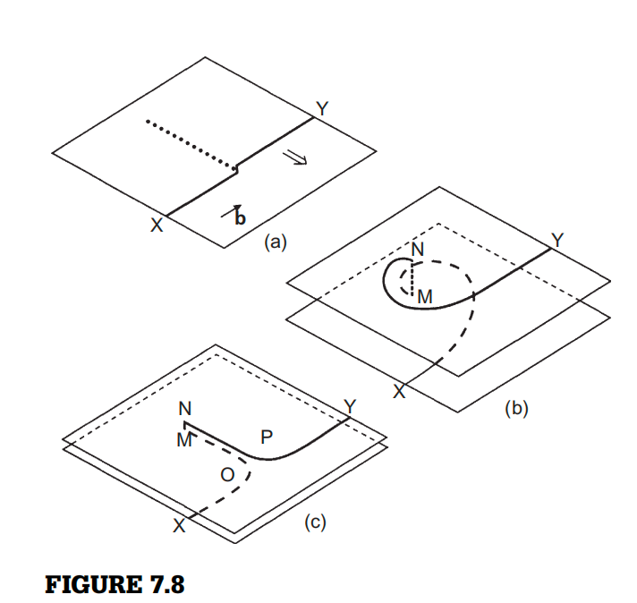

### 7.4.3 中等高度 jog：形成位错偶极子

中等高度 jog 的两个刃型臂相距较近，不能独立运动。主螺位错继续滑移时，会从 jog 两侧拉出符号相反的平行刃位错，形成**位错偶极子（dislocation dipole）**。

两平行刃型分量只有在外加滑移力足以克服相互吸引时才能相互越过。教材给出的近似条件为

$$
\tau b>
\frac{0.25\,Gb^2}{2\pi(1-\nu)y},
\tag{7.2}
$$

其中 $y$ 为 jog 长度（图中的 $MN$）。等价地，

$$
\tau>\frac{Gb}{8\pi(1-\nu)y}.
$$

$y$ 较小时难以满足该条件，因而优先形成偶极子。

### 7.4.4 长 jog：两个单端位错源

当 $y$ 足够大时，两个刃型臂相互作用减弱，可近似作为相互独立的**单端位错源（single-ended sources）**弓出和滑移。长 jog 常由双交滑移或位错暂时离开原滑移面形成。

### 7.4.5 平行滑移面上的偶极子与 superjog

另一个典型机制发生在两条伯格斯矢量相同、线向近似相反且位于平行滑移面上的位错之间：

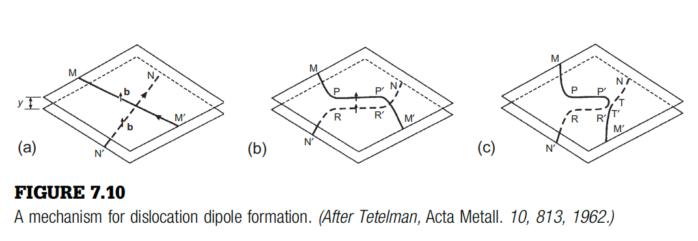

1. 两位错的弹性作用使局部线段重新取向，形成符号相反的平行刃型段 $PP'$ 和 $RR'$。
2. 当滑移面间距 $y$ 很小时，这些刃型段结合成稳定偶极子。
3. 若邻近线段接近螺型，其中一段可交滑移并与另一条位错连接。
4. 连接线段夹断后，一条位错上留下刃型偶极子，另一条位错上留下 superjog。

判断位错符号时应同时标出正线向：按照 Burgers 回路约定，符号相反的位错可具有相同伯格斯矢量，但线向相反。

这种位错偶极子常见于塑性变形早期，尤其是滑移集中在一组平行滑移面时。

---

## 7.5 Jog、缺陷碎屑与棱柱位错环

运动位错后方经常留下点缺陷轨迹、偶极子和许多小型棱柱位错环，统称为位错**碎屑（debris）**。它们是螺位错上刃型 jog 非保守运动的直接结果。

### 7.5.1 点缺陷聚集形成位错环

第一种机制是 jog 产生的点缺陷发生扩散和聚集：

- 温度足够高时，空位可扩散并聚集成空位型棱柱环；
- 较低温度下，间隙原子通常比空位迁移更快，若基本 jog 能产生间隙原子，则更容易先形成间隙型环；
- 环的性质由最初 jog 或缺陷团簇的符号决定。

### 7.5.2 偶极子夹断与分解

第二种机制由中等高度 jog 或平行滑移面反应产生的位错偶极子继续演化：

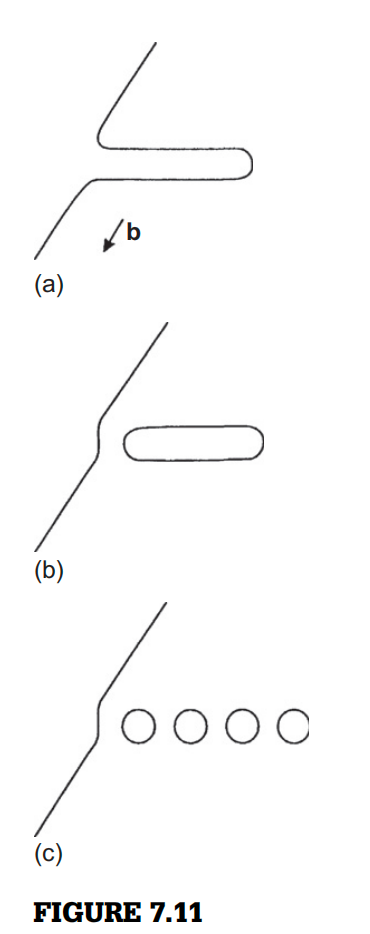

1. 偶极子通过交滑移从主位错线上夹断，形成封闭的长条形环；
2. 偶极子两条长边为异号刃位错，相互吸引；
3. 借助攀移，长条环可分裂成一列较小的棱柱环；
4. 管道扩散（pipe diffusion）沿位错核心输运物质，因此该过程可在低于体扩散显著温度的条件下发生。

螺位错中的螺旋转弯若从主线脱离，也会释放一个棱柱位错环。

### 7.5.3 不可穿透颗粒附近的 jog 与环

弥散强化合金中，位错绕过不可穿透颗粒时可在多个滑移面间交滑移，形成 jog、螺旋线段或闭合环：

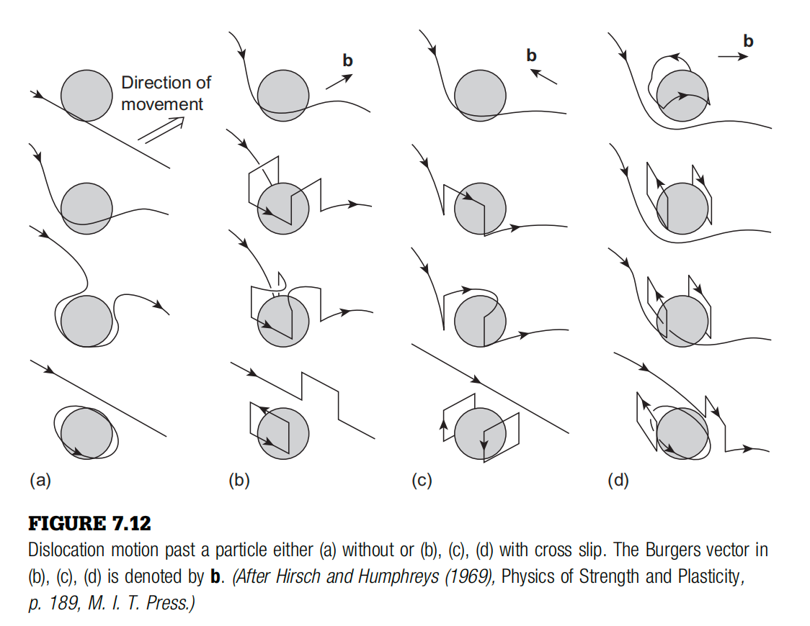

这些残余线段和环会继续阻碍后续位错，因此颗粒绕过、jog 形成和缺陷碎屑共同贡献弥散强化与加工硬化。

---

## 7.6 扩展位错交叉与扩展 jog

### 7.6.1 交叉前的局部收缩

FCC 扩展位错由两个 Shockley 不全位错和中间层错带组成。两条扩展位错不能直接让层错带彼此穿过；在交叉区域必须先发生**局部收缩（constriction）**，重新形成未扩展的完整位错。

完整位错交叉后可再次分解，于扩展位错上留下基本 jog。由于形成 jog 前需要消除局部层错，扩展 jog 的能量取决于：

- 层错能 $\gamma$；
- 两个不全位错的平衡间距；
- jog 能否进一步分解；
- 交叉处形成的是内禀还是外禀层错。

低层错能对应更宽的扩展位错和更高的收缩功，因此通常提高扩展位错交叉的阻力。

### 7.6.2 可滑移的扩展 jog

在合适的伯格斯矢量与滑移面组合下，刃位错上的完整 jog 可再次分解，形成被层错面包围的**可滑移扩展 jog（glissile extended jog）**：

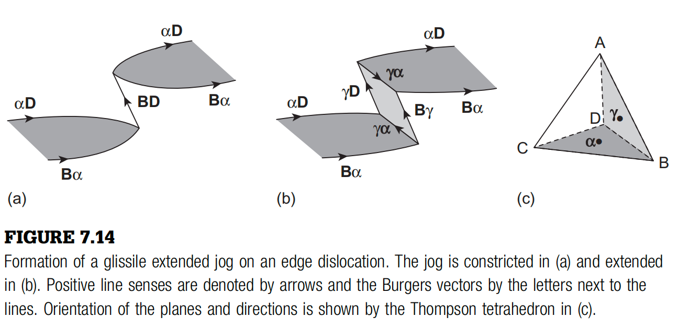

图中 (a) 为收缩 jog，(b) 为分解后的扩展 jog；Thompson 四面体给出各线段的伯格斯矢量和面取向。

### 7.6.3 不可滑移的扩展 jog

螺位错上的 jog 分解后可能产生不能在任一相关 $\{111\}$ 面上保守运动的阶梯杆或其他 sessile 分量，形成**不可滑移扩展 jog（sessile extended jog）**：

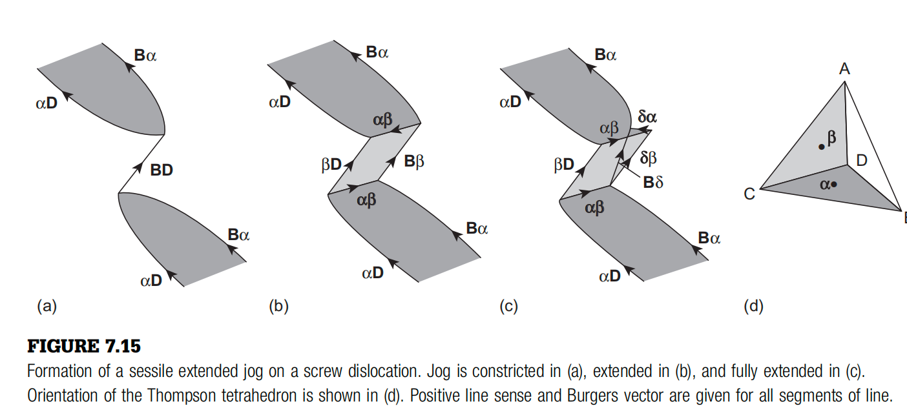

扩展 jog 可形成锐角或钝角弯折，也可能包围外禀层错。具体结构由位错线向、交叉顺序、伯格斯矢量和层错能共同决定。

---

## 7.7 吸引结、排斥结与位错反应

位错交叉不仅是核心尺度的短程过程。两位错接触前，其长程应力场已经使位错弯曲并改变交叉难度。

### 7.7.1 两条正交螺位错的相互作用

考虑两条相互垂直的螺位错：位错 $A$ 平行 $y$ 轴，位错 $B$ 平行 $z$ 轴，两者最短距离为 $d$：

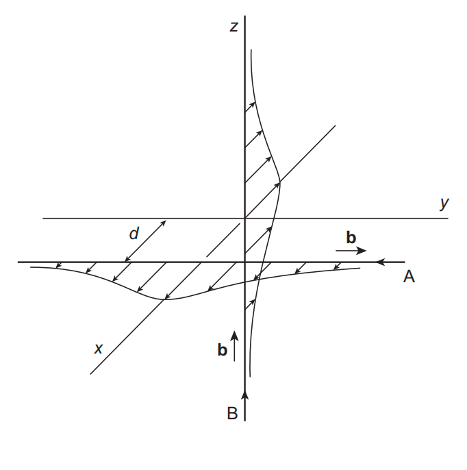

位错 $B$ 的应力场在 $A$ 上产生的单位长度滑移力大小为

$$
f_A(y)=\frac{Gb^2d}{2\pi(d^2+y^2)},
$$

位错 $A$ 的应力场在 $B$ 上产生

$$
f_B(z)=\frac{Gb^2d}{2\pi(d^2+z^2)}.
$$

力的正负由两位错符号决定：

- 某一符号组合下，两条位错在交点附近相互排斥，必须额外做功才能使其相交；
- 反转其中一条位错的符号后，力变为吸引，相交容易，但分离需要额外功。

对理想刚性直线，吸引与排斥情形涉及的附加功大小相同；真实位错可弯曲，弯曲会削弱排斥结、增强吸引结，因此**吸引结通常更强**。

### 7.7.2 结段的伯格斯矢量与 Frank 判据

两位错在交点反应后，连接段的伯格斯矢量满足

$$
\mathbf b_3=\mathbf b_1+\mathbf b_2.
$$

若

$$
b_3^2<b_1^2+b_2^2,
$$

反应可降低弹性线能。产物结段可能：

- 在某个参与滑移面内可动，形成 **glissile junction**；
- 不在允许滑移面内，形成 Hirth、Lomer 或 Lomer–Cottrell 等 **sessile lock**；
- 与反号共线线段发生湮灭，形成 **collinear reaction**。

### 7.7.3 可滑移吸引结

FCC 中，位错 $DC$ 在面 $BCD$ 上滑移，与面 $ABC$ 上伯格斯矢量为 $CB$ 的林位错反应：

$$
DC+CB=DB.
$$

产物 $DB$ 位于两个滑移面交线附近，并可在 $BCD$ 面内滑移：

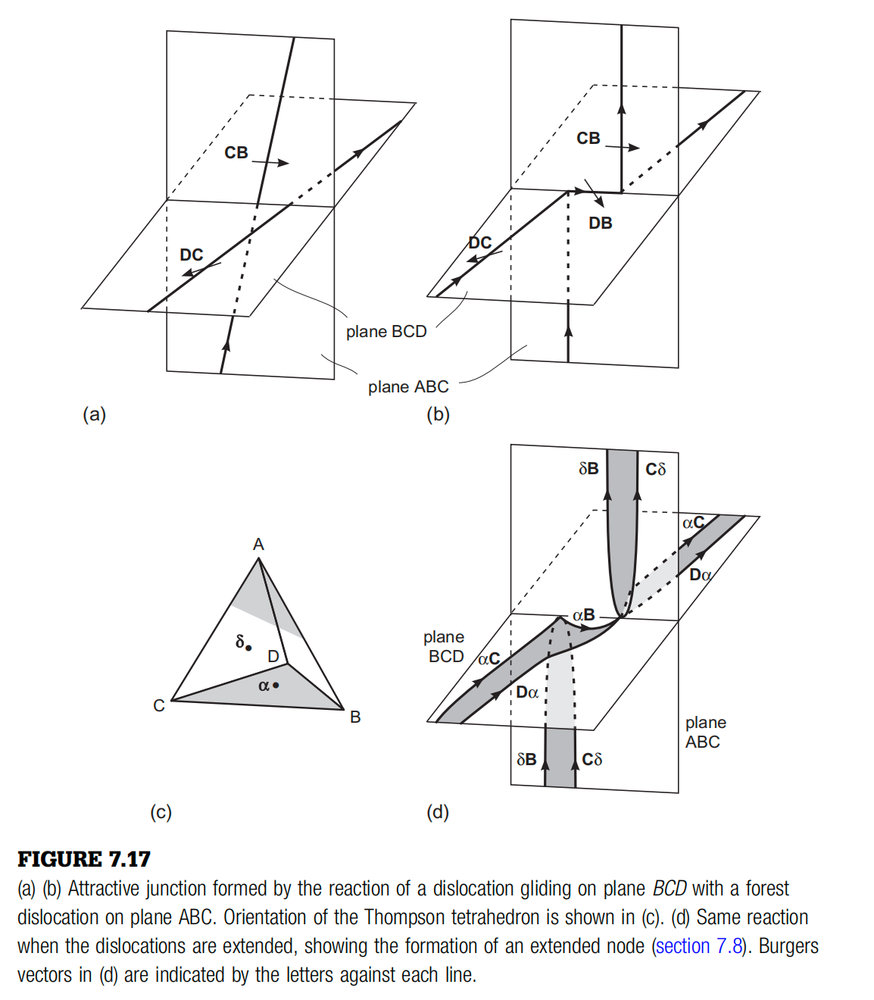

尽管产物结段本身可滑移，其两端仍被林位错约束。只有外应力足以克服反应带来的能量降低并使结段缩短至零时，滑移位错才能解锁。若母位错已扩展，交点附近还会形成扩展节点。

### 7.7.4 共线反应

两条伯格斯矢量相同、线向相反的位错在弹性吸引下局部平行排列后，共线线段可沿两个滑移面交线相互湮灭：

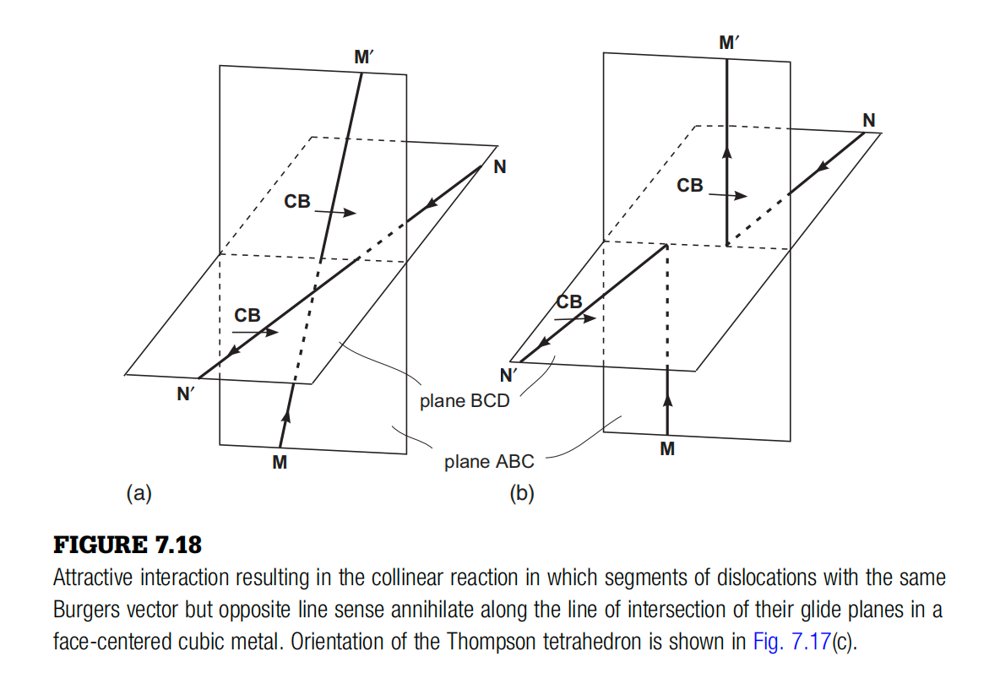

反应后，两条位错重新连接到对方的远端。共线反应会显著改变位错网络拓扑，被认为是加工硬化的重要机制之一。

### 7.7.5 BCC 多位错结与 Frank–Read 源

BCC 中，两条 $\frac12\langle111\rangle$ 位错可发生有利反应，形成 $\langle100\rangle$ 结段。随应力增加，该结段可以解拉链式缩短；第三条 $\frac12\langle111\rangle$ 位错还可继续与结段反应，将其转化为 $\frac12\langle111\rangle$ 螺型段：

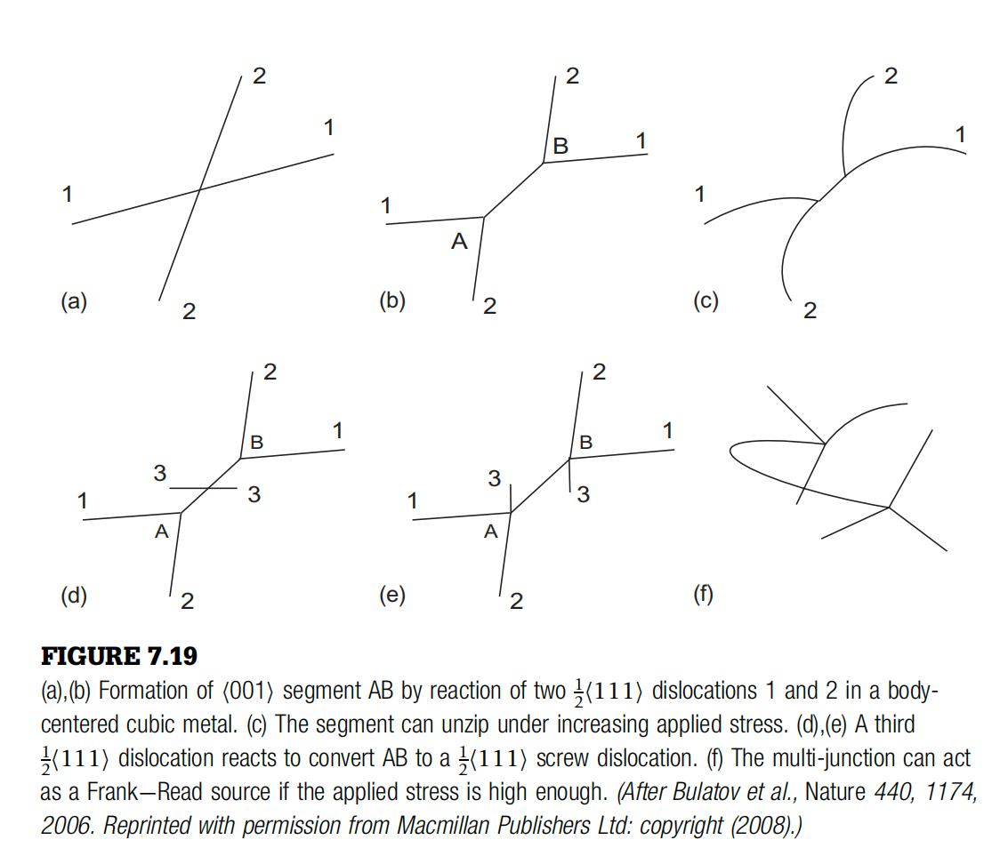

一个具体反应为

$$
[001]+\frac12[11\bar{1}]
=\frac12[111].
\tag{7.3}
$$

等价地，三条初始位错的总反应可写为

$$
\frac12[\bar{1}11]
+\frac12[1\bar{1}1]
+\frac12[11\bar{1}]
=\frac12[111].
\tag{7.4}
$$

反应前后三条线段的伯格斯矢量平方和明显降低，因此形成多结在能量上有利。节点 $A$、$B$ 会钉扎中间螺型段；当外应力升高时，该段可作为 **Frank–Read 位错源（Frank–Read source）**弓出并增殖位错。

---

## 7.8 扩展层错节点与层错能测量

扩展位错反复交叉后，会形成由扩展节点与收缩节点连接的网络。节点附近层错带的曲率由位错线张力与层错面张力平衡决定，因此可用显微图像估计层错能。

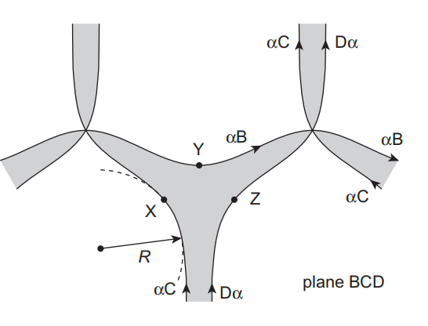

设节点层错边界的局部曲率半径为 $R$，位错线张力为

$$
T\simeq\alpha Gb^2.
$$

单位长度上的力平衡给出

$$
\gamma=\frac{T}{R}
\simeq\frac{\alpha Gb^2}{R}.
\tag{7.5}
$$

另一方面，在 $\nu=0$ 的简化各向同性近似下，两个 Shockley 不全位错的平衡间距为

$$
d\simeq\frac{Gb^2}{4\pi\gamma}.
\tag{7.6}
$$

联立可得

$$
\frac{R}{d}\simeq4\pi\alpha.
$$

若取 $\alpha\simeq0.5$，

$$
R\simeq2\pi d\simeq6d.
$$

实验通常测量节点的内径而不是单个不全位错间距，因此测得的节点尺度往往比 $d$ 大约一个数量级。该方法提供了由扩展节点几何反推层错能 $\gamma$ 的实验途径，但精确分析还需考虑泊松比、弹性各向异性、图像投影和节点三维形状。

---

## 7.9 微观机制与宏观加工硬化

| 微观结构或反应 | 对位错运动的直接影响 | 宏观结果 |
| --- | --- | --- |
| 基本 jog | 使螺位错运动需要攀移或产生点缺陷 | 温度依赖增强，流动应力上升 |
| Superjog | 形成偶极子或单端位错源 | 位错储存和局部增殖增加 |
| 位错偶极子 | 强烈束缚相邻异号刃位错 | 形成稳定障碍和缺陷碎屑 |
| 棱柱位错环 | 钉扎后续位错并储存点缺陷 | 加工硬化、回复和蠕变行为改变 |
| 吸引结与 sessile lock | 把滑移位错固定在林位错上 | 林硬化增强 |
| 共线反应 | 湮灭局部线段并重连位错网络 | 网络拓扑和硬化速率改变 |
| 多结与 Frank–Read 源 | 节点钉扎后促进新位错增殖 | 位错密度快速上升 |
| 扩展节点 | 收缩功和层错能控制解锁 | 低层错能材料更易平面滑移和强加工硬化 |

随着应变增加，林位错密度和交叉概率提高，位错平均自由程缩短。宏观流动应力通常可用 Taylor 关系描述其数量级：

$$
\tau_{\mathrm f}\sim\alpha_TGb\sqrt{\rho},
$$

其中 $\rho$ 为总位错密度，$\alpha_T$ 为反映位错相互作用强度的无量纲系数。Jog、位错结和偶极子的形成，是该统计硬化关系背后的重要微观来源。

---

## 7.10 本章小结

- 位错相交时，每条位错获得方向和长度与另一条位错伯格斯矢量相对应的台阶；台阶在滑移面内时为 kink，离开滑移面时为 jog。
- 基本 jog 能量以核心能为主，约为 $\alpha Gb^3$；螺位错拖动 jog 时可能连续产生空位或间隙原子。
- Superjog 可形成位错偶极子、单端位错源和棱柱位错环，并在运动位错后留下缺陷碎屑。
- 扩展位错相交前必须局部收缩；扩展 jog 的结构与能量受层错能和不全位错间距控制。
- 长程弹性作用产生吸引结和排斥结；伯格斯矢量反应可形成 glissile junction、sessile lock 或共线湮灭。
- BCC 多位错结可生成被节点钉扎的螺型段，并在高应力下充当 Frank–Read 位错源。
- 扩展节点的曲率半径与层错能满足 $\gamma\simeq T/R$，可用于实验估算层错能。
- Jog、偶极子、位错环和位错结共同缩短位错平均自由程，是加工硬化的重要微观机制。
