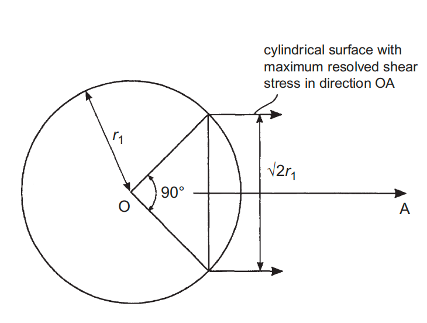
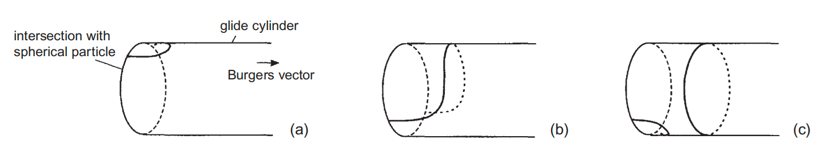
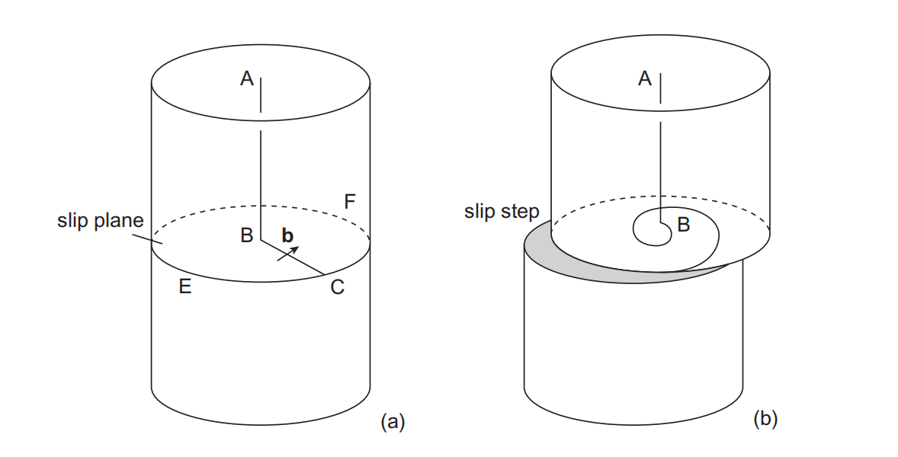
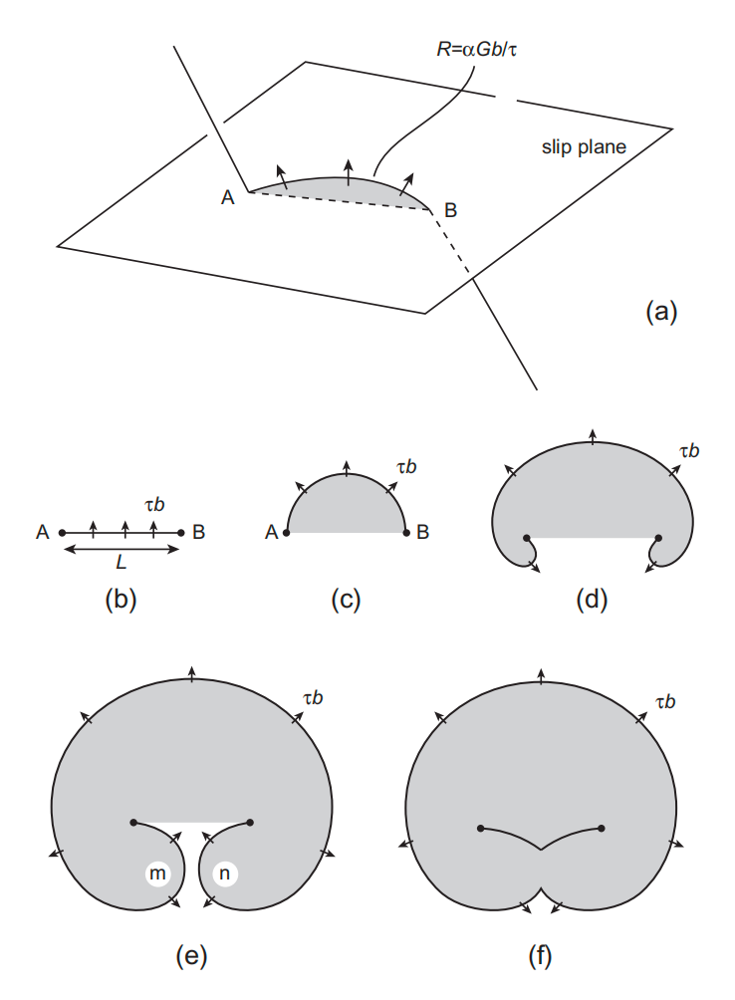

# 8. 位错的起源与增殖（Origin and Multiplication of Dislocations）

> **本章概要**：位错可以在晶体生长、冷却、界面拼合和局部应力集中过程中产生；已有位错还可通过 Frank–Read 源、多重交滑移、Bardeen–Herring 源和晶界源持续增殖。均匀形核需要接近理论强度的高应力，因此常规塑性流动主要依赖预存位错的运动与再生增殖。

---

## 8.1 为什么晶体中会存在大量位错

### 8.1.1 位错自由能

位错增加晶体的弹性应变能，但也增加构型熵。位错熵对单位长度自由能的最大负贡献可估为

$$
\Delta F_{\mathrm{ent}}\sim-\frac{2kT}{b},
$$

而弹性应变能贡献约为

$$
E_\ell\sim Gb^2.
$$

二者乘以一个原子尺度 $b$ 后可比较：

$$
Gb^3\sim5\text{--}10\ \mathrm{eV},
\qquad
kT\simeq\frac1{40}\ \mathrm{eV}\quad(300\ \mathrm K).
$$

因此通常有

$$
Gb^2-\frac{2kT}{b}>0.
$$

位错不像热平衡空位那样仅靠构型熵就能在完整晶体中大量稳定存在。实际位错主要由生长缺陷、应力集中和非平衡形核产生，并在后续变形中增殖。

### 8.1.2 塑性变形中的位错增殖

随着应变增加，位错密度会迅速上升。变形早期，位错运动可能集中在一组平行滑移面；随后其他滑移系启动，位错交叉、形成 jog 和位错结，并产生更多可动或被钉扎的位错线。

要解释晶体能够产生远大于单条位错扫过量的塑性应变，必须存在**再生式增殖（regenerative multiplication）**：源每完成一个循环后仍保留可继续工作的母位错。

---

## 8.2 新生晶体中的位错来源

即使采用精细工艺，也很难生长出完全无位错晶体。新生晶体中的位错主要来自两类途径：

1. 种晶、容器表面或起始界面中的已有缺陷向新晶体延伸；
2. 生长过程中因局部应力、界面拼合或点缺陷聚集而偶然形核。

### 8.2.1 种晶缺陷的继承

若种晶中的位错穿过正在生长的表面，它可随界面推进直接延伸进新生晶体。因此，种晶质量和生长界面取向会显著影响最终位错密度。

### 8.2.2 局部内应力形核

相邻区域被迫发生不同体积变化时，会产生较大局部内应力。常见来源包括：

- 温度梯度造成的不均匀热膨胀或收缩；
- 成分变化造成的晶格参数差异；
- 相变或晶体结构变化造成的比体积差异；
- 晶体黏附容器壁而无法自由收缩；
- 生长设备振动或其他随机机械扰动。

当局部应力达到约

$$
\tau_{\mathrm{local}}\sim\frac G{30}
$$

的量级时，可能形核位错。若形核发生在高温，位错还能通过攀移重新排列，形成较低能的位错网络。

### 8.2.3 生长界面的拼合（Impingement）

两个相邻枝晶或生长前沿拼合时，若取向略有偏差或表面台阶不能完全匹配，界面必须引入位错来协调几何错配。

即使两部分晶体取向相同，只要晶格参数不同，界面原子也会形成交替的良好匹配区和差匹配区，差匹配区由**错配位错（misfit dislocations）**承担。类似机制也常见于：

- 析出相与基体界面；
- 外延薄膜与衬底界面；
- 固态相变形成的新相界面。

### 8.2.4 过饱和空位坍塌

晶体从接近熔点的温度快速冷却时，高温平衡空位浓度可能被冻结为过饱和状态。空位聚集成薄片后可发生坍塌，形成空位型位错环。该机制与前述 Frank 环和棱柱位错环的形成直接相连。

---

## 8.3 位错的均匀形核

### 8.3.1 圆形位错环的能量

在不含其他缺陷的理想晶体内部直接产生位错称为**均匀形核（homogeneous nucleation）**。设分切应力为 $\tau$，在滑移面上形成半径为 $r$、伯格斯矢量模为 $b$ 的圆形位错环。

取 $\nu=0$ 的简化各向同性近似，位错环的线能为

$$
E_{\mathrm{line}}
=\frac12Gb^2r\ln\left(\frac{2r}{r_0}\right),
$$

其中 $r_0$ 为核心截断半径。位错环扫过面积 $\pi r^2$，外应力做功为

$$
W=\pi r^2\tau b.
$$

形核过程的总能量变化为

$$
E(r)
=\frac12Gb^2r\ln\left(\frac{2r}{r_0}\right)
-\pi r^2\tau b.
\tag{8.1}
$$

第一项随位错线长度增加而升高，第二项是外应力释放的机械势能。

### 8.3.2 临界半径和形核势垒

小位错环首先使系统能量升高。当

$$
\frac{\mathrm dE}{\mathrm dr}=0
$$

时达到能量极大值，对应临界半径 $r_{\mathrm c}$：

$$
r_{\mathrm c}
=\frac{Gb}{4\pi\tau}
\left[
\ln\left(\frac{2r_{\mathrm c}}{r_0}\right)+1
\right].
\tag{8.2}
$$

相应形核势垒为

$$
E_{\mathrm c}
=\frac14Gb^2r_{\mathrm c}
\left[
\ln\left(\frac{2r_{\mathrm c}}{r_0}\right)-1
\right].
\tag{8.3}
$$

- 当 $r<r_{\mathrm c}$ 时，位错环倾向于收缩消失；
- 当 $r>r_{\mathrm c}$ 时，外应力做功占优，位错环可自发扩张；
- $E_{\mathrm c}$ 是热激活均匀形核需要跨越的能垒。

### 8.3.3 为什么常规屈服不是均匀形核

若完全不依赖热涨落，必须使 $E_{\mathrm c}=0$。由式 (8.3)：

$$
\ln\left(\frac{2r_{\mathrm c}}{r_0}\right)=1,
\qquad
r_{\mathrm c}=1.36r_0.
$$

代入式 (8.2) 得

$$
\tau=\frac{Gb}{2\pi r_{\mathrm c}}
\simeq\frac G{10}.
\tag{8.4}
$$

这一应力接近理论剪切强度。

实际金属的宏观屈服应力上限更接近 $\tau\sim G/1000$。若取 $r_0=2b$，式 (8.2) 给出

$$
r_{\mathrm c}\simeq500b,
$$

式 (8.3) 对应

$$
E_{\mathrm c}\simeq650Gb^3,
$$

典型金属中约为 $3\ \mathrm{keV}$。室温热涨落越过该势垒的概率与

$$
\exp\left(-\frac{E_{\mathrm c}}{kT}\right)
$$

成正比，实际上可以忽略。

> [!important] 结论
> 常规屈服应力下，完整晶体内部几乎不可能发生位错均匀形核。塑性流动通常依赖预存位错的运动与增殖；只有自由表面、界面、裂纹、夹杂物等应力集中处，局部应力才可能接近形核要求。

---

## 8.4 应力集中处的位错形核

位错更容易在以下位置异质形核：

- 自由表面、台阶和划痕；
- 裂纹尖端；
- 析出物、夹杂物及第二相界面；
- 晶界和相界；
- 热膨胀或晶格参数不匹配区域。

### 8.4.1 球形错配夹杂物的位移场

考虑半径为 $r_1$ 的刚性球形夹杂物，其自由半径相对基体孔洞存在错配应变 $\varepsilon$。在无限各向同性基体中，球外位移为纯径向位移：

$$
u_r(r)=\frac{\varepsilon r_1^3}{r^2},
\qquad r\ge r_1.
\tag{8.5}
$$

界面处

$$
u_r(r_1)=\varepsilon r_1,
$$

恰好满足径向错配条件。直角坐标分量为

$$
u_x=\varepsilon r_1^3\frac{x}{r^3},
\qquad
u_y=\varepsilon r_1^3\frac{y}{r^3},
\qquad
u_z=\varepsilon r_1^3\frac{z}{r^3}.
\tag{8.6}
$$

### 8.4.2 应变、应力与最大剪应力

定义

$$
q(r)=\frac{\varepsilon r_1^3}{r^3}.
$$

球坐标下的主应变为

$$
\varepsilon_{rr}=\frac{\mathrm du_r}{\mathrm dr}=-2q,
\qquad
\varepsilon_{\theta\theta}
=\varepsilon_{\phi\phi}
=\frac{u_r}{r}=q.
$$

体积应变为零：

$$
\varepsilon_{rr}
+\varepsilon_{\theta\theta}
+\varepsilon_{\phi\phi}
=-2q+q+q=0.
$$

因此 Lamé 体积项消失，主应力为

$$
\sigma_{rr}=-4Gq,
\qquad
\sigma_{\theta\theta}
=\sigma_{\phi\phi}
=2Gq.
$$

最大剪应力为

$$
\tau_{\max}
=\frac{\sigma_{\max}-\sigma_{\min}}2
=3Gq.
$$

$q\propto r^{-3}$，故最大值位于界面 $r=r_1$：

$$
\tau_{\max}=3\varepsilon G,
\tag{8.7}
$$

只讨论大小时写为

$$
|\tau_{\max}|=3|\varepsilon|G.
$$

由最大分切应力取向可得到与球形夹杂物相交的优选圆柱滑移面，其截面直径为

$$
\sqrt2\,r_1.
$$

### 8.4.3 玻璃夹杂物—AgCl 案例

教材以玻璃颗粒和 AgCl 晶体为例。若二者从 $370^\circ\mathrm C$ 冷却到 $20^\circ\mathrm C$，线膨胀系数分别为

$$
\alpha_1=34\times10^{-7}\ \mathrm{K^{-1}},
\qquad
\alpha_2=345\times10^{-7}\ \mathrm{K^{-1}},
$$

则错配应变约为

$$
\varepsilon\simeq0.01.
$$

因此

$$
\tau_{\max}\simeq3(0.01)G
\simeq\frac G{33}.
\tag{8.8}
$$

该局部应力远高于常见宏观屈服应力，足以在夹杂物界面形核位错。

### 8.4.4 位错半环与棱柱环的形成

在 $\tau_{\max}$ 作用下，优选滑移圆柱与夹杂物界面的交线上先形成小位错半环：

1. 前方刃型分量沿圆柱表面远离夹杂物；
2. 两侧螺型分量受到切向力，沿圆柱表面向相反方向滑移；
3. 其他离开圆柱面的运动需要攀移，因此位错被限制在滑移圆柱上；
4. 两端相遇后以相反线向湮灭，释放一个闭合棱柱位错环。

若 $\varepsilon>0$，形成正的间隙型棱柱环；若错配应变符号相反，则可形成空位型环。应力随距界面增加而衰减，因此新生成的环最终在有限位置停止或与其他缺陷反应。

---

## 8.5 单端螺旋源与 Frank–Read 源

能够产生大塑性应变的位错源必须在放出一个位错环后恢复原始可动线段。最重要的机械增殖机制是单端螺旋源和 Frank–Read 源。

### 8.5.1 单端螺旋源

设位错 $ABC$ 中，线段 $BC$ 位于滑移面 $CEF$ 内，可以自由滑移；线段 $AB$ 不在该滑移面内，视为 sessile 锚定段。$BC$ 只能绕固定点 $B$ 旋转：

该机制具有两个结果：

1. 每绕 $B$ 一周，滑移面上、下晶体的相对位移增加一个 $b$；旋转 $n$ 周后总位移为 $nb$，晶体表面形成较大的滑移台阶；
2. 每次旋转都会增加位错线总长度，因此它是再生式的单端位错源。

### 8.5.2 Frank–Read 源的弓出

Frank–Read 源（Frank–Read source）是两端固定的位错线段。设源长为 $L$，两端 $A$、$B$ 被位错结、复合 jog、析出物等障碍固定。外加分切应力 $\tau$ 对位错施加单位长度力

$$
f=\tau b.
$$

线张力

$$
T\simeq\alpha Gb^2
$$

使弓出线段保持曲率。平衡半径为

$$
R=\frac{T}{\tau b}
\simeq\frac{\alpha Gb}{\tau}.
$$

随着 $\tau$ 增大，$R$ 减小。当线段成为半圆时

$$
R_{\min}=\frac L2.
$$

临界应力为

$$
\tau_{\mathrm{FR}}
=\frac{2\alpha Gb}{L}.
$$

若取 $\alpha\simeq0.5$：

$$
\tau_{\mathrm{FR}}\simeq\frac{Gb}{L}.
\tag{8.9}
$$

### 8.5.3 再生循环

超过临界构型后，位错线继续扩展，形成肾形大环。内侧线段 $m$、$n$ 具有相同伯格斯矢量但线向相反，相遇后湮灭。最终得到：

- 一个向外持续扩张的闭合位错环；
- 一条重新连接 $A$、$B$ 的母位错线段。

母线段恢复后可再次弓出，因此一个 Frank–Read 源能够连续发射多个位错环。源越短，临界应力越高；长源更容易启动。

> [!note] 与宏观塑性的联系
> Frank–Read 源把有限数量的预存位错转化为大量移动位错，是屈服后位错密度迅速增加的核心机制之一。新生位错与林位错、析出物和晶界继续交互，推动加工硬化。

---

## 8.6 多重交滑移增殖

实验中的位错蚀坑带具有有限宽度，说明位错不只分布在单一滑移面，而是扩展到一组平行滑移面。该现象可由**多重交滑移（multiple cross-slip）**解释。

典型过程为：

1. 螺位错从主滑移面交滑移到另一面；
2. 再次交滑移回与原面平行的滑移面；
3. 两次交滑移之间形成较长且相对不动的 jog；
4. 各主滑移面上的可动线段继续弓出，分别形成类似 Frank–Read 源的线段；
5. 滑移从一个平面传播到多个平行平面，形成宽滑移带。

当交滑移很容易时，各源未必完成独立的闭合环循环；多个平行面上的位错线可由 jog 连成一条连续位错。相较单一 Frank–Read 源，多重交滑移能更快增加位错总长度和受影响滑移面数量，因此增殖效率更高。

---

## 8.7 攀移增殖与 Bardeen–Herring 源

### 8.7.1 其他攀移增殖机制

前文已涉及两种能增加位错总长度的攀移过程：

- 棱柱位错环吸收点缺陷后扩张；
- 以螺型为主的位错在攀移作用下形成螺旋结构。

与 Frank–Read 源类似，固定线段也可通过攀移形成再生式 **Bardeen–Herring 源（Bardeen–Herring source）**。

为保持源的再生性，攀移线段两端需要由不能以同样方式攀移的螺型段或稳定节点锚定。若锚点本身是可自由攀移的刃型线段，原子面会随攀移被连续移除或添加，固定条件可能消失。

### 8.7.2 化学力与曲率平衡

当空位浓度为 $c$、热平衡浓度为 $c_0$ 时，空位过饱和对位错产生单位长度化学力：

$$
f_{\mathrm{chem}}
=\frac{bkT}{\Omega}
\ln\left(\frac{c}{c_0}\right),
$$

其中 $\Omega$ 为原子体积。与线张力平衡：

$$
\frac{bkT}{\Omega}
\ln\left(\frac{c}{c_0}\right)
=\frac{\alpha Gb^2}{R}.
\tag{8.10}
$$

### 8.7.3 临界空位过饱和度

对长度为 $L$ 的固定攀移源，临界构型同样近似为半圆，即 $R=L/2$。因此

$$
\ln\left(\frac{c}{c_0}\right)
=\frac{2\alpha Gb\Omega}{LkT}.
\tag{8.11}
$$

取 $\alpha\simeq0.5$、$\Omega\simeq b^3$、$Gb^3\simeq5\ \mathrm{eV}$，在 $T=600\ \mathrm K$ 时 $kT\simeq0.05\ \mathrm{eV}$，得到

$$
\ln\left(\frac{c}{c_0}\right)
\simeq\frac{100b}{L}.
$$

例如：

$$
L=10^3b
\quad\Rightarrow\quad
\frac{c}{c_0}\simeq1.11,
$$

$$
L=10^4b
\quad\Rightarrow\quad
\frac{c}{c_0}\simeq1.01.
$$

因此较长 Bardeen–Herring 源只需很小的空位过饱和即可启动。快速淬火时可达到远高于此的过饱和度，源可能在快速冷却阶段持续工作。

| 位错源 | 驱动力 | 临界条件 | 主要温度范围 |
| --- | --- | --- | --- |
| Frank–Read 源 | 外加剪应力 | $\tau\gtrsim2\alpha Gb/L$ | 滑移可进行的广泛温区 |
| Bardeen–Herring 源 | 点缺陷化学势 | $\ln(c/c_0)\gtrsim2\alpha Gb\Omega/(LkT)$ | 扩散和攀移显著的高温或强过饱和条件 |

---

## 8.8 晶界位错源

大量实验表明，晶界可以向晶粒内部发射位错。主要机制包括：

### 8.8.1 晶界位错网络

低角度晶界由规则位错网络组成，其中某些被节点固定的线段可作为 Frank–Read 源；若高温下允许攀移，也可作为 Bardeen–Herring 源。

### 8.8.2 吸附晶格位错与晶界台阶

晶格位错可被晶界结构吸收并在无外应力时稳定存在。吸附位错产生的晶界台阶是有利形核位置，因为发射位错时减少部分晶界面积，可降低形核激活能。

### 8.8.3 位错塞积诱导发射

滑移位错在晶界前形成塞积（pile-up）时，塞积头部应力被显著放大，可在低于均匀形核应力的外加载荷下：

- 激活晶界已有位错源；
- 从相邻晶粒发射位错；
- 触发跨晶界滑移传递；
- 在不利条件下诱发微裂纹。

### 8.8.4 迁移晶界产生位错

晶界迁移时，原子在新晶格位置重新排列。偶然错配可在晶界经过的晶格中留下位错。因此，再结晶、晶粒长大和固态相变过程中，迁移晶界本身也是位错来源。

---

## 8.9 位错来源与增殖机制比较

| 机制 | 初始位置或条件 | 主要驱动力 | 生成结果 | 宏观意义 |
| --- | --- | --- | --- | --- |
| 生长继承 | 种晶或初始表面已有位错 | 生长界面推进 | 位错延伸进新晶体 | 决定初始位错密度 |
| 界面拼合 | 枝晶、外延层、析出相界面 | 晶格/取向错配 | 界面位错或错配位错 | 松弛残余应力 |
| 空位片坍塌 | 快速冷却后的空位过饱和 | 点缺陷凝聚 | 空位型位错环 | 形成淬火缺陷 |
| 均匀形核 | 近乎完整晶体 | 接近理论强度的剪应力 | 临界位错环 | 常规屈服下几乎不发生 |
| 应力集中形核 | 表面、裂纹、夹杂物、晶界 | 局部高应力 | 半环或棱柱环 | 实际新位错形核的重要途径 |
| Frank–Read 源 | 两端固定的可滑移线段 | 外加分切应力 | 连续闭合位错环 | 最经典的机械增殖源 |
| 多重交滑移 | 易交滑移的螺位错 | 剪应力和交滑移 | 多平面连续位错 | 快速形成宽滑移带 |
| Bardeen–Herring 源 | 两端固定的可攀移线段 | 点缺陷化学势 | 攀移位错环 | 高温、淬火和蠕变增殖 |
| 晶界源 | 位错网络、台阶或塞积附近 | 外应力、晶界迁移 | 向晶内发射位错 | 控制多晶屈服和滑移传递 |

---

## 8.10 本章小结

- 位错自由能通常为正，晶体中的位错主要由非平衡生长、应力集中和后续增殖产生。
- 新生晶体可继承种晶缺陷，也可因局部热应力、界面拼合和过饱和空位坍塌产生位错。
- 均匀形核需要约 $G/10$ 的应力；普通屈服应力下形核势垒过高，塑性主要依赖预存位错。
- 球形错配夹杂物界面的最大剪应力为 $\tau_{\max}=3\varepsilon G$，可在圆柱滑移面上形核并释放棱柱环。
- Frank–Read 源的临界应力近似与源长成反比：$\tau_{\mathrm{FR}}\simeq Gb/L$。
- 多重交滑移使一条位错扩展到多个平行滑移面，通常比单一 Frank–Read 源增殖更快。
- Bardeen–Herring 源由点缺陷化学势驱动，其临界条件由空位过饱和度而非剪应力决定。
- 晶界位错网络、晶界台阶、塞积应力集中和迁移晶界均可向晶粒内部提供位错。
