# 9. 位错阵列与晶体界面（Dislocation Arrays and Crystal Interfaces）

> **本章概要**：塑性变形产生的位错可在回复过程中重排为低能阵列，构成小角度晶界。晶界的几何错配、应力场和能量分别可用 Frank 关系、位错弹性场叠加和 Read–Shockley 模型描述。界面位错与台阶还控制晶界迁移、孪晶和部分相变过程；位错塞积则展示了另一类具有强应力集中的位错排列。

**符号约定**：$\mathbf b$ 为伯格斯矢量（Burgers vector），$b=|\mathbf b|$；$\boldsymbol\xi$ 为位错线单位切向；$\mathbf l$ 为转轴单位向量，$\mathbf n$ 为界面单位法向；$D$ 为位错间距，$G$ 为剪切模量，$\nu$ 为泊松比。除明确标注角度制外，公式中的取向差 $\theta$ 均用弧度。各节中的局部坐标、台阶高度及能量符号另行定义，公式编号沿用原学习资料。

---

## 9.1 塑性变形、回复与再结晶（Plastic Deformation, Recovery and Recrystallization）

### 9.1.1 塑性变形后的位错结构

晶体的塑性变形会产生并增殖位错，形成三维位错阵列或位错分布。其形态主要取决于晶体结构、变形温度、应变和应变速率，也受到晶界、析出物及层错能（stacking-fault energy）等因素影响。

大量位错相互作用可形成**位错缠结**（dislocation tangles）。当位错具有足够的重排能力时，可形成位错密集的**胞壁**（cell walls），包围位错密度较低的**位错胞**（dislocation cells）。胞内并非严格无位错，胞壁也不一定已经成为具有清晰取向差的亚晶界。

低温冷加工（cold working）通常抑制扩散和攀移，使位错更难通过回复消除或重排；但不能据此断言冷加工后的位错必然均匀分布。胞状结构、平面滑移带或缠结仍取决于材料、层错能和变形条件。

塑性变形过程中，大部分外功以热的形式耗散，少部分以位错等缺陷的能量保留，称为**储存能**（stored energy）。升温后，缺陷可通过湮灭、重排或晶界迁移降低这部分能量。

### 9.1.2 回复与多边化

**回复**（recovery）是变形组织中缺陷湮灭和重排的过程，可降低残余内应力，并使加工硬化的晶体部分软化。其主要机制包括异号位错湮灭、位错滑移与交滑移，以及在扩散允许时发生的攀移。

原资料以

$$
T\gtrsim0.3T_{\mathrm m}
$$

作为热激活回复可能显著的经验温区，其中 $T$ 和熔点 $T_{\mathrm m}$ 均采用绝对温度。该比例不是适用于所有材料的临界值；回复速率还与纯度、储存能、时间和可用运动机制有关。

回复中，原本较杂乱的位错可重排为规则位错墙，形成取向稍有差异的亚晶粒。这种形成小角度亚晶界的过程称为**多边化**（polygonization）。位错墙能够相互屏蔽应力场，因此比孤立、杂乱的位错分布具有更低的弹性能。

### 9.1.3 再结晶与晶粒长大

**再结晶**（recrystallization）是低位错密度的新晶粒形成并长大、逐步取代变形组织的过程，通常涉及大角度晶界的迁移。它不能简单理解为“超过某个固定温度就生成大角度晶界”；发生条件还取决于预变形程度、退火时间、初始晶粒尺寸、溶质和第二相。

再结晶后的晶粒通常较细。继续退火时，晶粒可能进一步长大，称为**晶粒长大**（grain growth）。其驱动力主要来自总晶界面积及晶界能的降低；这与回复、再结晶主要消耗变形储存能的机制应加以区分。[NPTEL 再结晶教学资料](https://archive.nptel.ac.in/content/storage2/courses/113101003/parts/partVII/module1/1.4.html)

| 过程   | 主要组织变化          | 主要能量变化    |
| ---- | --------------- | --------- |
| 回复   | 位错湮灭、重排，可能形成亚晶界 | 缺陷能和内应力降低 |
| 再结晶  | 低位错密度晶粒取代变形组织   | 变形储存能显著降低 |
| 晶粒长大 | 晶粒粗化，总晶界面积减小    | 总晶界能降低    |

### 9.1.4 晶界的几何自由度

一般平直晶界（grain boundary）的宏观几何需要五个自由度：转轴 $\mathbf l$ 的方向占两个，相对转角 $\theta$ 占一个，晶界法向 $\mathbf n$ 的方向占两个。这里尚未计入两侧晶体的相对平移、界面重构等微观自由度。[Kiel 大学晶界几何讲义](https://www.tf.uni-kiel.de/matwis/amat/def_en/kap_7/backbone/r7_1_1.html)

在**固定转轴**后，一般倾斜晶界常用取向差 $\theta$ 和晶界面倾角 $\phi$ 两个参数描述；对称条件会进一步约束 $\phi$。因此，不宜无条件地把“对称倾斜晶界”称为具有两个独立自由度。

理想、无限且满足几何相容条件的小角度晶界可使远场应力相互抵消，但有限晶界、终端、不规则排列或多余位错仍可产生长程应力场，详见 9.4 节。

---

## 9.2 简单位错晶界（Simple Dislocation Boundaries）

小角度晶界（low-angle boundary）可近似描述为若干组相互分离的晶格位错。取向差增大、位错核心明显重叠后，这种离散位错模型不再可靠。

### 9.2.1 对称倾斜晶界

**倾斜晶界**（tilt boundary）的转轴平行于晶界面。最简单的对称倾斜晶界（symmetric tilt boundary）由一组等间距、同号刃型位错构成，位错线平行转轴，伯格斯矢量垂直晶界。

设晶粒间取向差为 $\theta$，位错间距为 $D$，几何关系为

$$
\frac{b}{2D}=\sin\frac{\theta}{2},
\qquad
D=\frac{b}{2\sin(\theta/2)}.
\tag{9.1}
$$

当 $\theta\ll1$ 时，

$$
\theta\simeq\frac bD,
\qquad D\simeq\frac b\theta.
\tag{9.2}
$$

因此，取向差越大，协调错配所需的位错越密集。式 (9.1) 的几何形式并不意味着位错模型可直接用于任意大角度晶界。

### 9.2.2 非对称倾斜晶界

固定转轴后，若晶界面偏离两晶粒的对称面，便得到非对称倾斜晶界（asymmetric tilt boundary）。重要的是晶界相对于两侧晶格的取向不同；两晶粒分别“转了多少”还依赖所选参考取向。

考虑原资料中的正交晶格构造：转轴沿 $[001]$，晶界在垂直转轴的截面内与两晶粒的平均 $[100]$ 方向夹角为 $\phi$。需要两组位错线均平行转轴、伯格斯矢量相互垂直的刃型位错来协调错配。

若沿晶界截面取长度 $s$，第一组晶面在两侧的数目差为

$$
N_1=\frac{s}{b_1}
\left[\cos\left(\phi-\frac\theta2\right)
-\cos\left(\phi+\frac\theta2\right)\right]
\simeq\frac{s\theta\sin\phi}{b_1}.
$$

同理，第二组的数目差大小为 $|N_2|\simeq s\theta|\cos\phi|/b_2$。由 $D_i=s/|N_i|$，得到

$$
D_1\simeq\frac{b_1}{\theta|\sin\phi|},
\qquad
D_2\simeq\frac{b_2}{\theta|\cos\phi|}.
\tag{9.3}
$$

间距取正值，位错的正负号另由伯格斯矢量和线向约定确定。若某一分母中的三角因子为零，则该组位错密度为零、间距趋于无穷。这一结果也可由 9.3 节的 Frank 关系导出。

### 9.2.3 扭转晶界

**扭转晶界**（twist boundary）的转轴垂直晶界面，即 $\mathbf l\parallel\mathbf n$。最简单的正交网格由两组互相垂直的螺型位错构成；每组位错线与自身的伯格斯矢量平行，且都位于晶界面内。

小角度下，各组位错的间距满足

$$
D_1\simeq\frac{b_1}{\theta},
\qquad
D_2\simeq\frac{b_2}{\theta}.
$$

这对应正交螺位错网格。更一般的扭转晶界还可能包含非正交位错或经位错反应形成的网络，不能一概限定为两组互相垂直的螺位错。

---

## 9.3 一般小角度晶界（General Low-Angle Boundaries）

### 9.3.1 Frank 关系：由取向差确定净位错含量

沿晶界内任意探测矢量 $\mathbf r$ 构造跨越两侧晶粒的伯格斯回路（Burgers circuit），晶格相对旋转造成的闭合差必须由所穿过位错的伯格斯矢量总和承担。

采用两晶粒相对于中间参考晶格分别旋转 $\pm\theta/2$ 的约定，Frank 关系（Frank's relation）写为

$$
\mathbf B(\mathbf r)
=2\sin\frac\theta2\,(\mathbf r\times\mathbf l)
\simeq\theta(\mathbf r\times\mathbf l).
\tag{9.4}
$$

其中 $\mathbf r\cdot\mathbf n=0$，$\mathbf B$ 是原资料中记作 $\mathbf d$ 的净闭合差：

$$
\mathbf B(\mathbf r)=\sum_iN_i\mathbf b_i.
\tag{9.5}
$$

$N_i$ 是沿 $\mathbf r$ 穿过第 $i$ 组位错的有符号数目；连续分布近似下，它代表平均穿越数。交换晶粒或反转回路方向会改变符号，必须保持约定一致。有限转角公式与参考晶格的选取有关，不应把中间参考系的形式与单侧晶格参考系的形式混用。

该关系属于 Frank–Bilby 方程（Frank–Bilby equation）的晶界几何表述。它约束的是**净伯格斯矢量含量**，通常不能独自唯一确定实际网络；还须结合晶体允许的 $\mathbf b_i$、能量和位错反应。[Frank–Bilby 方程与参考空间研究](https://doi.org/10.1016/j.pmatsci.2012.10.002)

对于线向为 $\boldsymbol\xi_i$、间距为 $D_i$ 的平行位错组，可选晶界内与线向垂直的单位向量 $\mathbf m_i$，使其方向与穿越计数一致，则

$$
N_i=\frac{\mathbf r\cdot\mathbf m_i}{D_i},
\qquad
\sum_i\frac{\mathbf r\cdot\mathbf m_i}{D_i}\mathbf b_i
\simeq\theta(\mathbf r\times\mathbf l).
$$

这一式子说明，求间距时应让探测方向垂直于相应位错线；只有 $\mathbf l$ 位于晶界面内时，才可直接选择 $\mathbf r\parallel\mathbf l$。

### 9.3.2 仅含一组位错的晶界

若晶界只含一组同种位错，则

$$
N\mathbf b=\theta(\mathbf r\times\mathbf l).
\tag{9.6}
$$

该式必须对晶界内所有 $\mathbf r$ 成立。对于非零取向差，这要求

$$
\mathbf l\cdot\mathbf n=0,
\qquad \mathbf b\parallel\mathbf n.
$$

取 $\mathbf r\parallel\mathbf l$ 时，右侧为零，因此该方向不穿过位错，位错线满足 $\boldsymbol\xi\parallel\mathbf l$。由于 $\mathbf b\perp\boldsymbol\xi$，这是一组纯刃型位错构成的倾斜晶界。

再取 $\mathbf r=r(\mathbf l\times\mathbf n)$，有

$$
N\mathbf b
=r\theta[(\mathbf l\times\mathbf n)\times\mathbf l]
=r\theta\mathbf n.
$$

由 $\mathbf b=b\mathbf n$ 得到 $Nb=r\theta$，即 $D=r/N=b/\theta$，与式 (9.2) 一致。例如，$\mathbf l\parallel[001]$、$\mathbf n\parallel[100]$ 时，位错线沿 $[001]$，$\mathbf b\parallel[100]$，探测方向可取 $[010]$。

### 9.3.3 含两组位错的晶界

设 $\mathbf b_1$ 和 $\mathbf b_2$ 不平行：

$$
N_1\mathbf b_1+N_2\mathbf b_2
=\theta(\mathbf r\times\mathbf l).
\tag{9.7}
$$

两侧与 $\mathbf b_1\times\mathbf b_2$ 作点积，得到

$$
\mathbf r\cdot[\mathbf l\times(\mathbf b_1\times\mathbf b_2)]=0.
\tag{9.8}
$$

因为 $\mathbf r$ 可取晶界内任意方向，方括号中的向量必须平行于 $\mathbf n$ 或为零。由此可区分两类构型。

**（1）$\mathbf l\times(\mathbf b_1\times\mathbf b_2)\ne0$。** 这时转轴位于晶界面内，晶界为纯倾斜型；令 $\mathbf r\parallel\mathbf l$ 可知两组位错线均平行转轴。再取 $\mathbf r=r(\mathbf l\times\mathbf n)$，便有

$$
N_1\mathbf b_1+N_2\mathbf b_2=r\theta\mathbf n.
\tag{9.9}
$$

将 $\mathbf n$ 沿两个伯格斯矢量方向分解，即可求出两组位错密度。9.2.2 节的正交刃位错例子便给出式 (9.3)。一般情况下，“纯倾斜型”描述的是宏观取向关系，不保证每条位错都没有螺型分量；若各组 $\mathbf b_i\perp\mathbf l$，才各自为纯刃型。

**（2）$\mathbf l\parallel\mathbf b_1\times\mathbf b_2$。** 取

$$
\mathbf l=\frac{\mathbf b_1\times\mathbf b_2}
{|\mathbf b_1\times\mathbf b_2|},
$$

利用向量三重积展开，有

$$
N_1\mathbf b_1+N_2\mathbf b_2
=\frac{\theta}{|\mathbf b_1\times\mathbf b_2|}
\left[\mathbf b_1(\mathbf r\cdot\mathbf b_2)
-\mathbf b_2(\mathbf r\cdot\mathbf b_1)\right].
\tag{9.10}
$$

特别地，若 $\mathbf n=\mathbf l$，便得到纯扭转晶界。由 $\mathbf b_1$、$\mathbf b_2$ 线性独立，可分别读出

$$
N_1=\frac{\theta\,\mathbf r\cdot\mathbf b_2}
{|\mathbf b_1\times\mathbf b_2|},
\qquad
N_2=-\frac{\theta\,\mathbf r\cdot\mathbf b_1}
{|\mathbf b_1\times\mathbf b_2|}.
$$

若两伯格斯矢量夹角为 $\alpha$，相应的垂直线间距为

$$
D_1=\frac{b_1|\sin\alpha|}{\theta},
\qquad
D_2=\frac{b_2|\sin\alpha|}{\theta}.
$$

只有在 $\mathbf b_1\perp\mathbf b_2$ 时，间距才简化为 $D_i=b_i/\theta$，同时两组位错线分别平行自身的伯格斯矢量，构成纯螺型正交网络。这个正交条件不能在使用简式时省略。

### 9.3.4 FCC 的 $(111)$ 六边形位错网络

面心立方晶体（face-centred cubic crystal, FCC）的 $(111)$ 面内，可选三种 $a/2\langle110\rangle$ 伯格斯矢量：

$$
\mathbf b_{AB}=\frac a2[\bar110],
\qquad
\mathbf b_{BC}=\frac a2[10\bar1],
\qquad
\mathbf b_{CA}=\frac a2[0\bar11],
$$

其中 $a$ 为晶格常数，下标采用 Thompson 记号（Thompson notation）。在节点处，

$$
\mathbf b_{AB}+\mathbf b_{BC}+\mathbf b_{CA}=0,
\qquad
\mathbf b_{AB}+\mathbf b_{BC}=\mathbf b_{AC}.
$$

两组位错相交后可反应生成第三种线段，使网络形成总线长和能量更低的六边形构型。绕节点标记伯格斯矢量时，字母必须首尾相接，并与线向、回路方向一致，不能任意改变次序。

设规则网络相邻六边形中心的距离为 $h_{\mathrm{hex}}$。沿跨越一类边的相应探测方向取 $\mathbf r_i$，每段长度 $r_i$ 穿过 $r_i/h_{\mathrm{hex}}$ 条该类位错，Frank 关系给出

$$
\mathbf b_i\frac{r_i}{h_{\mathrm{hex}}}
=\theta(\mathbf r_i\times\mathbf l).
$$

对三类边同时满足该式，要求转轴垂直网络平面，且各边为纯螺型位错。于是

$$
\mathbf l\parallel[111],
\qquad
\theta\simeq\frac b{h_{\mathrm{hex}}},
\qquad b=\frac a{\sqrt2}.
$$

因此，这一规则六边形网络是 $(111)$ 面上的小角度扭转晶界。若把同一规则网络直接放到其他晶面上，通常不能继续完全协调错配；要避免长程应力，网络的形状、位错线向或组成必须相应改变。这并不意味着其他晶面上的晶界必然存在长程应力。

网络中的位错还可分解形成扩展节点（extended nodes），同时保持节点处的伯格斯矢量守恒和整体 Frank 关系；可与第 7 章的扩展节点内容对照。其他结构如 BCC 也可形成稳定网络，但其几何和反应由各自允许的伯格斯矢量决定。

小角度晶界常在攀移容易进行时形成；仅靠滑移也可能构成晶界，但必须同时满足可用滑移系、位错反应和几何相容条件，限制更严格。

---

## 9.4 位错阵列的应力场（Stress Fields of Dislocation Arrays）

### 9.4.1 有限刃型位错墙：应力场的线性叠加

考虑各向同性、无限大线弹性介质中的一列同号刃型位错：位错线沿 $z$ 轴，伯格斯矢量为 $\mathbf b=b\mathbf e_x$，各位错位于 $x=0$、$y=nD$，相邻位错间距为 $D$。有限位错墙包含 $n=-N,\ldots,N$ 共 $2N+1$ 条位错。令

$$
y_n=y-nD,
$$

即场点相对于第 $n$ 条位错的纵向坐标。将第 4 章的单条刃型位错应力场逐项相加，得到

$$
\sigma_{xx}
=-\frac{Gb}{2\pi(1-\nu)}
\sum_{n=-N}^{N}
\frac{y_n(3x^2+y_n^2)}{(x^2+y_n^2)^2},
\tag{9.11}
$$

$$
\sigma_{yy}
=\frac{Gb}{2\pi(1-\nu)}
\sum_{n=-N}^{N}
\frac{y_n(x^2-y_n^2)}{(x^2+y_n^2)^2},
\tag{9.12}
$$

$$
\sigma_{xy}
=\frac{Gb}{2\pi(1-\nu)}
\sum_{n=-N}^{N}
\frac{x(x^2-y_n^2)}{(x^2+y_n^2)^2}.
\tag{9.13}
$$

其中 $G$ 为剪切模量，$\nu$ 为泊松比。由于这是平面应变问题，另有

$$
\sigma_{zz}=\nu(\sigma_{xx}+\sigma_{yy}),
\qquad
\sigma_{xz}=\sigma_{yz}=0.
$$

这些表达式只适用于位错核心之外。这里沿用第 4 章的拉应力取正约定；原截图中 $\sigma_{zz}$ 关系式前的负号应改为正号。

相邻位错的部分应力分量可以相互抵消。例如，在两条位错的中间位置 $y=D/2$，$n=0$ 与 $n=1$ 对 $\sigma_{xx}$、$\sigma_{yy}$ 和 $\sigma_{zz}$ 的贡献分别等大反号；但不能据此断言所有应力分量在该处都为零。继续加入位置相对称的位错，会扩大应力抵消显著的区域。

### 9.4.2 无限位错墙的应力屏蔽

令 $N\to\infty$，上述求和可得到无限周期位错墙的应力场。当距离墙面足够远时，其剪应力的主导项为

$$
\sigma_{xy}\simeq
\frac{2\pi Gbx}{(1-\nu)D^2}
\cos\!\left(\frac{2\pi y}{D}\right)
\exp\!\left(-\frac{2\pi|x|}{D}\right).
\tag{9.14}
$$

原资料将 $|x|\gtrsim D/(2\pi)$ 作为使用该近似的距离量级；作为远场渐近式，它在 $2\pi|x|/D\gg1$ 时更准确。其关键特征是**指数衰减**：应力的衰减尺度为 $D/(2\pi)$，而孤立位错的应力按距离的倒数衰减。因此，排列规则且满足几何相容条件的无限位错墙可以有效屏蔽长程应力场，弹性应变主要集中在墙面附近。

**有限位错墙不能直接套用无限墙的结论。** 在远离端部的局部区域，它可以近似无限墙；但端部仍产生未抵消的应力。在远大于整面位错墙尺度的位置，同号有限阵列具有非零总伯格斯矢量，其远场仍具有长程特征。

### 9.4.3 墙面取向与位错的吸引、排斥

若通过位错滑移，使上述位错墙相对于原来的低能取向倾斜角度 $\phi$，而仍只保留原来的一组伯格斯矢量，则各位错的应力不再充分抵消，墙体能量和长程应力都会增加。这里的 $\phi$ 描述**墙面取向的变化**，应与两晶粒的取向差 $\theta$ 区分。

通过引入另一组适当的刃型位错，可以组成满足几何相容关系的倾斜晶界，消除不必要的长程应力。同样，单独一组平行螺型位错形成的无限墙一般仍有长程应力；适当的第二组螺型位错与其组成交叉网络后，才可能构成低能扭转晶界。

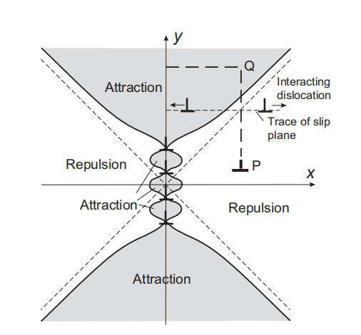

*图 9.4-1：有限位错墙对一条同号、平行刃型位错的滑移作用。灰色区域标为吸引区（Attraction），其余相应区域标为排斥区（Repulsion）；“Interacting dislocation”为与墙相互作用的位错，“Trace of slip plane”为滑移面的迹线。图中的吸引或排斥指位错沿其滑移面趋近或远离墙面，并不代表任意方向上的力都具有同样符号。*

对图中伯格斯矢量为 $b\mathbf e_x$ 的测试位错，单位长度滑移力为 $f_x=b\sigma_{xy}$。其符号随位置变化，因而有限墙周围同时存在吸引区和排斥区。较高温度下，位错可以先通过攀移改变滑移面位置，例如由 $P$ 附近进入 $Q$ 所在的吸引区，再沿滑移面向墙靠近；墙中已有位错也可稍作调整，最终形成较低能的排列。这解释了回复过程中位错墙能够吸收周围位错并扩展的机制，但并不意味着所有附近位错都会自动进入墙中。

---

## 9.5 位错阵列的应变能（Strain Energy of Dislocation Arrays）

### 9.5.1 Read–Shockley 小角度晶界能

规则位错墙通过应力抵消降低弹性应变能。对由等间距刃型位错组成的小角度对称倾斜晶界，**Read–Shockley 公式**（Read–Shockley equation）给出单位面积晶界能

$$
\gamma(\theta)=\gamma_0\theta\bigl(A-\ln\theta\bigr),
\qquad
\gamma_0=\frac{Gb}{4\pi(1-\nu)}.
\tag{9.15}
$$

这里 $\theta>0$ 必须以**弧度**表示，$A$ 是与位错核心截断及核心能有关的无量纲常数；$\gamma$ 与 $\gamma_0$ 的单位均为 $\mathrm{J\,m^{-2}}$。原资料将它们写作 $E$ 与 $E_0$，本节改用 $\gamma$，以免与单位长度位错能量混淆。

该模型要求 $\theta\ll1$，使 $D\simeq b/\theta$，且相邻位错的核心区仍可分辨。角度增大时，单位面积位错数增加；与此同时，间距减小又使单条位错的远场更早被屏蔽。两者共同产生 $\theta(A-\ln\theta)$ 的角度依赖。[Read 与 Shockley 的原始论文](https://journals.aps.org/pr/abstract/10.1103/PhysRev.78.275)讨论了这一小角度位错模型。

### 9.5.2 从位错墙的应力场推导晶界能

设 $E_\ell$ 为分配给墙中一条位错的单位长度弹性应变能。采用弹性加载做功的方法，可写成

$$
E_\ell
=\frac b2\int_{r_0}^{\infty}\sigma_{xy}(x,0)\,\mathrm dx,
\tag{9.16}
$$

其中 $r_0$ 为核心截断半径，$\sigma_{xy}$ 是**整个无限位错墙**在 $y=0$ 上的应力，因子 $1/2$ 来自线弹性加载过程。该式同时计入近场的自能和阵列相互作用带来的屏蔽效应。

积分可按 $x\sim D/(2\pi)$ 分成两段：

- **近场**：$r_0<x\lesssim D/(2\pi)$，应力近似孤立刃型位错的应力，$\sigma_{xy}\simeq Gb/[2\pi(1-\nu)x]$。
- **远场**：$x\gtrsim D/(2\pi)$，用式（9.14）在 $y=0$ 处的指数衰减形式近似。

在 $r_0\ll D/(2\pi)$ 的条件下，两部分分别为

$$
\begin{aligned}
\frac b2\int_{r_0}^{D/(2\pi)}\sigma_{xy}\,\mathrm dx
&\simeq\gamma_0b\ln\!\left(\frac{D}{2\pi r_0}\right),\\[4pt]
\frac b2\int_{D/(2\pi)}^{\infty}\sigma_{xy}\,\mathrm dx
&\simeq\gamma_0b\frac2e.
\end{aligned}
\tag{9.17}
$$

因此

$$
E_\ell\simeq
\gamma_0b\left[\ln\!\left(\frac{D}{2\pi r_0}\right)+\frac2e\right].
$$

每单位晶界面积所含位错线长为 $1/D\simeq\theta/b$，故

$$
\begin{aligned}
\gamma&=\frac{E_\ell}{D}\\
&\simeq\gamma_0\theta
\left[\ln\!\left(\frac{b}{2\pi r_0}\right)+\frac2e-\ln\theta\right].
\end{aligned}
$$

这正是式（9.15），其中分段近似给出

$$
A\simeq\ln\!\left(\frac{b}{2\pi r_0}\right)+\frac2e.
$$

若采用更准确的无限墙应力场进行积分，并取 $r_0/D\ll1$，常数项 $2/e$ 改为 $1$。若另行计入单位长度核心能 $E_{\mathrm c}$，它对晶界能的贡献为 $E_{\mathrm c}/D$，可并入 $A$。因此，$A$ 的具体数值依赖核心模型；稳健的结论是小角度下的 $-\theta\ln\theta$ 形式，以及有效外截断尺度由位错间距控制。

### 9.5.3 通过三叉结夹角比较晶界能

晶界三叉结（grain-boundary triple junction）达到局部平衡时，可以利用晶界之间的夹角估计相对晶界能。若可忽略界面能对晶界面取向的导数项，以及外部约束和三叉结自身的附加作用，则每个晶界可近似提供大小等于其单位面积能量的**界面张力**（interfacial tension）。

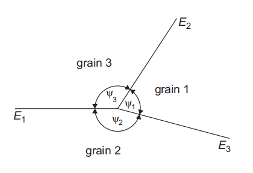

*图 9.5-1：垂直于三叉线的截面。grain 1、2、3 分别为晶粒 1、2、3；原图的 $E_1,E_2,E_3$ 对应本节的单位面积晶界能 $\gamma_1,\gamma_2,\gamma_3$，而 $\psi_i$ 是另两条晶界之间、与第 $i$ 条张力对应的夹角。*

三股界面张力满足矢量平衡，力三角形给出

$$
\frac{\gamma_1}{\sin\psi_1}
=\frac{\gamma_2}{\sin\psi_2}
=\frac{\gamma_3}{\sin\psi_3}.
$$

测量三叉结夹角和各晶界的取向差，就能建立晶界能的**相对值**与取向差之间的关系；若三条晶界能相等，则平衡夹角均为 $120^\circ$。这里的界面张力按单位三叉线长度计，不能直接称为单条位错的线张力。对于显著各向异性的晶界，应采用包含取向导数项的 Herring 平衡条件，简单的正弦关系不再充分。[相关原始研究](https://scholarsarchive.byu.edu/facpub/1137/)说明了利用三叉结处的力与力矩平衡反演晶界能的方法。

### 9.5.4 适用范围与实验比较

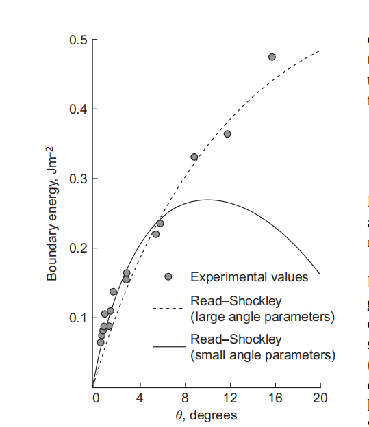

*图 9.5-2：原资料中的晶界能对比图。纵轴为单位面积晶界能，单位 $\mathrm{J\,m^{-2}}$；横轴为取向差，图上以度标注。圆点为实验值（Experimental values），实线为采用小角度参数的 Read–Shockley 曲线，虚线为采用大角度拟合参数的曲线。原截图未给出材料及完整实验出处，因此此处仅用于说明模型适用范围，不能据此提取材料参数。*

Read–Shockley 公式能够解释小角度晶界能随取向差增加的主要趋势。当角度继续增大，位错核心相互重叠，晶界不再能描述为间隔良好的独立晶格位错，原有推导便失去依据。改变拟合参数可能使同一函数形式贴合一段大角度数据，但这种数值拟合不能证明小角度位错模型仍然成立；将小角度参数直接外推，也可能得到图中不合理的能量下降。

对同一材料及同一类晶界，在模型适用范围内应使用物理意义一致的参数；不同晶界类型、晶界面取向或核心结构并不必然共用同一套参数。

---

## 9.6 界面中的位错与台阶（Dislocations and Steps in Interfaces）

### 9.6.1 允许的界面缺陷：位错、台阶与 disconnection

界面线缺陷不仅能容纳两侧晶体的几何错配，还能在运动时使一个晶粒或一相长大、另一侧缩小。描述这类缺陷需要区分两个量：**伯格斯矢量 $\mathbf b$** 表征位错特征，**台阶高度 $h$** 表征界面的法向位置变化。

考虑两个晶体 $\lambda$ 和 $\mu$，取共同单位法向 $\mathbf n$ 从 $\mu$ 指向 $\lambda$。在最简单的平移对称构造中，两侧表面的台阶分别由各自晶格的平移矢量 $\mathbf t_\lambda$ 和 $\mathbf t_\mu$ 描述，其带符号阶高为

$$
h_\lambda=\mathbf n\cdot\mathbf t_\lambda,
\qquad
h_\mu=\mathbf n\cdot\mathbf t_\mu.
$$

将两侧表面拼合，并通过局部畸变消除重叠或间隙，就得到界面线缺陷。按下图中缺陷线正方向指向纸外的约定，其伯格斯矢量为

$$
\boxed{\mathbf b=\mathbf t_\lambda-\mathbf t_\mu.}
\tag{9.18}
$$

因此，法向分量满足

$$
b_n=\mathbf b\cdot\mathbf n=h_\lambda-h_\mu.
$$

本节用两侧有符号阶高的平均值描述拼合后的台阶高度：

$$
h=\frac{h_\lambda+h_\mu}{2}.
$$

两侧晶体的晶向指标必须先换算到**同一个空间坐标系**，才能相减；指标写法不同不一定意味着两个实际矢量不同。

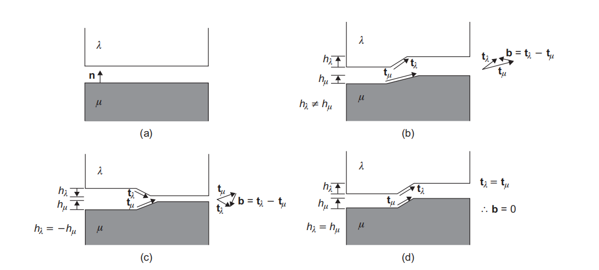

*图：将晶体 $\lambda$（白）与 $\mu$（灰）的表面拼合。（a）平直表面；（b）两侧平移矢量与阶高均不相同；（c）等高反号的台阶；（d）两侧具有相同平移矢量的台阶。图中的 $\mathbf t_\lambda$、$\mathbf t_\mu$ 都应在共同坐标系中比较。*

依据最终界面的位错与台阶特征，可区分：

| 类型                                  | 伯格斯矢量                  | 台阶高度    | 物理含义            |
| ----------------------------------- | ---------------------- | ------- | --------------- |
| 纯界面位错（pure interfacial dislocation） | $\mathbf b\ne\mathbf0$ | $h=0$   | 存在平移错配，但无净台阶    |
| 纯台阶（pure step）                      | $\mathbf b=\mathbf0$   | $h\ne0$ | 界面发生高度变化，但无位错特征 |
| 台阶位错（disconnection）                 | $\mathbf b\ne\mathbf0$ | $h\ne0$ | 同时具有位错与台阶特征     |

本节沿用原资料的用法，将同时具有两种特征的缺陷称为 disconnection；有些文献也将纯台阶、纯位错视为它的退化情形。图（c）中，两侧等高反号的台阶拼合后无净台阶；图（d）中 $\mathbf t_\lambda=\mathbf t_\mu$，故 $\mathbf b=\mathbf0$，仍可保留非零台阶。台阶特征与位错特征是两个需要分别判断的性质。

### 9.6.2 重合位置点阵与 DSC 点阵

将两晶体的理想点阵按给定取向关系叠加，并平移使一对点阵点重合，可得到**双色点阵图**（dichromatic pattern）。在某些特殊取向关系下，所有重合点构成周期点阵，称为**重合位置点阵**（coincidence-site lattice，CSL）。

对于同一种晶体，重合指数 $\Sigma$ 定义为单个晶体点阵点密度与 CSL 点密度之比：

$$
\Sigma=\frac{\rho_{\mathrm{lattice}}}{\rho_{\mathrm{CSL}}}
=\frac{V_{\mathrm{CSL}}}{V_{\mathrm{lattice}}},
$$

其中 $V$ 为相应点阵的原胞体积。因此 $\Sigma=5$ 表示每五个点阵点中有一个属于重合点阵。CSL 描述的是两侧点阵的取向关系，不能单凭 $\Sigma$ 确定真实界面的原子结构或能量。

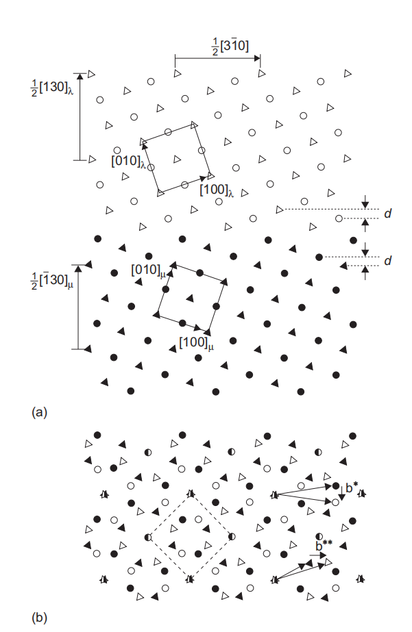

*图：（a）两个 FCC 晶体沿各自的 $\{130\}$ 面拼合前的 $[001]$ 投影，圆形与三角形表示相邻两个 $(001)$ 原子层，空心与实心符号区分两晶体；（b）将两点阵叠加形成的双色点阵图，半填充符号表示重合位置，虚线菱形示意其周期。*

图示例子中，两 FCC 晶体绕共同的 $\langle001\rangle$ 轴相对转动

$$
\theta=2\tan^{-1}\!\left(\frac13\right)\simeq36.9^\circ,
$$

并沿 $\{130\}$ 面构成 $\Sigma5$ 对称倾斜晶界。该角度已较大，不能再把整个晶界当作间隔很宽、核心彼此分离的普通晶格位错墙。

进一步考虑：将一个晶体相对另一个晶体平移，哪些位移能保持双色点阵的重合关系，仅使重合位置整体改变？这些允许位移构成**DSC 点阵**（displacement-shift-complete lattice）。对于具有相同界面结构的两侧区域，其间允许的界面位错伯格斯矢量可取 DSC 点阵矢量，通常可以小于普通晶格的最短平移矢量。CSL 是两点阵的共同重合点集合，DSC 则描述保持这种关系的相对平移；两者不可混用。参见 [Kiel 大学关于 DSC 点阵与晶界缺陷的讲义](https://www.tf.uni-kiel.de/matwis/amat/def_en/kap_7/backbone/r7_1_3.html)。

CSL 的共同平移还给出了纯台阶的一个构造。对图中的 FCC $\Sigma5$ 界面，取

$$
\mathbf t_\lambda=\frac a2[130]_\lambda,
\qquad
\mathbf t_\mu=\frac a2[\bar1 30]_\mu,
$$

其中 $a$ 为晶格常数。虽然两矢量在各自晶体坐标系中的指标不同，在共同坐标系中却相同，故

$$
\mathbf b=\mathbf0,
\qquad
h_\lambda=h_\mu=h=10d.
$$

这里 $d$ 是图中标出的、平行于界面的相邻含原子层间距。对该 FCC 构造，$d=a/(2\sqrt{10})$，所以 $h=a\sqrt{10}/2=10d$；不要将它直接误写成仅由立方晶胞指标计算的 $a/\sqrt{10}$。

CSL 对立方晶体的部分低指数转轴关系尤其直观，但对一般取向、较低对称性的晶体或不同结构的相界，未必存在简单的有限周期重合点阵；它不能作为所有界面的通用原子结构模型。

### 9.6.3 界面位错的识别

**高分辨率电子显微镜**（high-resolution electron microscopy，HREM）可帮助确定界面附近的原子排列，再结合**伯格斯回路**（Burgers circuit）分析线缺陷。构造回路时应：

1. 在两晶体内部，分别沿其已知晶格方向和步数行进；
2. 在跨越界面的两处使用相互对应、定义一致的参考路径；
3. 将各段矢量转换到共同参考坐标系，比较含缺陷界面与无该缺陷的参考界面的闭合差。

闭合差在选定的回路与线方向约定下给出 $\mathbf b$。不能忽略晶界本身的取向变化而直接沿用单晶中的数格点规则，否则会把背景晶格错配误认为额外的界面位错。台阶高度 $h$ 则须从缺陷两侧的界面位置另外确定。

### 9.6.4 外延界面中的错配位错

在**外延界面**（epitaxial interface）处，薄膜与衬底的自然晶格参数可能不同。较薄的薄膜可以通过弹性变形保持原子面连续匹配，形成**共格界面**（coherent interface）。在连续弹性描述中，这种共格应变可用分布式的等效位错含量表示，但不意味着共格界面已经含有一组真实、离散的错配位错。

当薄膜增厚时，即使失配应变近似不变，单位界面面积对应的弹性应变能仍随厚度增加。引入**错配位错**（misfit dislocations）需要付出位错能，却可降低共格应变能；超过相应临界厚度后，含错配位错的**半共格界面**（semicoherent interface）可能更有利。实际松弛还取决于位错形核与运动条件。参见 [Kiel 大学关于错配位错与临界厚度的讲义](https://www.tf.uni-kiel.de/matwis/amat/def_en/kap_8/backbone/r8_1_1.html)。

错配位错的应力场可部分抵消共格应变场。在理想的完全松弛极限中，真实错配位错与等效共格位错的平均含量相互补偿，远离界面的平均失配应力趋于消失；实际界面可保留残余应变，位错核心附近的局部应力也仍然存在。

---

## 9.7 晶界与相界的运动（Movement of Boundaries）

### 9.7.1 界面运动的基本条件

界面缺陷能够移动，并不意味着整个界面可以任意迁移。描述晶界或相界运动时，需要同时满足四类条件：

1. **运动学条件**：若依靠位错滑移，运动必须位于允许的滑移面内。对于非螺型位错，滑移面包含位错线和伯格斯矢量；纯螺型位错的具体滑移面还受晶体结构和核心结构限制。
2. **物质守恒**：若缺陷运动需要吸收或释放原子、空位，必须存在相应的输运途径。
3. **热力学驱动**：运动应降低体系的适当自由能，或由外应力做功驱动。驱动力可来自储存能差、界面曲率、相变自由能差、应力或非平衡点缺陷浓度。
4. **动力学可达性**：驱动力和热激活必须足以克服晶格阻力、溶质拖曳及其他障碍；具有有利的能量变化并不保证界面立即运动。

这里要区分**界面迁移**（boundary migration）与**晶界滑动**（grain-boundary sliding）：前者使界面沿法向移动、改变两侧晶体的体积，后者使两晶体沿界面相对位移。某些机制会将两者耦合起来。

### 9.7.2 晶格位错阵列的协同运动

对于由一组平行刃型位错组成的理想对称小角度倾斜晶界，各位错具有相互平行的滑移面，因此晶界可以通过位错的协调滑移迁移。

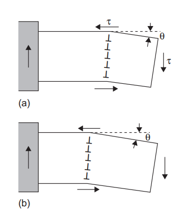

*图 9.22：剪应力驱动理想对称小角度倾斜晶界迁移；晶界位移伴随两侧晶体的相对剪切。$\tau$ 为作用在组成晶界的位错滑移系上的分切应力，$\theta$ 为取向差。*

设位错间距为 $D$，单条位错单位长度的滑移力为

$$
f_\ell=b\tau.
$$

单位晶界高度内有 $1/D\simeq\theta/b$ 条位错，故单位晶界面积承受的驱动力为

$$
F=\frac{b\tau}{D}\simeq\theta\tau.
\tag{9.19}
$$

这里 $F$ 是单位面积的力，量纲为压力，$\theta$ 以弧度表示；等式 $F=\theta\tau$ 采用小角度近似。该结果适用于这类位错滑移几何，不能直接用于任意晶界。

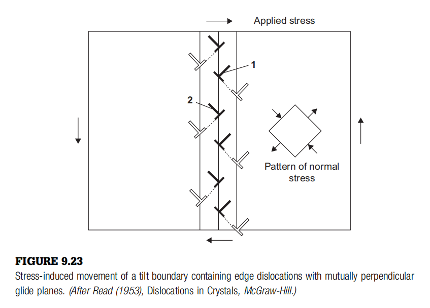

*图 9.23：两组刃型位错的滑移面互相垂直。单纯各自滑移会使它们偏离共同的晶界面；保持晶界整体构型的迁移通常还需要攀移协调。图中 Applied stress 为外加应力，Pattern of normal stress 为相应的正应力分布。原图据 Read（1953）。*

对图示的两组位错阵列，各组位错仅沿自身滑移面运动时，通常不能使整面晶界保持原有形状并共同平移。协调迁移可能同时需要**滑移**（glide）与**攀移**（climb）；攀移涉及空位或原子的吸收、释放，往往在扩散较活跃的较高温度下更容易发生。这是特定阵列几何的限制，不能概括为所有倾斜晶界都必须依靠攀移。

### 9.7.3 界面缺陷的滑移与变形孪晶

前文讨论的是组成小角度晶界的晶格位错。更一般的界面缺陷可以具有不同于完整晶格平移矢量的伯格斯矢量，并同时携带台阶。**界面位错的伯格斯矢量并不普遍要求位于界面内**；本小节讨论的是其中能够沿界面滑移的情形。

对于两侧成分和原子数密度相同的晶体，若缺陷的位错线与 $\mathbf b$ 都位于界面内，则界面可以充当其滑移面。带有非零台阶高度的台阶位错（disconnection）沿界面移动时，一方面产生由 $\mathbf b$ 决定的相对位移，另一方面使界面推进一个台阶高度。只有在相应的孪晶晶体学条件下，这种运动才构成**变形孪晶**（deformation twinning）。

以 BCC 晶体常见的 $\{112\}\langle111\rangle$ 孪晶系为例，孪晶位错在相邻的 $\{112\}$ 晶面上依次滑移，其伯格斯矢量属于

$$
\mathbf b_{\mathrm{tw}}\in\frac{a}{6}\langle111\rangle,
\qquad
b_{\mathrm{tw}}=\frac{a\sqrt3}{6},
$$

其中 $a$ 为 BCC 常规晶胞的晶格常数，所选 $\langle111\rangle$ 方向必须位于对应的 $\{112\}$ 晶面内。与之配合的单层台阶高度为

$$
h=d_{112}=\frac{a}{\sqrt6},
$$

因而理想孪晶剪切量为

$$
s=\frac{b_{\mathrm{tw}}}{h}=\frac1{\sqrt2}.
$$

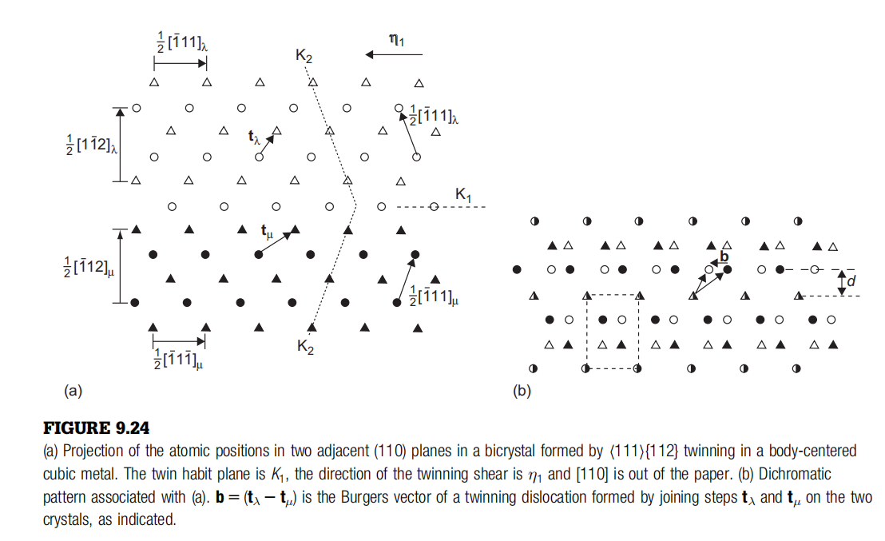

*图 9.24：BCC 晶体中 $\{112\}\langle111\rangle$ 孪晶的原子投影及双色点阵。$K_1$ 为孪晶面，$\boldsymbol\eta_1$ 表示孪晶剪切方向，$K_2$ 为第二无畸变面；图中的观察方向为 $[110]$。两侧阶矢量之差给出孪晶位错的伯格斯矢量 $\mathbf b=\mathbf t_\lambda-\mathbf t_\mu$。该孪晶取向关系对应 $\Sigma=3$ 的重合点阵。*

图示构造将两晶体中的允许阶矢量连接起来，得到同时具有单层台阶和 $a\langle111\rangle/6$ 伯格斯矢量的缺陷。台阶上升或下降的方向、位错线正向与伯格斯回路方向必须配套指定，不能脱离这些约定单独判断其正负刃型性质。

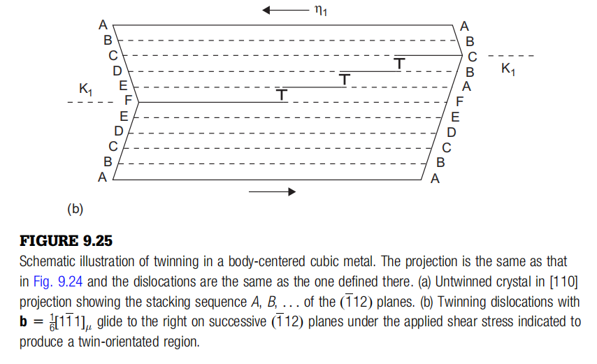

*图 9.25：孪晶位错在连续的孪晶面上滑移，逐层改变堆垛关系，使孪晶区长大。字母表示原子层的堆垛位置，$K_1$ 为孪晶界；本笔记保留的是原图的（b）部分。*

孪晶是晶体协调塑性变形的重要机制，尤其在易于启动的独立滑移系不足时更为重要。对于某些简单点阵，均匀孪晶剪切即可将原子带到孪晶位置；对于具有多原子基元的结构，例如 HCP 晶体，仅有宏观剪切通常还不够，部分原子还需作局部**原子调整**（shuffle）。这里的“多原子基元”指每个布拉菲点阵点附带多个原子，不是同一个原子位置被多个原子占据；shuffle 也不等同于长程扩散。

### 9.7.4 扩散辅助运动与原子通量守恒

界面缺陷运动所需的原子输运，需要同时考虑其**台阶分量**和**位错分量**。同相、等密度晶界中，若 $\mathbf b$ 具有界面法向分量，缺陷沿界面的运动会包含非保守的攀移分量；相界两侧的成分或密度不同，还会使台阶扫过的区域产生额外原子收支。[Hirth 与 Pond 的界面缺陷理论](https://doi.org/10.1016/S1359-6454(96)00132-2)提供了将这两部分分别分析的框架。

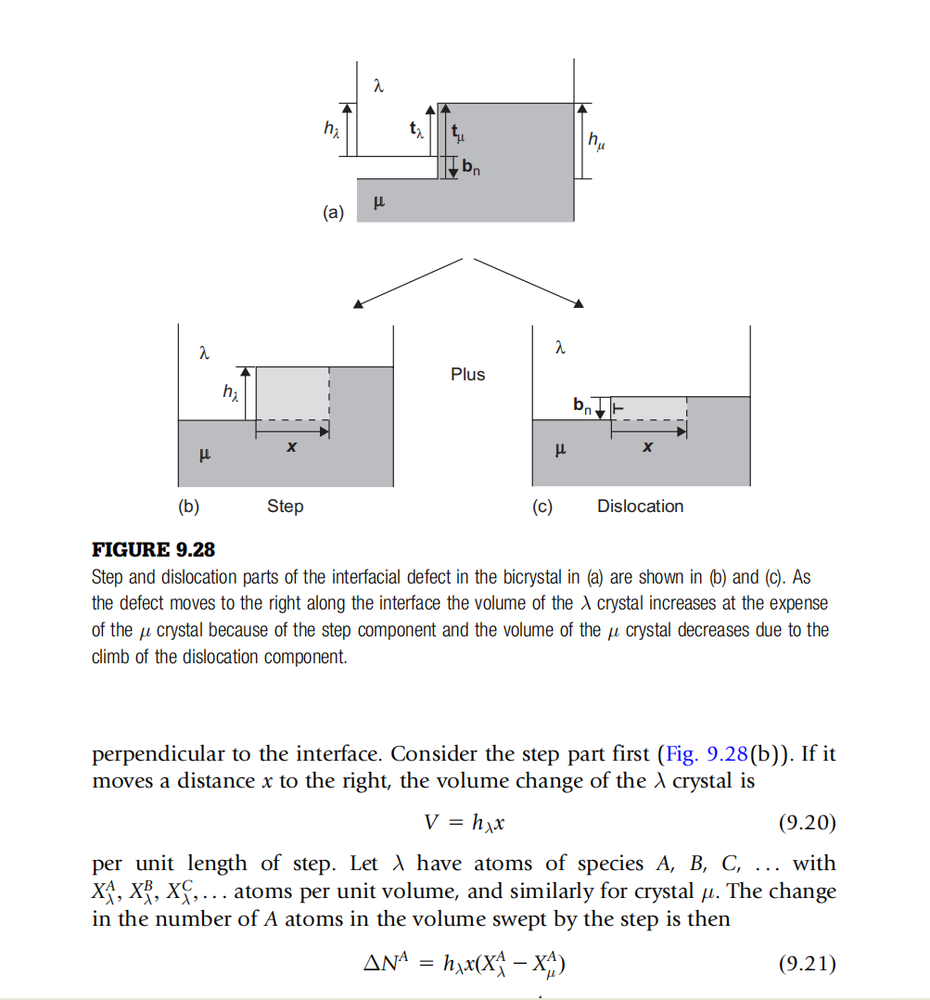

*图 9.28：界面缺陷（a）分解为台阶部分（b，Step）与位错部分（c，Dislocation）；Plus 表示两部分相加。缺陷向右运动时，台阶使 $\lambda$ 晶体长大并消耗 $\mu$ 晶体，位错的攀移分量则改变 $\mu$ 晶体的体积。下方原图附带的英文推导已在正文完整转写。*

沿用第 9.6 节的约定：$\mathbf n$ 为从 $\mu$ 指向 $\lambda$ 的界面单位法向，

$$
h_i=\mathbf n\cdot\mathbf t_i,
\qquad
\mathbf b=\mathbf t_\lambda-\mathbf t_\mu,
\qquad
b_n=\mathbf n\cdot\mathbf b=h_\lambda-h_\mu.
$$

下述 $V$ 和 $\Delta N^A$ 均为**单位缺陷线长**对应的体积变化和原子数变化。令缺陷沿图示向右移动 $x$，速度为 $v$；$X_\lambda^A$、$X_\mu^A$ 分别表示两相中 $A$ 组分的原子数密度，单位为 $\mathrm{m^{-3}}$，不是无量纲原子分数。规定 $J^A>0$ 表示必须从外部向缺陷输送 $A$ 原子，$J^A<0$ 表示缺陷释放该组分。

**台阶分量。** 台阶使 $\lambda$ 晶体的体积增加

$$
V_{\mathrm{step}}=h_\lambda x,
\tag{9.20}
$$

并使相同体积的 $\mu$ 晶体被替代。两相所需的 $A$ 原子数之差为

$$
\Delta N_{\mathrm{step}}^A
=h_\lambda x\left(X_\lambda^A-X_\mu^A\right).
\tag{9.21}
$$

运动所用时间为 $x/v$，故所需通量为

$$
J_{\mathrm{step}}^A
=h_\lambda v\left(X_\lambda^A-X_\mu^A\right).
\tag{9.22}
$$

**位错分量。** 按图中的分解方式，把攀移造成的附加体积变化计入 $\mu$ 晶体，有

$$
V_{\mathrm{disl}}=b_nx,
\tag{9.23}
$$

$$
\Delta N_{\mathrm{disl}}^A=b_nxX_\mu^A,
\tag{9.24}
$$

$$
J_{\mathrm{disl}}^A=b_nvX_\mu^A.
\tag{9.25}
$$

因此，完整缺陷运动所需的净原子通量为

$$
\boxed{
J^A=v\left[
h_\lambda\left(X_\lambda^A-X_\mu^A\right)
+b_nX_\mu^A
\right].
}
\tag{9.26}
$$

这里的 $J^A$ 是每单位缺陷线长、每单位时间的原子收支，单位为 $\mathrm{m^{-1}s^{-1}}$（原子个数按计数处理），不同于按单位面积定义的扩散通量。图中 $h_\mu>h_\lambda$，因此 $b_n<0$，式（9.23）–（9.25）均为负，表示位错分量使 $\mu$ 晶体体积减少并释放原子。

代入 $b_n=h_\lambda-h_\mu$，式（9.26）还可写成更直接的守恒形式：

$$
J^A=v\left(h_\lambda X_\lambda^A-h_\mu X_\mu^A\right).
$$

由此可以看清三类情况：

- **同相、同成分、同原子数密度的界面**：$X_\lambda^A=X_\mu^A$，台阶项为零，$J^A=vb_nX_\mu^A$。理想孪晶位错通常满足 $b_n=0$，可在无净原子输运的条件下推动孪晶界；若 $b_n\ne0$，则需要相应的原子或空位输运。
- **两侧成分不同的相界**：必须分别满足每个组分的守恒。总原子数相同也不意味着各组分通量为零，通常需要扩散来调节成分。
- **同成分但密度不同的相界**：台阶项与位错项可以相互抵消。若对所有组分均有 $h_\lambda X_\lambda^A=h_\mu X_\mu^A$，则 $J^A=0$，因此不能仅凭“两侧密度不同”就断言界面迁移必须依赖扩散。

式（9.26）是物质守恒条件，并不是由通量直接给出迁移速度的动力学定律；仍需结合扩散速率、界面反应和迁移能垒判断实际运动是否可发生。

### 9.7.5 马氏体相变（Martensitic Transformations）

马氏体相变是原子协同运动导致晶体结构改变、并伴随特征性形状应变的**无扩散位移型相变**（diffusionless displacive transformation）。它可由降温或外加应力诱发，涉及短程、协调的原子位移，在转变前沿不依靠长程扩散来重新分配成分。它仍有形核和长大过程，不能将“无扩散”理解为“没有形核”；也不能把所有局部位移或界面台阶运动都称为马氏体相变。其结构变化与剪切、体积变化之间的关系可参见[剑桥大学马氏体教学资料](https://www.phase-trans.msm.cam.ac.uk/2002/martensite.html)。

马氏体相变与孪生都可通过界面线缺陷的协同运动描述，但马氏体通常改变晶体结构，并可能伴随原子数密度变化，所以其形状应变一般不只是纯剪切。界面的**惯习面**（habit plane）、取向关系和迁移方式必须满足更严格的几何相容与物质守恒条件。

这类相变与钢的淬火组织形成、某些合金的形状记忆效应密切相关。相变是否发生，取决于化学自由能差、应变能与形核或迁移阻力之间的竞争，不能只根据温度下降作出判断。

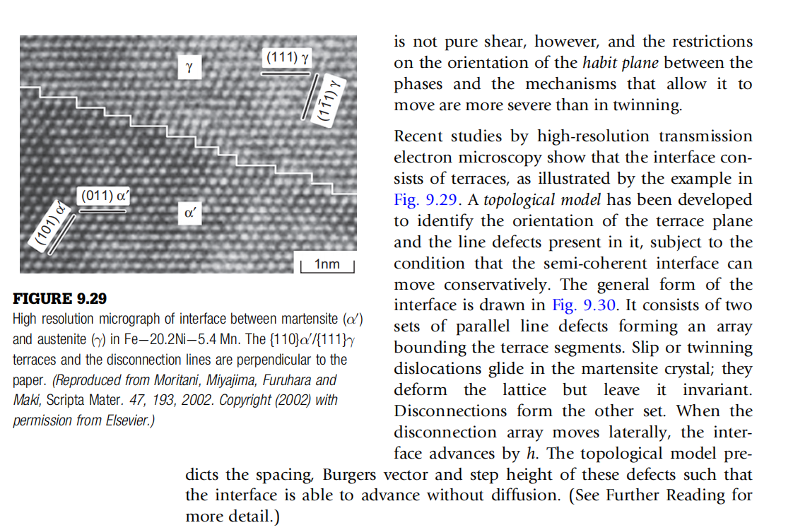

*图 9.29：Fe–Ni–Mn 合金中马氏体 $\alpha'$ 与奥氏体 $\gamma$ 界面的高分辨电子显微像。界面由近似平直的平台（terrace）与台阶组成，图示平台满足 $\{110\}_{\alpha'}\parallel\{111\}_\gamma$，平台边缘和台阶位错线垂直于图面。原图引自 Moritani 等（2002）；[作者所在机构的文献记录](https://repository.kulib.kyoto-u.ac.jp/items/189866ab-a213-4d99-9d7a-3a897e8f263c)可核对论文出处。*

在原图所述的界面拓扑模型中，需要区分两类作用：晶体内部的滑移或孪生协调形状应变，属于**晶格不变变形**（lattice-invariant deformation）；界面上的台阶位错沿平台边缘移动，则使相界按台阶高度推进并实现母相到产物相的转换。模型通过允许的伯格斯矢量、阶高及排列间距，寻找满足无净扩散输运的迁移构型。原图附带英文段落所述的“两组平行线缺陷”是该模型的具体界面描述，不应视为所有马氏体界面的统一结构。

平台和台阶的存在本身不能判定相变是否无扩散；应结合各组分守恒、缺陷运动方式和实际动力学判断。

---

## 9.8 位错塞积（Dislocation Pile-ups）

### 9.8.1 塞积的形成与模型条件

当同一滑移面上的同号位错在外加剪应力作用下不断滑向难以穿过的障碍，前面的位错受阻，后面的位错继续靠近，就会形成**位错塞积**（dislocation pile-up，也称位错堆积）。各位错之间的排斥力、外应力和障碍反力共同决定平衡位置。

以下采用经典单端塞积模型：$n$ 条平行直位错具有相同的伯格斯矢量，在均匀各向同性线弹性介质中、同一滑移面上运动；分切应力 $\tau$ 为常量，障碍直接阻挡最前方位错。忽略核心结构、交滑移、攀移和穿透障碍等松弛过程。若考虑均匀晶格摩擦，$\tau$ 应理解为扣除摩擦阻力后的有效驱动应力。

刃型、螺型位错都可以形成塞积。螺型位错在条件适合时能够交滑移而绕过障碍，使某些塞积更易松弛，但交滑移需要合适的滑移面和足够的驱动力，不能据此排除螺型位错塞积。

### 9.8.2 塞积头部的应力放大

最前方位错受到外加应力和其余 $n-1$ 条位错的共同作用。设其受到的总前向驱动应力为 $\tau_1$，障碍提供大小相等、方向相反的阻力应力 $\tau_0$。

把所有位错的沿滑移方向受力相加，位错间成对的内力相互抵消，外应力给出的总驱动力为 $nb\tau$（按单位位错线长计）。只有头部位错直接承受障碍反力，因此

$$
nb\tau=b\tau_0,
\qquad
\tau_1=\tau_0,
$$

即

$$
\boxed{\tau_1=n\tau.}
\tag{9.27}
$$

同样可用虚功说明：使整个阵列向前虚移 $\delta x$，外应力做功 $nb\tau\,\delta x$；位错间相对位置不变，因此相互作用能不变，障碍所对应的能量增加为 $b\tau_0\,\delta x$。令二者相等便得到式（9.27）。

这里的 $\tau_1$ 不包括头部位错自身应力与障碍反力；在平衡状态下，若把障碍反力也计入，头部位错的**净力仍为零**。$n\tau$ 表示障碍必须抵抗的局部驱动应力，不是样品中处处存在的应力。

塞积还会对位错源产生**背应力**（back stress） $\tau_b$。位错源只有在

$$
\tau-\tau_b>\tau_{\mathrm{src}},
$$

即有效应力超过位错源启动应力 $\tau_{\mathrm{src}}$ 时，才能继续产生位错。随着塞积增长，背应力可能使源停止工作。

### 9.8.3 位错数目、密度与头部间距

令塞积占据 $0\le x\le L$，$x=0$ 位于源侧或塞积尾部，障碍位于 $x=L$。在位错数较多的连续分布近似下，经典单端塞积中的位错数为

$$
n=\frac{L\tau}{A},
\tag{9.28}
$$

其中

$$
A=
\begin{cases}
\displaystyle\frac{Gb}{\pi},&\text{螺型位错},\\[6pt]
\displaystyle\frac{Gb}{\pi(1-\nu)},&\text{刃型位错}.
\end{cases}
$$

$G$ 为剪切模量，$\nu$ 为泊松比；这里 $A$ 的量纲为应力乘长度。该式中的系数取决于单端塞积及 $L$ 的定义，不能直接套用到两端塞积或改变长度定义后的模型。

为说明位错如何分布，可引入沿滑移方向的一维位错数密度 $\rho_{\mathrm{pu}}(x)$，使 $\rho_{\mathrm{pu}}(x)\,dx$ 表示区间 $dx$ 中的位错条数。它的单位为 $\mathrm{m^{-1}}$，区别于通常以 $\mathrm{m^{-2}}$ 表示的体积位错密度。对应的连续分布为

$$
\rho_{\mathrm{pu}}(x)
=\frac{2\tau}{\pi A}\sqrt{\frac{x}{L-x}},
\qquad 0<x<L.
$$

积分可验证总位错数：

$$
\begin{aligned}
n
&=\int_0^L\rho_{\mathrm{pu}}(x)\,dx\\
&=\frac{2\tau}{\pi A}\frac{\pi L}{2}
=\frac{L\tau}{A}.
\end{aligned}
$$

因此位错越靠近障碍越密集。连续模型在 $x\to L$ 时的密度发散表示头部的强烈集中，不意味着真实位错间距可以降为零。经典离散解给出最前两条位错的间距近似为

$$
\Delta x_{12}\simeq0.92\frac{L}{n^2}.
$$

这一数值用于理想单端塞积、位错数较多的情形；当间距接近核心尺度时，线弹性位错模型需要修正，障碍穿透、反应或裂纹形核也可能先发生。

### 9.8.4 远场、应力集中与低角度晶界的区别

由上述密度分布可求得塞积的位错数加权质心：

$$
\bar x=\frac1n\int_0^Lx\rho_{\mathrm{pu}}(x)\,dx
=\frac{3L}{4}.
$$

在距离整个塞积远大于 $L$ 的位置，首阶近似可将其视为位于 $\bar x=3L/4$、伯格斯矢量为 $n\mathbf b$ 的等效大位错。因此有限同号塞积仍具有明显的长程弹性场。

这与理想、无限周期的小角度倾斜晶界不同：后者的位错沿晶界方向规则排列，应力分量在远离晶界时相互屏蔽；塞积中的同号位错则挤在同一滑移面上，并向障碍端集中。晶界的远场屏蔽来自特定排列几何与应力叠加，不能简单归因于“位错间距越来越小”；有限位错墙的端部效应仍需单独考虑。

塞积头部的高应力能够促进邻晶滑移、障碍穿透或局部损伤。对于螺型位错，适当的局部应力还可能促进交滑移并缓解塞积。在远离离散位错核心、又足够接近塞积头部的连续介质范围内，塞积产生的应力集中与裂纹尖端具有类似的平方根尺度关系，典型量级为

$$
\tau_{\mathrm{tip}}(r)\sim\tau\sqrt{\frac{L}{r}},
$$

其中 $r$ 是距塞积头部的距离，具体系数和应力分量由几何条件决定。这种类比支持裂纹形核与应力集中的分析，但位错塞积本身不等同于已经形成自由表面的裂纹。[Eshelby、Frank 与 Nabarro 的经典工作](https://doi.org/10.1080/14786445108561060)讨论了同滑移面位错的平衡位置及其与滑移裂纹应力场的联系。
